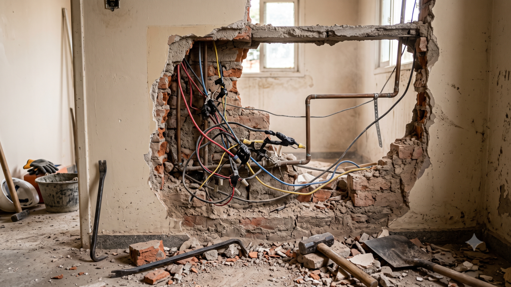

*The broken wall - Image created with Gemini (Nano Banana 2)*

Anyone who has ever renovated a house knows the moment when the sledgehammer breaks through an old wall. The plaster falls and you see what was behind it: wiring nobody ever designed that way, a splice made in a hurry, a pipe that takes a strange detour to avoid something that isn't even there anymore.

None of that is on the blueprint. And yet it worked. The house stood for twenty years resting on solutions someone came up with on a Saturday afternoon, fixed on the spot and never wrote down.

As long as the wall stayed closed, all of it was invisible and harmless. Someone knew. Someone remembered. Someone found a way.

## The invisible layer of organizational design

Every organization has walls like that. Behind the org chart, the processes and the systems there is a layer of improvisation that holds the operation up without showing up in any report.

It's the person who knows who to call when the flow gets stuck. It's the one who looks at an order and senses something is wrong before it turns into a problem. It's the one who reconciles two versions of a number that should match and don't. It's the one who takes on a responsibility that isn't written down anywhere.

This invisible work absorbs the ambiguities the organization's design never resolved. Who has authority over what. Which criterion applies when two criteria contradict each other. What to do when a case looks like none of the ones anticipated.

As long as the work is done by people, the wall stays closed. People interpret the context, notice the exception, go to whoever really knows and move on. The mess is still there, and it almost never gets in the way.

It's worth saying that not all improvisation is virtuous. A good part of it covers up mistakes, rework and choices nobody ever reviewed, just as behind old plaster there is also dangerous wiring and badly placed plumbing. So opening the wall isn't always a loss. Often it's the first real chance to fix what had been patched up in the dark.

## AI automation opens the wall

This is where artificial intelligence comes in, but the point is less glamorous than what is usually sold.

A system has to turn records, rules, permissions and goals into executable decisions and actions. To do that, it needs those things to be explicit. And when it hits a gap, it doesn't always stop to ask, the way a new employee would.

Depending on how it was built, it may freeze. It may ask for confirmation. Or, in the most common and most treacherous case, it may fill the gap with a plausible inference, repeat that inference with exemplary consistency and spread it at scale.

Think of a discount policy that, on paper, goes up to 15%. In practice, everyone knows the sales team goes beyond that when the customer is a long-standing one, that there is an informal ceiling of around 25%, and that above that someone calls the director. This arrangement was never written down, and it worked for years because the people involved knew how to read the context of each case. Now put an AI Agent in charge of approving discounts. It will find fifteen in the document and a history of approvals above that in the data. It will follow some rule, and nobody chose which one.

Notice what happened. The ambiguity a person used to work around in silence became automated behavior, visible and multiplied. The problem wasn't born there. It was already behind the plaster.

I've been hearing a lot of talk about AI creating management problems, but I think it's the other way around. It is putting the organization through a stress test and revealing what was already there. Most of what shows up in that test is old design debt (similar to what happened with the adoption of agile methods).

To be fair, AI also brings entirely new problems. Hallucination, malicious prompt injection, the silent drift of a model over time. These problems exist and they are serious. They just aren't most of what I'm seeing break in organizations.

## Technology alone is not the problem

Far beyond the technology, the problem lives in the gap between AI's efficiency at optimizing and the organization's capacity for governance.

The more efficient a company becomes at optimizing what it can measure and represent, the greater its exposure to what was left out of the representation. To what remained tacit, contested or invisible.

I've been using one sentence to sum this up: **an organization optimizes what it can make legible and pays for what it leaves out of the representation**.

AI is useful precisely to the extent that it makes work legible. And it becomes dangerous when the gap grows between what has become legible to the system and what still matters to the business. The two grow together, and that's why the same rollout can be a huge gain in one area and a silent disaster in another.

## Management is moving to a different place

AI doesn't eliminate the need for management. It displaces management. Management moves away from directly supervising tasks and toward designing the conditions under which humans and machines can act together.

The work that starts to matter is different:

- Defining who has authority over what
- Separating who decides from who is accountable
- Knowing what can be trusted in your own body of information
- Establishing what happens when there's an exception
- Keeping a trail of what was decided and why.

None of this is new. It's just that before, you could get away with not doing it, because there were people absorbing what was missing.

An interesting observation: self-managed organizations had to write down early on what other organizations could leave implicit: who decides what, based on which criterion, within which limit and accountable to whom. They paid that cost years ago, often complaining about it.

As it turns out, describing a role precisely and writing the power of attorney for an AI agent are almost the same work. Whoever already has that document in hand is a few steps ahead.

## Food for thought

If tomorrow a system had to carry out, on its own, a decision that goes through you today, would it find the criterion you use written down? Or would it find a gap and fill it with the most plausible assumption?

When something goes wrong in your area, who absorbs it? And what happens to that work when part of the operation is no longer done by people?

Which wall in your company would you rather open by choice, now, instead of finding out what's behind it in the middle of a rollout?
