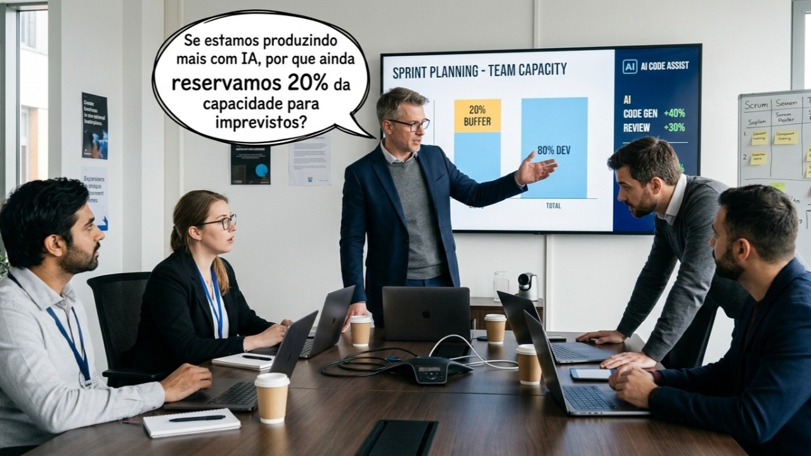

*A CTO pushing to raise the team's productivity - Image generated with Gemini (Nano Banana 2)*

In a sprint planning meeting, the team looks at its capacity (time and effort) and sets aside 20% for the unexpected. Nobody needs to explain why: the bug that shows up at the end of the week, the integration whose contract changes without warning, the urgent request from sales that arrives the day before delivery...

A few months later, that same team has adopted artificial intelligence to write code, review *pull requests* and generate tests. Delivery really did speed up. Until the CTO shows up and asks in a meeting: if we're producing more, why keep setting aside 20% of the team's capacity?

It looks like the most rational decision in the world. Raise the sprint commitment, fill the margin, cash in on the gain.

What the question ignores is that AI sped up production, not the handling of the unexpected. The margin didn't exist to make up for slowness, but to absorb the impact of the unpredictable.

## Only variety can absorb variety

In cybernetics, [W. Ross Ashby](https://en.wikipedia.org/wiki/W._Ross_Ashby) formulated the **law of requisite variety**, summed up in a phrase that circulates in several versions: only variety can absorb variety. In practice, a system only stays stable if its repertoire of responses is as varied as the problems it faces.

The Friday bug, the integration that breaks and the last-minute request are variety. None of them is predictable one by one, and all of them show up with some regularity.

The margin the team set aside was a repertoire of responses. Tom DeMarco gave that margin a name, **slack**, and it lives in the deadline, in capacity, in the budget and in quality tolerance.

Notice what AI did and what it didn't do. It increased the speed of producing code. The variety of the environment stays the same, and the repertoire to absorb it shrank the moment the margin became more delivery commitment.

## The math that only goes halfway

I've been calling this the **accounting asymmetry of slack**: slack shows up in planning, but coordination doesn't.

Cut the slack and the number improves in the very next cycle, because slack is something you can measure. The cost of that decision comes later: as alignment meetings, escalations, rework and manager time spent on replanning. Since it is born in another spreadsheet, with another owner and in another quarter, nobody adds it to the savings that justified the cut.

With artificial intelligence in the middle, the asymmetry becomes even more convincing. A new line enters the budget, which is the tool, and an old line leaves, which is the slack. Both are visible, both compare nicely on a slide, but coordination stays exactly where it was: off the books.

## The invisible cost of running at the limit

Queueing theory explains why waiting time doesn't grow at the same pace as demand. As a system's utilization rises, delay doesn't increase gradually: it multiplies. If the arrival rate and the duration of tasks vary, the slowdown curve shoots up even earlier (exactly as happens in traffic right before a jam).

It's true that knowledge work isn't a passive queue. People reprioritize, negotiate, batch and drop tasks all the time.

Even so, the math of the curve reflects an intuitive reality: raising utilization from 70% to 80% barely hurts, but going from 95% to 100% turns the sprint into an unpredictable scenario. That critical zone is exactly where the pursuit of efficiency through artificial intelligence pushes the operation, because that's where the gains seem easiest to demonstrate. The last bit of slack is the most expensive of all, yet it is also the first to be sacrificed.

## What Toyota understood about cutting slack

Someone will bring up *just-in-time*. Taiichi Ohno documented the deliberate removal of inventory slack at Toyota's factory, and it worked. What disappears in the short version is the other half of the story: in place of physical slack, the factory built an information apparatus designed to see variation in real time and react to it, with kanban and stop signals. In Ashby's vocabulary, the factory traded one form of variety for another, but it didn't give up the repertoire.

It's the same structure of argument people use for artificial intelligence today. The essential difference lies in how each apparatus fails.

Kanban failed locally, visibly and slowly. A card stopped, someone saw it, the line stopped and the error announced itself before it could spread. AI-assisted coordination gets things wrong in a different way: consistently, at scale and silently. A system that misclassifies misclassifies every single time, and nobody notices until the accumulated effect shows up. It's the opposite of the card that gets stuck.

Therein lies the asymmetry: the AI gain shows up quickly, in immediate productivity metrics; the error shows up slowly, spread across departments, with no owner and no date. That's why anyone planning to cut slack while counting on AI as the apparatus first needs to answer one question: does my apparatus fail like kanban, or in a worse way? If it fails like kanban, the cut is defensible. If it fails silently, you've removed the margin exactly when you're going to need it.

## How to make a better decision about cutting slack

There's no exact formula for this math, but it's easy to raise the quality of the decision with two simple questions:

- **Mapping the real cost:** How many hours did the department lose to alignment meetings, escalations and rework over the last three months? Without that diagnosis, any promise of savings is being compared against nothing.
- **The tool's failure mode:** How will the team spot an error in this new system, and how long will it take? When there's no clear answer to that, it means slack is still the only real safety mechanism (even if it looks like waste on the spreadsheet).

Neither of these questions prevents the cut. But both change the level of awareness at the moment of deciding.

## Food for thought

- In your company, has anyone ever added up what AI saved on one side against what it started to consume in coordination, verification and correction on the other?
- Has your operation gained repertoire to deal with the unexpected, or has it only gained speed to produce the expected?
- And could you point out right now the last bit of slack left in your department, or has it already been filled with some activity that seemed like a good idea at the time?
