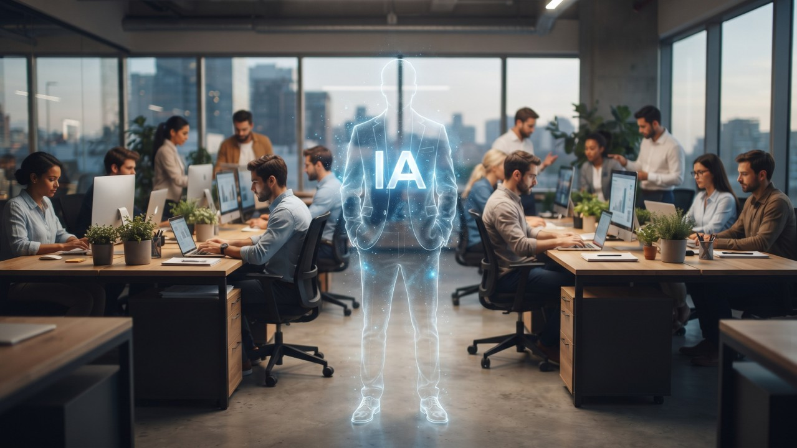

*AI as the new invisible boss of organizations (image created by Gemini)*

There is a sentence every horizontal startup says proudly in its first meeting: we have no bosses here, we're all owners. And there is a second sentence that no one says out loud, but everyone knows: when the decision gets tight, it's so-and-so who bangs the gavel.

These two sentences live side by side in the same company all the time. The first is on the website. The second is in the side WhatsApp group. And the distance between the two is exactly what artificial intelligence is about to fill.

## Removing structure doesn't remove power

[Jo Freeman wrote](https://en.wikipedia.org/wiki/The_Tyranny_of_Structurelessness), back in the early 1970s, an essay that has aged startlingly well. The argument is simple:

> Abolishing the formal structure of a group does not abolish power. It only makes it invisible.

Where there is no declared authority, what appears is not the absence of authority. What appears is an informal authority that no one elected, that is not on any org chart and, for that very reason, that no one can hold accountable. The person who actually decides is still there. What disappears is the possibility of pointing at them and asking for an explanation.

Notice the cruel inversion. The formal structure, with all its bureaucracy, at least said who answered for what. By erasing it in the name of freedom, the group doesn't become freer. It is left at the mercy of a power that now has no name and no address.

## What the cases show

Some companies tried to take the idea of operating without a formal hierarchy seriously, and the accounts are instructive.

[Valve](https://www.valvesoftware.com/en/), known for having no bosses on paper, is described by former employees as having a hidden layer of power and intense internal competition. [Medium](https://medium.com/) adopted a model without traditional management and, by its own leadership's account, struggled to coordinate at scale, until it backed away. [Zappos](https://www.zappos.com/) saw a significant exodus of people after imposing holacracy by ultimatum, although the founder himself disputed attributing that exodus to the model alone.

None of these cases proves that distributed organization doesn't work. What they illustrate is more modest and more useful: erasing the org chart doesn't make the functions of management disappear. Someone keeps routing information, absorbing the unexpected and deciding who gets what is scarce. Whether or not you have an org chart is not what's essential, but rather knowing where each of these functions sits in the organization.

## AI inherits the trap, and deepens it

Now combine this old trap with the new promise.

The talk of the moment is that artificial intelligence will finally allow the lean company, with no layers and no managers in the middle. Cut the hierarchy, let the tool coordinate, and the structure disappears.

But the structure doesn't go away. The functions the manager performed don't evaporate when the position is cut. They migrate. And when they migrate to a system, they run straight into the problem Freeman described, now with an extra layer of opacity.

The routing the boss used to do is now done by the algorithm that decides which ticket is the priority. The distribution of what is scarce goes through the system that recommends who to promote. Coordination becomes the automated flow that no one designed in full. In each of these cases, the function is still being performed. What changes is that now it has no name, no badge and, worse than the informal boss, not even a human being you can ask for an explanation.

We swapped the boss no one elected for a system no one deliberately configured. The tyranny of structurelessness has gained an automated version, and it presents itself in the best of disguises: technical neutrality.

[Maurício Tragtenberg](https://pt.wikipedia.org/wiki/Maur%C3%ADcio_Tragtenberg) saw through this trick long before AI existed. In "Burocracia e Ideologia" (1974), he argued that treating administration as a neutral technique is already an ideology in itself: the supposed neutrality serves to present as mere efficiency what is, at bottom, a power relationship.

An algorithm wears this disguise perfectly. It doesn't command, it "optimizes". It doesn't choose who moves up, it "recommends". The wording gets softer, the power relationship stays the same, and it becomes harder to challenge precisely because no one calls it power anymore.

That same Tragtenberg was wary of promises of participation that grant symbolic influence while the real decision stays concentrated at the top. It's worth keeping that wariness, because "we're all owners here" and "AI democratizes decision-making" may be the same sentence, spoken in two different centuries.

## What to do before cutting the layer

Freeman's lesson is not to keep the hierarchy at any cost. It is that power doesn't disappear, it just changes hiding places. And the lesson for the age of AI is the same, with greater urgency.

Before cutting a layer of management on the trust that the tool will take over, a simple test is worth running. For each thing that manager used to do, ask:

> When the decision moves to the system, who will the affected person be able to turn to in order to contest it?

If the answer is a person with a first and last name, you have only changed the method. If the answer is "the system decided that", you have just created an invisible boss.

A mature organization is not one that has no power. It is one that knows where the power is and can hold it accountable. That remains the central question, with or without an org chart, with or without AI.

## Food for thought

- In your company, when someone says there is "no boss" or that "everything is flat", who, in practice, bangs the gavel when the decision gets tight?
- Of the coordination work you have automated, how much left a person to turn to, and how much became a "the system decided that" that no one can contest?
- If the power in your organization is not on the org chart, where is it? Could you point to it if you had to?
