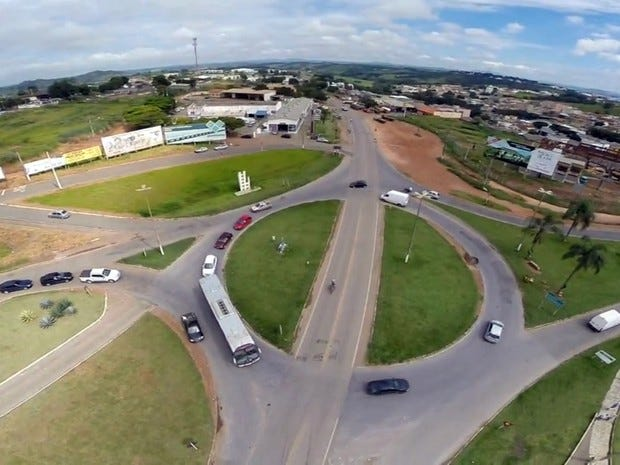
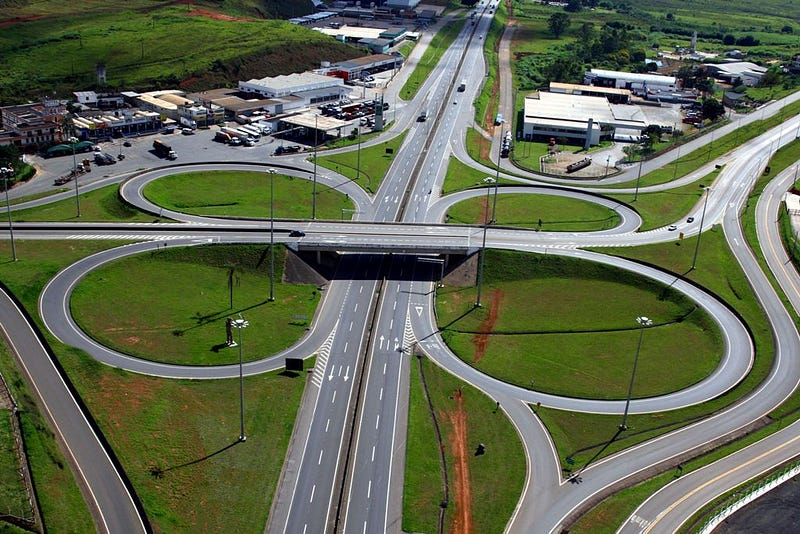

*Office Worker Hiding — Ferrantraite*

Today let's talk a bit about the management model we've adopted here at Ateliê de Software. Shall we find out what makes it different?

This is the interchange in Alfenas, a city in the south of Minas Gerais, Brazil, which connects the roads to Poços de Caldas, Varginha and Pouso Alegre, and also gives access to José do Rosário Vellano University (UNIFENAS).

*Interchange in Alfenas (MG)*

It's a very busy interchange: thousands of trucks, cars, motorcycles, bicycles and students pass through it every day. There are no speed bumps and no speed cameras. The road signage is poor. Everyone who goes through this interchange has to pay extra attention so as not to put their lives at risk.

Despite this scenario, it's an interchange where few accidents happen each year. This efficiency in terms of the number of accidents means there is no priority to improve it and make it safer for the people who go through it. Even so, everyone crosses this interchange in fear.

Since the risk of an accident is high, drivers have to slow down and people need to stay alert so they don't get hit by vehicles. Everyone puts energy and focus into getting across this interchange. It's always a tense moment for the people making that crossing…

This other interchange, on the other hand, is on the Fernão Dias Highway and connects the cities of Pouso Alegre and Itajubá.

*Interchange on the Fernão Dias Highway (Pouso Alegre — Itajubá)*

It's a different kind of interchange, with a structure designed to keep traffic flowing well while also keeping people safe. That's why this interchange also has a low accident rate.

However, unlike the Alfenas interchange, which achieves its low number of accidents through people's fear, the Fernão Dias interchange gets the same result through its structure. So everyone can cross it calmly and with confidence.

**But what does this have to do with how companies are managed?**

These interchanges help us understand companies' management models. While some companies use fear and tension to control people and ensure the work gets done efficiently, others create environments where trust and calm are the foundation of the management model.

Companies that adopt **fear-driven management** suffer from low engagement at work. People constantly work in fear of being reprimanded, fear of being fired, fear of being rebuked if they propose something different, and fear of being held accountable for work that depends much more on collective effort than on individual effort. Meanwhile, these are the very same companies that ask people to think "*outside the box*", expecting them to innovate despite the fear.

Companies that bet on **trust-driven management**, on the other hand, cultivate psychological safety in the workplace and believe that everyone is there to achieve a grand goal that no one could reach alone. These companies seek to value people and bring them together around a strong purpose, sharing a similar set of principles and values. Companies like these choose autonomy and collaboration as social technologies to replace command and control based on threats. As a result, teamwork, innovation and superior performance become a natural consequence of these choices.

To wrap up, something to reflect on: How is management at your company? Is it driven by fear or by trust? What kind of "interchange" are people crossing at work?
