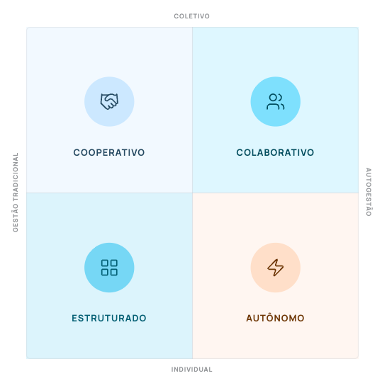

*Image created with Gemini (Nano banana 2) — Team vs. Group*

In the [previous article](/en/articles/cognitive-coherence/), I defined **Cognitive Coherence** as the functional compatibility between the individual's cognitive architecture and the organization's architecture of power and communication. I argued that this compatibility shows up in the first dimension of the model I am proposing, the **degree of autonomy** the environment demands, which ranges from hierarchical command to full self-management and is captured by three empirically validated dimensions: discomfort with ambiguity, moral absolutism and need for complexity / novelty.

But Cognitive Coherence is not limited to the dimension of autonomy. It operates simultaneously on a second dimension, one that is often underestimated or confused with the first: the **mode of coordination** the work requires.

## Group and team are not synonyms

The literature on organizations and self-management often treats group and team as interchangeable terms. In practice, however, these words describe structurally distinct modes of coordination. The distinction, even if it may seem semantic, is central to understanding why certain work arrangements work for some people and wear others out.

A **group** is a set of people who share a space, an identity or a general purpose, but whose members work in a predominantly independent way. Individual goals may be similar or complementary, but there is no mandatory operational interdependence. If one member is absent, the others keep operating without significant structural impact. Satisfaction in a group comes from social belonging, mutual support and the exchange of knowledge, benefits that do not depend on intensive coordination.

A **team**, by contrast, shares a goal that requires interdependence. The work is structured so that members depend on one another's *inputs* and *outputs*. There is continuous coordination, shared responsibility and a collective identity tied to the result. If one member fails, the entire system is affected.

A concrete example helps pin down this difference. Researchers in the same lab can function as a group: each one runs their own study, shares findings in seminars, but produces independently. A surgical team, on the other hand, operates as a team: every move depends on the other, one person's mistake compromises everyone and the result only exists in the coordinated action of the whole. Both arrangements can occur in organizations that present themselves as "collaborative", but they place radically different demands on the people who inhabit them.

## The interdependence tax

This distinction between modes of coordination is decisive for diagnosing *P-O Fit* (*person-organization fit*) because each mode imposes a different cognitive cost. Teamwork requires constant alignment:

- syncing schedules;
- communication rituals;
- managing interpersonal conflicts;
- compensating for members who do not contribute proportionally;
- the emotional burden of keeping relationships productive under pressure.

This cost is the **interdependence tax**: it is paid disproportionately by the individual, while the benefits of coordination (higher aggregate productivity, emergent innovation, distribution of risk) are captured predominantly by the organization.

Organizational research supports this idea under different names. Organ (1988), in formalizing the concept of **Organizational Citizenship Behavior**, recognized that much of the work that makes teams function is invisible, unpaid and voluntarily taken on by the most relational members. Edmondson (1999), studying **psychological safety** in surgical teams, showed that maintaining active transparency and a willingness for constructive disagreement requires sustained emotional energy. Martela and Nandram (2025), analyzing the Buurtzorg model, documented that self-management does work in teams, but only when members internally distribute lateral coordination roles such as planning, communication, mentoring and social bridging. Across all these studies, the common point is that interdependence produces real value, but it is not free for those who sustain it.

For some cognitive profiles, this tax is bearable and even energizing. For others, it is exponentially heavier. A professional who needs long blocks of concentration, or whose processing style works best in continuous, uninterrupted flows, can be extraordinarily productive working independently within a group, yet see their performance drastically reduced when forced to operate in a team with frequent alignment rituals, chat interruptions and daily sync meetings.

This does not mean these people are incapable of working in a team. It means that the mode of coordination imposed by the environment needs to be coherent with the individual's processing profile. What changes is not the value of the contribution, but the energy cost of producing it.

## Three dimensions of orientation toward coordination

Just as **Readiness for Autonomy** can be broken down into empirically anchored dimensions, the individual's orientation toward interpersonal coordination can be too. In the model I propose, it is articulated in three independent but complementary constructs, grounded in the literature on the **Big Five** (Costa & McCrae, 1992), **Psychological Safety** (Edmondson, 1999) and **Lateral Coordination in Decentralized Systems** (Martela & Nandram, 2025):

1. **Social Agreeableness:** The preference for, and the energy for, collective interaction. People with high social agreeableness experience life in a team as a source of energy: meetings, conversations, negotiations and collaborative dynamics fuel their engagement. People with low social agreeableness, without this implying any deficit, experience the same interaction as a drain on energy, preserving their productivity when they have room to work in a more isolated way.
2. **Ethical Integrity and Informational Transparency:** The willingness to proactively share information, mistakes, doubts and lessons learned. This dimension is less obvious than it seems. In horizontal organizations, the strategic withholding of information works as a systemic poison: it erodes trust, stalls the agility of circles and creates invisible asymmetries of power. Transparency, in this context, is not a declared value, but a daily practice that takes courage and effort.
3. **Systemic Empathy and Organizational Citizenship Behavior.** The proactivity to help peers without being ordered to by a superior or having it formalized in a process. It is what shows up when someone spontaneously takes on facilitating a tense meeting, covers for an overloaded colleague or reorganizes an information flow without being asked. This dimension is what keeps self-managed teams cohesive in the absence of hierarchical coordination.

The combination of these three dimensions defines what the *P-O Fit* model calls **Social and Ethical Intelligence**, the construct that positions the individual on the second axis of the matrix. High agreeableness, high transparency and high systemic empathy make up a profile with a strong interdependent collaborative orientation. The opposite profile is neither antisocial nor selfish: it is simply oriented toward independent contribution within a collective, which makes up a different mode of coordination, not an inferior one.

This is where an important clarification is in order. A highly sociable individual who withholds strategic information operates in a qualitatively different way from an equally sociable individual who is also transparent. That is why the social dimension cannot be reduced to sociability: it also includes the willingness to operate in open information systems. Being likable is not enough if it comes with opacity.

## Misalignment is also asymmetrical in this dimension

In the previous article, I also argued that misalignment in the dimension of autonomy is not symmetrical: its costs differ depending on the direction of the mismatch. The same happens here.

A person with a strong interdependent collaborative orientation, placed in a predominantly isolated work environment or in a group without coordination rituals, experiences **relational isolation**: they feel disconnected from the collective, lose energy because what fuels them is missing, and often move to other, more social organizations, even for lower pay or prestige.

A person oriented toward independent contribution, placed in a team with intense sync rituals and pressure for constant interaction, experiences **coordination fatigue**: they wear themselves out in the effort to keep up a social performance, lose productive time in meetings they see as excessive and grow resentful of their own work, even if they like what they do.

Both misalignments produce the same surface symptoms that organizational literature usually lumps together as **low engagement**: lower productivity, higher absenteeism and loss of initiative. The structural cause, however, is the opposite, and treating them with the same recipe (more meetings, more rituals, more integration culture) tends to make the problem worse for those already overloaded with interaction.

## The complete Cognitive Coherence matrix

With both dimensions defined, **Self-Management** on the horizontal axis and **Coordination** on the vertical axis, it is possible to sketch the complete map on which the *P-O Fit* model operates. Every individual sits somewhere on this map, and so does every organization. The coherence between the two positions is what determines the quality of the fit.

*P-O Fit Matrix: Autonomy vs. Coordination*

Four broad territories emerge from this intersection. The top right corner holds environments of **fully collaborative self-management**, with high individual autonomy and high team interdependence. The bottom right corner represents **independent self-management**, with equally high autonomy, but more lateral and less interdependent coordination. The top left corner corresponds to **collaborative traditional management**, with clear hierarchical authority and a strong team spirit. The bottom left corner brings together structures of **specialized traditional management**, with well-defined roles and predominantly individual work within a group coordinated by leadership.

These four territories are not moral categories, they are functional configurations. Successful organizations exist in all of them. People who thrive exist in all of them. What rarely works is placing a person in a territory incompatible with their cognitive architecture and then interpreting the resulting friction as an individual problem.

In the next article, I will detail how the model translates these dimensions into four operational indices (**IPA** — Readiness for Autonomy Index; **IRCC** — Resilience and Cognitive Load Index; **IISE** — Social and Ethical Intelligence Index; and **IPC** — Cognitive Processing Index) that turn the theoretical concept of Cognitive Coherence into something measurable, comparable and actionable for organizations and people.

## Something to reflect on

Think about the work you do today. Does it happen predominantly as a group or as a team? Are the coordination rituals your company adopts (daily meetings, retrospectives, real-time synchronous communication) coherent with the actual nature of the interdependence between you and your peers?

Now widen the question. When you think of the people around you, how many do you believe would be more productive if the environment allowed more room for independent contribution? And how many, on the contrary, are trying to survive in an environment that expected more interdependent collaboration from them than their cognitive profile can bear without burning out?
