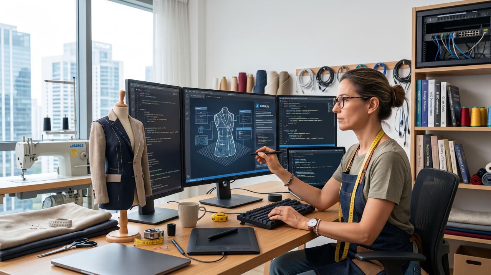

*An analogy between the Digital Artisan and the work in a Sewing Atelier (image generated with Gemini)*

> The Digital Artisan must combine human experience, AI agents and method to produce more and better, without giving up context, judgment and responsibility for quality.

Whoever walks into a sewing atelier usually notices the machines first. Some cut fabric in several layers at once. Others make thousands of stitches per minute, embroider complex designs or precisely repeat an entire sequence of movements.

However, none of these machines chooses the right fabric, understands the body of the person who will wear the garment or notices that a pattern needs adjusting. Quality still depends on the experience of whoever designs, tries things out, watches how the garment falls and fixes the finish.

An advanced machine lets a good professional produce more in less time. But it is knowledge of the craft that turns speed into quality.

This is similar to what is happening with the use of artificial intelligence in software development.

The models have become far more capable. They write code, analyze systems, create tests, investigate problems and work for hours on a single task. However, having access to a powerful tool still does not turn someone into a good software developer or designer.

Between the capability of the machine and the quality of the result lies the work of the **Digital Artisan**.

## The experience that guides the machine

An experienced artisan does not become less capable because they started using a better machine. Part of their knowledge simply moves somewhere else.

Their experience shows up in the choice of materials, in the construction of the pattern, in the assembly sequence, in the tuning of the equipment and in the criteria used to evaluate the finish. The tool carries out part of the work, but the professional is still designing the system that will produce the piece.

The same happens with **AI-assisted software development**.

The Digital Artisan understands the problem, knows the possibilities and limitations of the technology and creates the conditions for AI to produce a reliable result. They turn experience into context, instructions, constraints, tests and quality criteria.

Their work goes beyond writing a good prompt. They have to decide what will be built, how the agent should work, which actions are authorized, how the result will be verified and at what point a person should take over the decision.

Calling this professional an artisan also does not mean defending work that is improvised, slow or dependent on individual talent. After all, every good atelier has a working method.

The difference lies in the relationship with the process. In a factory, the process tries to reduce work to repeatable movements. In an atelier, the process expands the professional's ability to deal creatively with the particulars of each piece without giving up quality.

This is the point where the conversation about AI stops being just a conversation about models.

## From code generation to software development

Asking an AI to write a function is relatively simple. Entrusting it with a development task demands much more.

The agent needs to understand the product, know the architecture, respect the project's conventions, stay within the requested scope, create tests, check its own work, record decisions and know when to stop.

This environment currently goes by the name of ***harness***.

The term can be understood as a control structure around the model. It brings together instructions, context, tools, memory, tests, permissions, execution limits and observation mechanisms.

The formula is simple:

> Agent = model + harness

The model offers the capacity for reasoning and generation. The harness turns that capacity into a work process that is bounded, verifiable and open to learning.

In an atelier, we can think of the model as a sophisticated machine. The harness, in turn, brings together the patterns, the measurements, the organization of the workbench, the safety rules and the criteria used to examine each piece before delivery.

A Digital Artisan designs this environment.

## Guides, sensors and finish

A harness has elements that guide the agent before execution and mechanisms that check the result after it has worked.

Guides try to prevent known errors. Project instructions, architectural rules, examples and scope limits help the agent understand what it should do.

Sensors reveal problems the guides could not prevent. Automated tests, validators, static analysis, code review and human evaluation make it possible to identify failures and feed information back for a new attempt.

In a sewing atelier, the pattern guides the cut before it happens. The fitting reveals the adjustments needed after the parts have been assembled.

On their own, these mechanisms are not enough. A correct pattern does not guarantee that the sewing was well done. Examining the finish without a reliable pattern turns each piece into an improvised attempt.

The combination of guidance and verification creates a cycle of **execution**, **learning** and **correction**.

## The Ateliê's method turned into a harness

The name [Ateliê de Software](https://www.linkedin.com/company/atelie-de-software/) was chosen to express a specific way of understanding development: a combination of art and engineering, technique and creativity, experimentation and learning.

That choice has always stood in opposition to the traditional software factory model. Our [journey in search of agility](https://pt.linkedin.com/pulse/uma-jornada-em-busca-da-agilidade-atelie-de-software-4el0c) brought together practices from management, engineering, business analysis, UX Design and workflow organization.

Now we are bringing this knowledge into AI-assisted software development.

We have built, and keep evolving, an internal harness that turns more than 15 years of experience in software development and agility into procedures that agents can execute.

This environment is part of our teams' everyday work, and its results have already reached our clients' projects. They benefit from a faster development flow, with quality checks built into the process and more human attention on the decisions that truly require experience.

Our harness records the technical context of each project, creates specialized agents according to the architecture it finds and organizes flows for discovery, planning, implementation, testing, security, review, QA and documentation.

Before implementing a more complex task, the system checks whether there is enough context and whether there is a technical plan. The work can be broken down into smaller tasks, each with its scope, files involved, validation commands and expected results.

Tests are written before and during implementation. Specialized reviewers evaluate the result.

Actions that can change shared environments are given specific limits. The goal is to allow the agent to recognize when it does not have safe conditions to continue.

This principle guides much of our work:

> The autonomy of agents must be proportional to risk.

Tasks that are predictable, reversible and verifiable can receive more autonomy. Decisions with architectural, financial, legal or security impact, or that affect people, require human judgment.

The Digital Artisan does not hand their responsibility over to the tool. They decide where the tool can act on its own and where human experience needs to come back to the center of the process.

## When knowledge becomes part of the system

An experienced person recognizes problems that a beginner might not even notice. They know that certain fabrics stretch, that certain cuts require extra seam allowance and that a specific finish will not work on that piece.

Much of this knowledge tends to stay in the artisan's head.

The same happens in software teams. Architectural decisions, ways of investigating problems, review criteria and security precautions often live in people's memory or in conversations that get lost.

AI-assisted development creates an opportunity to make part of this knowledge explicit and reusable.

Our harness tries to turn experience into operational memory. Project maps, plans, decisions, reports, acceptance criteria and review results are preserved as artifacts. That way, a new run can start from the accumulated knowledge, without depending only on the memory of whoever took part in the previous conversation.

When an agent makes a mistake, we try to change the environment to prevent that class of failure from happening again. Sometimes that means writing a better instruction. In other cases, the right solution is a test, a validator or a technical constraint.

Feedback stops correcting just one delivery and starts improving the system that will produce the next ones.

## A human-agentic atelier

The harness already embodies part of this vision, but we still have important questions to answer.

We are evolving an architecture capable of observing the evidence produced by the work, controlling permissions and costs, evaluating the quality of the agents and linking technical decisions to business goals.

We also want to prevent observability from turning into surveillance of people. Number of commits, lines of code, tokens consumed or hours online are easy measures to collect, but they can encourage bad behavior.

Metrics need to favor the team's flow, quality, risk and delivered value.

There are capabilities that still need to mature, such as telemetry, security policies, automated evaluation of the procedures themselves, data classification and centralized permission control. Recognizing these limits is part of using the technology professionally.

## Experience is still the differentiator

There is a hasty reading according to which AI will reduce software development to describing wishes in natural language. Our practical experience points to a more demanding reality.

The more code an agent can produce, the more important the clarity of the goal, the architecture, the acceptance criteria, the scope limits and the verification mechanisms become.

The experienced professional can spend less time on repetitive execution, but takes on greater responsibility for the system that guides that execution.

That is the combination the term Digital Artisan tries to name: someone who masters their craft, understands the tool and knows that quality depends on judgment. AI extends their hands, but experience keeps guiding the work.

## Questions to reflect on

- What part of your team's knowledge still lives only in the heads of your most experienced professionals?
- Which agent errors keep being fixed by hand, without improving the next process?
- How can we use more advanced tools to produce better, without giving up responsibility for what we deliver?
