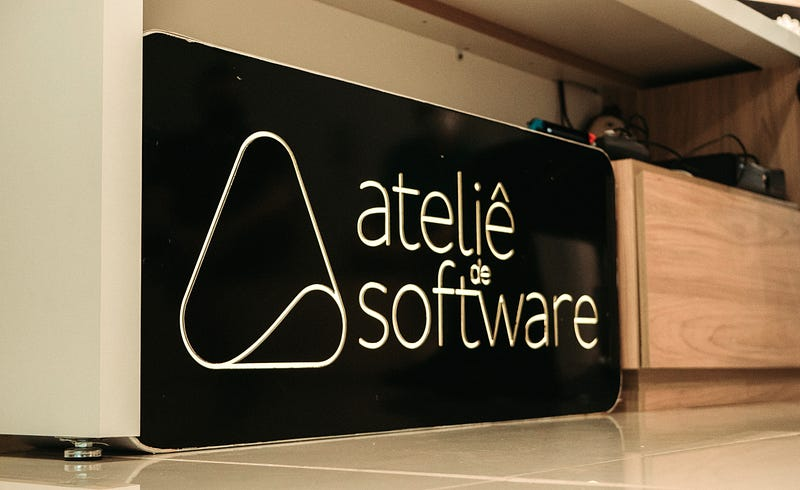
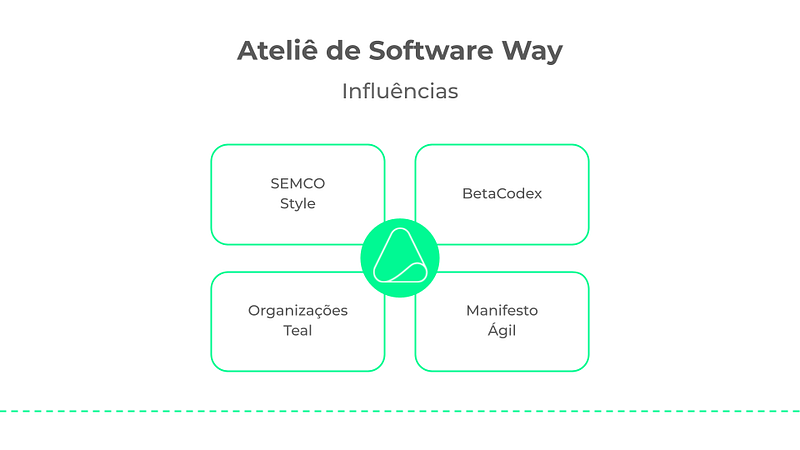

> After many conversations with clients, partners and friends who wanted to understand how we work, we decided to share the Ateliê de Software management style publicly.

> Our goal is to inspire other organizations that want to put modern management approaches into practice, based on transparency and autonomy, and to foster a more flexible and collaborative work environment.

> *➔* This is the 1st of 4 articles. It offers an introduction and also presents the main influences on our management style.

## Introduction

[Ateliê de Software](https://www.ateliedesoftware.com.br) is a company in the [Webgoal](https://www.webgoal.com.br) group dedicated to custom software development. The name was chosen to reflect our view of how software development work should be approached: a combination of art and engineering; technique and creativity; experimentation and learning. It is the opposite of the traditional software factory model.

From the start, Ateliê de Software stood out for its **distributed management**, for **autonomous teams** made up of multidisciplinary professionals and for its use of methods such as **Scrum, XP and Kanban** to adapt to market changes and make sure projects met clients' expectations and users' needs.

The Ateliê de Software **management style** (affectionately called the *Ateliê de Software Way* here) is the result of a **journey of more than 15 years of experimentation, learning and continuous adaptation**. It reflects a philosophy of work and a way of thinking and acting that sets it apart from conventional management models based on command and control.

Our approach is not just a response to market demands, but a conscious way of creating a workplace where human potential is maximized and where teams can organize themselves to **deliver the best value to our clients**.

### Style vs. Model

The distinction between a management "*model*" and a management "*style*" is fundamental to understanding the **Ateliê de Software Way**. While a management model is something more rigid, standardized and replicable, a management style is more flexible, adaptable and unique to each organization.

A management model can be compared to a manual or a recipe, offering defined, structured steps that can be applied to many companies regardless of the context or the people involved. A management style, on the other hand, is more fluid and organic, reflecting an organization's culture, experiences and values.

> A management style is a flexible, personalized approach, shaped by the culture, values and experiences of the people who make up an organization.

Just as one person's lifestyle can't simply be copied by someone else (because every individual has unique characteristics, different contexts and specific needs), a company's management style is the result of its environment and its history.

For example, a healthy lifestyle can inspire other people to take care of their own health, but the path each of them takes to reach the same goal will be different, because each person has a body, a routine and a relationship with health that are unique.

In the same way, the **Ateliê de Software Way** is not a "model" that can be "copied and pasted" into another organization, but a management style based on **transparency**, **autonomy** and **collaboration** that has evolved over time, influenced by the values and experiences of the people at the Ateliê. It's not a standard to be followed, but a path to be walked.

## Main influences

Our management style is strongly influenced by [**Semco's democratic management style**](https://semcostyle.com/), by the principles of the [**BetaCodex**](https://betacodex.org/) from the *Beyond Budgeting* movement, by the characteristics and practices of [**Teal Organizations**](https://reinventingorganizationswiki.com/en/theory/teal-paradigm-and-organizations/) and by the values and principles of the [**Agile Manifesto**](https://agilemanifesto.org/).

Together, these influences form a foundation for building an organizational system where **power is distributed**, **decisions are decentralized** and the focus is on **purpose and the development of people** to generate superior results.

Each of the influences that shaped the **Ateliê de Software** management style brought important elements to building a way of working that is genuinely people-centered. They are grounded in innovative management philosophies and put into practice through the agile methodologies that have emerged over the last few decades, challenging traditional models of work.

### Semco's Democratic Management

The democratic management conceived and practiced at Semco, under Ricardo Semler's leadership, had a profound influence on Ateliê de Software.

The *Semco Style* was born in Brazil in the 1980s, against a backdrop of economic crisis and political change. When Semler took over his father's company, he chose to break with traditional hierarchical structures and adopt a more horizontal approach, in which employees had the autonomy to make decisions about their work routines, their salaries and even the hiring of new colleagues.

The fundamental principles of Semco's democratic management are:

- **Autonomy and participation**: everyone has an active voice in decisions, from operational to strategic ones;
- **Radical transparency**: financial and operational information is widely shared;
- **Self-management**: teams are responsible for managing their own schedules and goals, without the need for constant supervision.

At the Ateliê, this influence shows up in financial openness, in collective participation in strategic decisions and in teams' autonomy to manage their own activities and projects. A culture of transparency and freedom is central to our management style, one in which people have the power to directly influence the company's direction.

### BetaCodex and Beyond Budgeting

The BetaCodex is an organizational transformation movement based on the principles of *Beyond Budgeting*, created in the early 2000s by thinkers such as Niels Pflaeging and Jeremy Hope.

This movement emerged out of dissatisfaction with traditional structures of financial control and planning, which were seen as ineffective in fast-changing environments. *Beyond Budgeting* questions the need for fixed annual budgets and advocates for a more agile, flexible kind of management, able to respond efficiently to changes in the market.

The fundamental principles of the BetaCodex include:

- **Decentralized control**: decision-making power is distributed to the operational teams that create value for the market;
- **Adaptability**: the organization must be able to adjust quickly to external changes;
- **Continuous planning**: instead of fixed budgets, management uses relative indicators to adjust goals as needed.

At Ateliê de Software, these principles are applied in practice through the absence of rigid hierarchies and through teams' freedom to allocate resources and adjust strategies according to what projects demand. There are no fixed budgets or unchangeable plans, which allows for an agile, efficient response to clients' needs and to market changes.

### Teal Organizations

The concept of *Teal* organizations was popularized by Frederic Laloux in his book "Reinventing Organizations" (2014).

The concept appeared at a time when many organizations were looking for alternatives to traditional management models, which are based on hierarchical, authoritarian structures. Laloux argues that companies can evolve into a form of organization more aligned with human nature, which he calls *Teal*. This kind of organization is characterized by self-management, evolutionary purpose and the pursuit of wholeness at work.

The principles of Teal organizations include:

- **Autonomy and Emergent Leadership**: Leadership is distributed, and teams are free to make decisions without depending on a formal manager;
- **Evolutionary purpose**: The organization is seen as a living organism, whose purpose evolves according to changes in its environment;
- **Wholeness**: People are encouraged to bring their whole selves to work, including their personal values, emotions and creativity.

At the Ateliê, the principles of self-management and emergent leadership are fundamental pillars of the organization. There is no formal supervision, and teams self-organize according to what projects demand. The Ateliê also values the well-being of its professionals, encouraging a culture in which people feel comfortable being themselves at work.

### The Agile Manifesto

The Agile Manifesto, published in 2001 by a group of 17 software development experts, including names such as Kent Beck, Robert C. Martin and Martin Fowler, revolutionized the way software is developed.

The Manifesto was created in response to traditional project management methods, which were seen as bureaucratic, slow and inefficient in an environment of high uncertainty and constant change. The agile movement proposed a more flexible approach, in which collaboration and rapid adaptation are priorities.

The core values of the Agile Manifesto are:

- **Individuals and interactions over processes and tools**: open communication and the relationships between people matter more than adherence to rigid processes or tools;
- **Working software over comprehensive documentation**: the focus is on delivering functional software that generates value, rather than spending a lot of time on detailed documentation as a guarantee of results;
- **Customer collaboration over contract negotiation**: the client is an active partner in the development process, and requirements should be adjusted together throughout the project as needed;
- **Responding to change over following a plan**: the ability to adapt quickly to new circumstances or information is valued more than strict adherence to a fixed, predetermined plan.

At Ateliê de Software, these values (as well as the [12 principles of the Agile Manifesto](https://agilemanifesto.org/principles.html)) are deeply woven into the company's culture. Multidisciplinary teams work collaboratively, always adjusting their work to clients' needs and to market changes. Agile management allows teams to respond quickly to new information, keeping an iterative, adaptive approach across every project.

Beyond the Agile Manifesto, Ateliê de Software relies on a number of management and software engineering methods, such as **Scrum, Kanban and Extreme Programming (XP)**, which make up [its journey in search of agility](https://share.atelie.software/uma-jornada-em-busca-da-agilidade-1aea10303dbd). These methods allow the Ateliê to maintain a high level of quality in software development, while fostering an environment of continuous collaboration and rapid response to change.

---

## The management style at Ateliê de Software

- Part 1: Introduction and main influences
- [Part 2: Values, assumptions and principles](https://share.atelie.software/o-estilo-de-gest%C3%A3o-do-ateli%C3%AA-de-software-parte-2-afa58ec674e3)
- [Part 3: Organizational structure and management practices](https://share.atelie.software/o-estilo-de-gest%C3%A3o-do-ateli%C3%AA-de-software-parte-3-42119df11601)
- [Part 4: Results and challenges](https://share.atelie.software/o-estilo-de-gest%C3%A3o-do-ateli%C3%AA-de-software-parte-4-97ca2795b16a)
