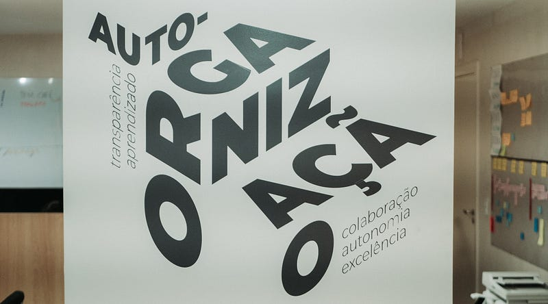
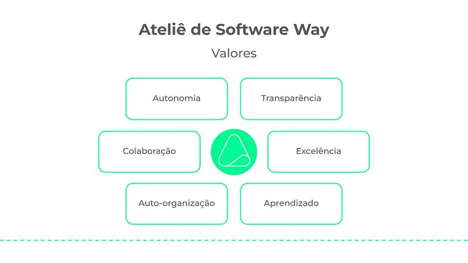
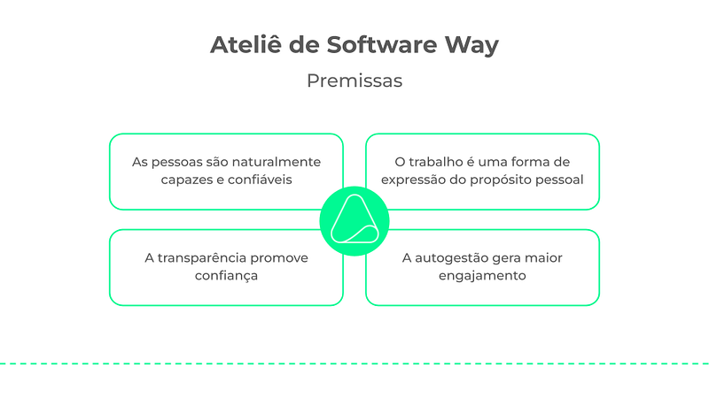

Values, principles and premises

> After many conversations with clients, partners and friends interested in understanding how we work, we decided to share the management style of Ateliê de Software publicly.

> Our goal is to inspire other organizations looking to implement modern management approaches, based on transparency and autonomy, fostering a more flexible and collaborative work environment.

> *➔* This is the 2nd of 4 articles. It presents the essence of our management style based on our values, principles and premises.

## Our essence

The essence of the **Ateliê de Software Way** is built on a view in which **people are not seen as the organization's most valuable asset, but as the organization itself**, where the work environment serves the development of autonomy, encouraging collaboration and creating opportunities for personal and professional growth.

Our essence is represented by fundamental **values, principles and premises** about management and how people act in the organization, as well as about the meaning of work itself, forming the foundation on which every decision, practice and relationship is structured.

This set of values, principles and premises was not formally defined when Ateliê de Software was founded. On the contrary, it emerged naturally over the years, as a result of the evolution of its own organizational culture.

### Values

Our values represent the fundamental beliefs that **guide behavior** and decisions within Ateliê de Software. They reflect what is important and desirable for our organizational culture, serving as a **moral or ethical guide for everyday actions**.

The 6 values of the **Ateliê de Software Way** are:

1. **Autonomy**  
   Doing the work that needs to be done in the way each person believes is best, considering the consequences of that choice for coworkers, for our business and for the client's business.  
   ➝ *Underlying values: freedom, responsibility and respect*
2. **Collaboration**  
   Doing the work together with other people to co-create solutions, share knowledge, develop new skills and achieve higher-quality results.  
   ➝ *Underlying values: empathy, communication and teamwork*
3. **Self-organization**  
   Finding the best way to work collectively, respecting rules and constraints, and trusting people's ability to achieve results that no one could achieve alone.  
   ➝ *Underlying values: emergent leadership, purpose, experimentation*
4. **Transparency**  
   Being open and honest in intentions, decisions and actions, allowing other people to see and understand what is happening, and favoring dialogue to deal with conflict.  
   ➝ *Underlying values: trust, integrity and honesty*
5. **Excellence**  
   Having full mastery of what we do and of the knowledge and skills needed to carry out our work, delivering first-rate services and products to our clients.  
   ➝ *Underlying values: ownership, feedback and continuous improvement*
6. **Learning**  
   Learning new concepts, techniques and tools to increase the effectiveness and efficiency of the work, putting new skills into practice and sharing knowledge and experience.  
   ➝ *Underlying values: mastery, curiosity and courage*

Over the years, these beliefs have been refined and strengthened by daily practice and by the ongoing collaboration among all the members of our team. These are the values that ensure the Ateliê maintains a healthy, innovative and adaptable work environment, always focused on personal growth, on delivering value to the client and on collective evolution.

### Premises

Our premises are assumptions we take as true to **ground our thinking and actions** within Ateliê de Software. They are the foundation on which the work model and the organizational practices are built.

These are the 4 premises of the **Ateliê de Software Way**:

1. **People are naturally capable and trustworthy**  
   *We believe that, when given the right conditions, people can make smart and productive decisions.*
2. **Work is a form of expression of personal purpose**  
   *Every task goes beyond technique, reflecting the creativity, values and identity of the person who carries it out, making work a meaningful expression of each individual's purpose.*
3. **Transparency builds trust**  
   *By sharing all information with people and teams, we allow everyone to understand the organization's situation and to be fully engaged in decisions.*
4. **Self-management generates greater engagement**  
   *When people and teams have the autonomy to decide how to organize their work, they become more efficient, more effective and more committed to results.*

These premises not only reflect the way we see people and work, they also shape our approach to every project, process and relationship. They support our management philosophy and help us maintain a collaborative, productive and human-centered workplace.

### Principles

Our principles are broad guidelines derived from our values and premises. They are **practical guidance** that helps put the values into practice in a coherent and consistent way, providing a clear framework for how to act or make decisions within Ateliê de Software.

Our main activity is developing custom software for large companies and for the government. So the principles we have for carrying out this work are:

- **Decisions are made by those closest to the challenges**: *Those who are directly involved in the work have greater ownership to make the necessary decisions, fostering agility and accountability in action.*
- **Organizational transparency**: *Financial information and strategic and operational decisions must be accessible to every team member, fostering trust and active participation in decision-making.*
- **Leadership is emergent, not formalized**: *Leadership arises naturally according to the needs of the work, without fixed or hierarchical positions, valuing competence and contribution in each context.*
- **Continuous feedback to enable growth**: *Peer feedback must be constant, constructive and oriented toward personal and professional development, improving processes and collective performance.*
- **Mistakes are learning opportunities**: *Mistakes must be treated as a natural part of the process of growth and innovation, encouraging experimentation and continuous improvement.*
- **Purpose guides the work**: *Every action and decision must be guided by a common purpose, ensuring that each contribution has a meaningful impact for the client and for the organization.*
- **Collaboration over competition**: *Success must be built through joint work and co-creation, prioritizing cooperation among team members and the search for innovative solutions.*
- **Use of agile methods and agile software engineering practices**: *Projects must adopt agile methodologies and agile software engineering practices to ensure flexibility, efficiency, effectiveness and quality in what we deliver to clients.*
- **Teams dedicated to the client**: *Teams must be autonomous, made up of experienced, high-performing professionals, working in a stable and proactive way to deliver software solutions that meet our clients' needs with responsibility and excellence.*

These principles turn our values and premises into practical actions in the day-to-day life of Ateliê de Software, reinforcing the importance of an environment where autonomy, collaboration and technical excellence are hallmarks of our deliveries and results.

---

## The management style at Ateliê de Software

→ [Part 1: Introduction and main influences](/en/articles/the-management-style-at-atelie-de-software-part-1/)  
→ Part 2: Values, premises and principles  
→ [Part 3: Organizational structure and management practices](/en/articles/the-management-style-at-atelie-de-software-part-3/)  
→ [Part 4: Results and challenges](/en/articles/the-management-style-at-atelie-de-software-part-4/)
