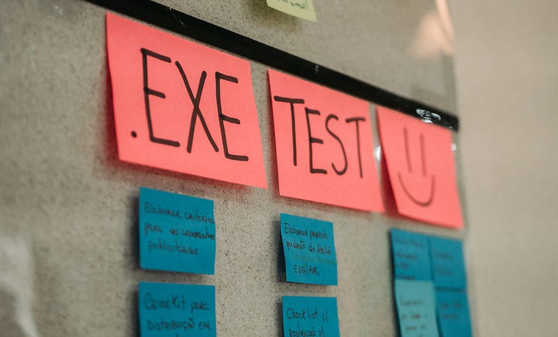
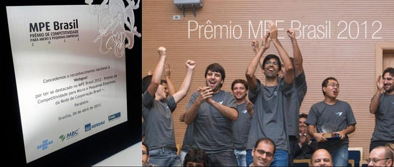
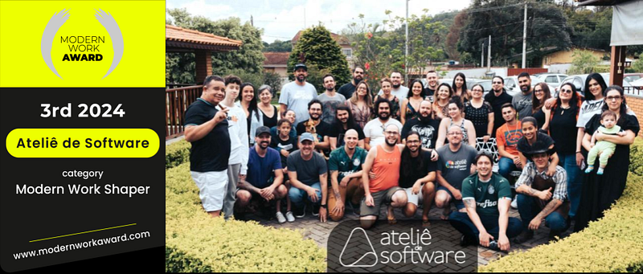
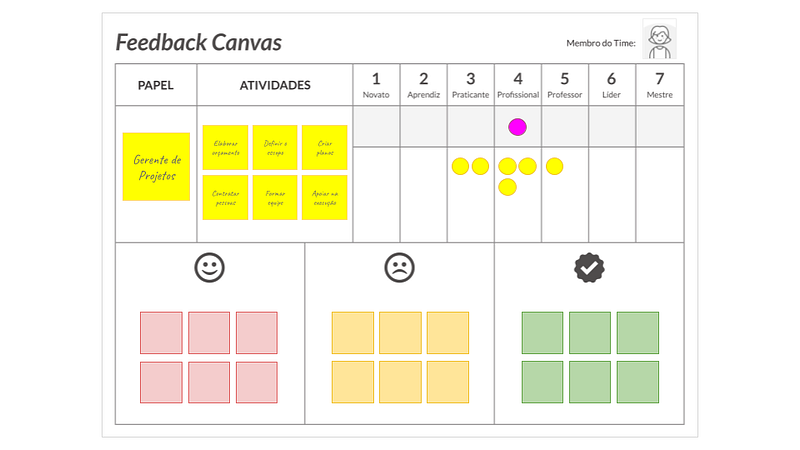

Results, recognition and challenges

> After many conversations with clients, partners and friends interested in understanding how we work, we decided to share Ateliê de Software's management style publicly.

> Our goal is to inspire other organizations looking to implement modern management approaches, based on transparency and autonomy, fostering a more flexible and collaborative work environment.

> *➔* This is the last in a series of 4 articles. It describes the results we have achieved and the challenges we have faced with our management style.

## Results

The ***Ateliê de Software Way*** has produced a series of positive results, both in people's development and in organizational and business results.

The way work and management are carried out creates an environment that **favors personal and professional growth, strengthens engagement and fosters a deep sense of satisfaction at work**.

More than an efficient and effective management approach, our management style also sets an important moral foundation, where **people are respected in their uniqueness and encouraged to develop their autonomy**.

### Personal and Professional Growth

By promoting autonomy and distributing responsibilities, we create opportunities that allow each person to be the protagonist of their own development.

> Ateliê de Software's management style allows people to grow.

Teams are encouraged to make decisions, solve problems creatively and contribute meaningfully to projects and other initiatives. This distributed power creates a culture of continuous learning, where people feel they are growing and acquiring new skills with every challenge they overcome.

The practice of constant feedback, combined with organizational transparency, offers regular opportunities to reflect on performance and professional development. This process, free of judgment, is focused on individual improvement, strengthening people's commitment to getting better within their teams.

### Engagement and satisfaction at work

The combination of transparency, autonomy and collaboration makes people feel truly responsible for the success of their projects and for the results delivered to clients.

> **Ateliê de Software's management style creates an environment that encourages people's engagement.**

This sense of belonging and responsibility not only drives high performance, but also brings a feeling of personal fulfillment. Teams are made up of individuals who feel valued for their contributions and have the freedom to innovate and make decisions connected to their talents.

On top of that, satisfaction at work is amplified by an environment of respect and welcome. At the Ateliê, people know that their opinions are heard, that they have an active voice in the organization and that their ideas can transform the way the company operates. This constant recognition strengthens the bond between professionals and the organization, creating a work environment where engaged and satisfied people are the norm, not the exception.

### Embracing diversity and developing autonomy

The decentralized structure and the focus on emergent leadership give room for people with different skills, perspectives and experiences to shine.

> Ateliê de Software's management style has the capacity to embrace and value diversity.

The absence of a rigid hierarchy and the encouragement of self-organization allow individual differences to be respected and used as a driving force for innovation. Diversity is celebrated, not only in terms of gender, ethnicity or origin, but also when it comes to ways of thinking and approaches to work.

Teams have the freedom to organize themselves in whatever way they consider most effective, and individuals have the opportunity to take on leadership roles as their talents emerge. This approach not only strengthens trust among team members, but also creates an inclusive space where each person feels they can contribute in a genuine and authentic way.

### The moral question: respect and freedom

Choosing a management style like Ateliê de Software's is not just a strategic business decision; it involves a deep moral dimension. By providing an environment where people are treated with respect, where diversity is valued and where autonomy is encouraged, the Ateliê affirms its commitment to human development in the workplace.

> Ateliê de Software's management style respects individuality and encourages personal development.

The freedom that runs through the work environment at the Ateliê always comes with responsibility. People are free to make choices about how they do their work, but they know those choices affect both their colleagues and the clients. This combination of freedom and responsibility reflects the mutual respect and trust that underpin the morality of this management style.

## Recognition

Ateliê de Software's innovative management style has been recognized and awarded over the years, establishing the organization as a reference in modern management practices.

### MPE Brasil Award (SEBRAE) — 2012

In 2012, Ateliê de Software, then still under the name [Webgoal](http://www.webgoal.com.br) (the holding company the Ateliê is part of today), received the **MPE Brasil Award**, promoted by SEBRAE, and was recognized as the best information technology company in the State of São Paulo. In addition to that award, the Ateliê also won the **Innovation Award**, standing out for the unique way it applied the principles of excellence and quality in management.

*Best IT Services company in the State of São Paulo and winner of the innovation award — MPE Brasil 2012*

What set the Ateliê apart from the other competing companies was its management approach, which, while meeting every excellence criterion listed by SEBRAE, implemented them in an unconventional way, breaking away from traditional practices and focusing on self-management, emergent leadership and continuous collaboration. This recognition highlighted the success of an innovative organizational culture aligned with the needs of today's market.

### Modern Work Awards — 2024

In October 2024, Ateliê de Software was awarded at the **Modern Work Awards**, an event that celebrates companies that are redefining the future of work. The Ateliê took 3rd place in the *Modern Work Shaper* category, which recognizes companies that not only adopt modern work practices internally, but also serve as inspiration and influence for other organizations around the world.

*Ateliê de Software took 3rd place in the Modern Work Shaper category*

The award reinforced the Ateliê's role as an organization that not only uses but leads the movement toward new forms of management. This prize further consolidated the Ateliê's reputation as a reference for companies looking to adopt more modern, collaborative and trust-based work models.

### Spreading the Feedback Canvas

Another significant contribution Ateliê de Software made to the market was the development of the [**Feedback Canvas**](/en/articles/feedback-instead-of-performance-reviews/), a tool created to make the feedback process easier in the context of teamwork.

*Feedback Canvas focused on performance in a specific role*

With the goal of making feedback more structured, accessible and useful, the Feedback Canvas quickly became popular among technology companies and came to be widely used to foster constructive conversations among team members.

The tool helped reinforce a culture of continuous, collaborative feedback in many organizations, promoting individual and collective development. Its large-scale adoption is a clear example of how Ateliê de Software has had an impact on the industry, not only through its internal practices, but also through tools that help other companies improve their management and work culture.

## Challenges

On the other hand, adopting the *Ateliê de Software Way* brought countless challenges, for the people as well as for the organization and its clients.

### Difficulties adapting, for people and clients

Not everyone can thrive in a management style that demands so much autonomy, responsibility and self-discipline. Some people prefer, or feel more comfortable in, work structures with clear hierarchies, where decisions are centralized and the path forward is set by formal leaders.

At the Ateliê, the absence of a rigid hierarchy and the constant need to make collective decisions can be seen as a challenge. Professionals who don't adapt to this level of freedom and shared responsibility end up struggling, and that can lead to frustration or disengagement. Some people need more guidance and clarity about their roles, which may not be so evident in a distributed organizational structure.

On the client side, the Ateliê's way of working may not be immediately understood either. Many clients come from traditional corporate environments, with rigid contracts and more top-down management, and had a hard time understanding and accepting the model of continuous, flexible collaboration practiced by the Ateliê's teams.

The expectation of tight control over deadlines and deliverables, for example, can create tension when it runs up against the Ateliê's adaptive and iterative approach, which prioritizes continuous adjustments according to how the project is going and the value generated for the client's business. This led to misaligned expectations and even to dissatisfaction among a few clients who couldn't adjust to a more agile style of project management.

### The challenge of shifting paradigms: mechanistic vs. organic

The mechanistic paradigm, widely adopted by traditional organizations, sees the company as a machine where each person plays a specific, predefined role, with clear rules and a chain of command that starts at the top and runs down the entire hierarchical structure. In this model, control and predictability are highly valued, and success is measured by how efficiently rigid processes are followed.

The organic model, on the other hand, like the one practiced at the Ateliê, sees the organization as a living system, where the interactions between people and the capacity for constant adaptation are essential to success. Teams are made up of individuals with multiple skills, who self-organize to solve problems collaboratively and creatively. In this context, leadership is emergent and fluid, and decisions are made collectively, based on the needs of the moment and on alignment with the organization's larger purpose.

This difference in paradigms can be challenging for many professionals who come from more traditional environments. The transition to a more organic style requires a shift in mindset, where autonomy and collective responsibility replace hierarchical control and direct supervision.

For some people, this change is exciting, while for others it represents significant discomfort, since the absence of a traditional structure can bring up feelings of insecurity or uncertainty. The need to adopt a more self-directed stance, less dependent on hierarchical orders, requires relearning how to see one's own work and one's own career.

### Conclusion

Ateliê de Software's management style reflects a journey of continuous evolution, where inspiring influences, solid values, principles and premises underpin every aspect of the organization.

With a self-managed structure and management practices that promote autonomy and collaboration, the Ateliê has achieved significant results, while facing and overcoming the challenges inherent to this way of working.

The experience gained and the culture built over the years establish the Ateliê as an example of how management based on trust and purpose can be successful and sustainable, serving as inspiration for other organizations looking for innovative and adaptable ways of working.

---

### The management style at Ateliê de Software

→ [Part 1: Introduction and main influences](/en/articles/the-management-style-at-atelie-de-software-part-1/)  
→ [Part 2: Values, premises and principles](/en/articles/the-management-style-at-atelie-de-software-part-2/)  
→ [Part 3: Organizational structure and management practices](/en/articles/the-management-style-at-atelie-de-software-part-3/)  
→ Part 4: Results, recognition and challenges
