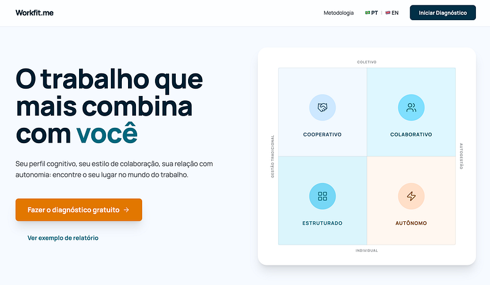

*Workfit.me — Diagnostic tool for the P-O Fit model I am proposing*

In the [previous article](/en/articles/standardized-management-in-a-world-of-diverse-minds/), I closed the conceptual argument of this series with a proposal: **recognizing people's cognitive diversity is not a concession to individual sensitivities, but the necessary next step in contemporary organizational design**.

---

### Articles on Cognitive Coherence and the P-O Fit Model

*To better understand the context of this text and the concepts of Cognitive Coherence and Person-Organization Fit, I recommend reading these articles:*

1. [When a person doesn't fit their work](/en/articles/when-a-person-doesnt-fit-their-work/)
2. [Cognitive Coherence: when the way you think, decide and act meets the way you work](/en/articles/cognitive-coherence/)
3. [The difference between a group and a team, and the invisible cost of coordinating work](/en/articles/the-difference-between-a-group-and-a-team-and-the-invisible-cost/)
4. [The four indices of Cognitive Coherence at work](/en/articles/the-four-indices-of-cognitive-coherence-at-work/)
5. [The P-O Fit Matrix and the 16 Places of Potential](/en/articles/the-p-o-fit-matrix-and-the-16-places-of-potential/)
6. [Cognitive Coherence and the Onboarding Model in Organizations](/en/articles/cognitive-coherence-and-the-onboarding-model-in-organizations/)
7. [Standardized management in a world of diverse minds](/en/articles/standardized-management-in-a-world-of-diverse-minds/)

---

It is a broad argument, with ethical and strategic implications. At the same time, it is an argument that risks staying in the realm of rhetoric if it does not come with instruments that make it operational.

That concern is what gave rise to **WorkFit.me**, a platform I am developing to turn my proposed P-O Fit model into something anyone can use. This article introduces the tool: what it is, how it works, what it delivers and how you can access it.

## A tool to make the invisible visible

The core idea behind WorkFit.me is simple: to give anyone the chance to discover their **Place of Potential** based on a psychometrically grounded methodology, at no cost.

The platform is provisionally available at <https://po-fit.vercel.app/> and fully implements the P-O Fit model presented throughout this series of articles.

Making the model available for free is intentional. Organizational diagnostic instruments tend to be restricted to expensive consulting firms and closed corporate processes, which produces an obvious paradox: the people who most need to understand their compatibility with a work environment are precisely the ones with the least access to this kind of information. That is why I want to make self-knowledge about organizational fit an accessible resource for any professional who wants to better understand themselves and the context they work in.

## The user journey

From the point of view of someone accessing the platform, the experience is straightforward. The user answers a 36-item questionnaire, spread across 12 cognitive blocks that correspond to the structural dimensions of the model. Each item was carefully built to measure an observable behavior at work, not to capture declared values or abstract preferences.

*Workfit.me — 36-question questionnaire for diagnosing the cognitive profile*

The questionnaire takes no more than 10 minutes to complete. At the end, the system applies the model's full algorithm: it calculates the averages of the 12 blocks, derives the four indices (IPA, IRCC, IISE and IPC), places the user on the P-O Fit Matrix (Autonomy × Collaboration), identifies their Place of Potential among the 16 profiles, detects the Universal Design flags and signals any risk personas worth watching.

*Workfit.me — Architecture of the algorithm for assessing the indices, classifying the profile and choosing the onboarding approach*

The result is delivered as a personalized report, written in accessible language and oriented toward action. No definitive labels about "who you are." The report translates the diagnosis into descriptions of where the person tends to thrive, the kind of communication they process best, the level of autonomy suited to their profile and the onboarding model that would make the most sense if they were joining a new organization today.

## A three-layer architecture

Behind the simplicity of the user experience, WorkFit.me rests on a three-layer architecture.

The first is the **psychometric layer**, grounded in validated constructs from the scientific literature. The IPA (Readiness for Autonomy Index) draws on Deci and Ryan's Self-Determination Theory (2017) and on Rotter's classic construct of locus of control (1966). The IRCC (Resilience and Cognitive Load Index) integrates the three dimensions of the MSTAT-II by Lauriola et al. (2016) and correlates inversely with Big Five Neuroticism (Costa & McCrae, 1992). The IISE (Social and Ethical Intelligence Index) combines the Big Five dimension of Agreeableness with Edmondson's concept of Psychological Safety (1999) and with the literature on lateral coordination in decentralized systems (Martela & Nandram, 2025). The IPC (Cognitive Processing Index) draws on the *strengths-based* perspective on neurodiversity of Doyle (2020) and the CIPD (2024). Each item in the questionnaire was mapped to these constructs through a systematic review of the literature.

The second is the **algorithmic layer**, which translates answers into a classification. This layer applies explicit, replicable rules: formulas for calculating the indices, trigger conditions for flags and personas, precedence criteria among profiles and tie-breaking criteria when multiple conditions seem to be met. All of these rules are documented and can be audited. The choice of a transparent algorithm, instead of a "black box" based only on opaque statistical models, is deliberate. The user and the organization have the right to understand how the diagnosis was built.

The third is the **interpretive layer**, which translates the technical result into human language. This layer uses generative artificial intelligence as a writing assistant, but keeps the content anchored in templates structured from the model itself. The result is a report that sounds personalized without being random and that offers practical recommendations without being prescriptive.

## What the report delivers

In concrete terms, the report the user receives at the end of the test is made up of six main sections.

The first presents the identified **Place of Potential**, with an interpretive description of the profile that goes beyond the label. The user understands not only the name of their profile (Systemic Facilitator, Analytical Specialist, Flow Coordinator, among others), but what that position means in terms of contribution, energy and potential.

The second describes the **states of the four indices** in the dual layer the model uses. Each index can be in five distinct states, which qualify the robustness of the position and explain important nuances. Someone may have high readiness for autonomy, for example, but show fragile autonomy under pressure, which calls for different environmental support than someone with consolidated autonomy.

The third lists the applicable **Universal Design flags**, which are concrete recommendations for environmental support. If the Asynchronous Communication flag is active, the report explains which kinds of environment favor this profile and suggests practical adjustments to routine. If the Executive Support flag is active, the report recommends specific cognitive infrastructure, such as a visible Kanban board and very short-term goals broken down visually.

The fourth highlights any **risk personas** worth watching, when applicable. This section is presented with ethical care: not as a judgment of the person's character, but as a signal of patterns that may create friction in certain organizational contexts and deserve awareness.

The fifth presents the ideal **onboarding model** for the identified profile. If you joined a new organization tomorrow, what integration design would favor your flourishing? The fifth section answers that question based on the model presented in article 6.

For those who want more depth, there is an extended version of the report that includes an **Individual Development Plan** generated by artificial intelligence from the full diagnosis. This plan offers suggestions for practical next steps: books, courses, kinds of projects to seek out, conversations to have, habits to try. It is a personalized professional development path, anchored in the profile and the flags identified.

*Workfit.me — Sample P-O Fit report with recommended professional development actions*

## A tool built in public

One important point to make explicit is that WorkFit.me is in an open validation phase. That means two things.

The first is epistemic honesty. The model was built from a solid review of the scientific literature and tested with calibrated synthetic data to validate the internal consistency of the algorithm. Even so, Phase 2 of the research plan, which consists of collecting data from 300 or more real respondents, applying confirmatory factor analysis and running convergent and divergent validation against well-established external scales, is still underway. In other words, WorkFit.me is useful today and will be progressively refined as real data is incorporated into the calibration process.

The second is a practical consequence of that transparency. Everyone who takes the test contributes to the continuous refinement of the model. The data, collected anonymously and in compliance with the LGPD (Brazil's data protection law), feeds the base that will support the formal statistical validation and the scientific publication that will follow. By taking your own diagnostic, you help build the instrument. And the instrument, as it is refined, helps the next person know themselves more accurately.

## An invitation

Go to <https://po-fit.vercel.app/>, take your diagnostic, discover your Place of Potential and explore the report with curiosity. Then, if something resonated strongly, or if something clashed completely with the way you see yourself, write in the comments. That feedback is the fuel that drives the evolution of the model. Every divergence between what the algorithm described and what you recognize in yourself is a valuable clue. Every convergence is a confirmation. Every suggestion about what was missing is a direction for refinement.

You can also share the tool with your team, with colleagues in your network or with people you think would benefit from taking the test. The more diverse the base of respondents, the more robust the model will be. And the more robust the model, the more accurate the diagnosis the next person will receive.

This series of articles ends here, in the editorial sense. However, you can find more detail on the concept of Cognitive Coherence and the proposed P-O Fit Model in this *whitepaper*: [P-O Fit — a method for integrating Cognitive Coherence and Organizational Design](https://drive.google.com/file/d/1xHv7JClAeM8K5TTYPwp2FdKKOiS6WHHz/view?usp=sharing).

## One last thing to reflect on

If you haven't taken the test yet, what are you waiting for? And if you have, what did the result reveal that you already knew about yourself, and what did it reveal that you had not yet put a clear name to?

Whatever the answer, it is worth exploring. It is in this space between what we intuitively know about ourselves and what we still cannot articulate that professional self-knowledge is built.
