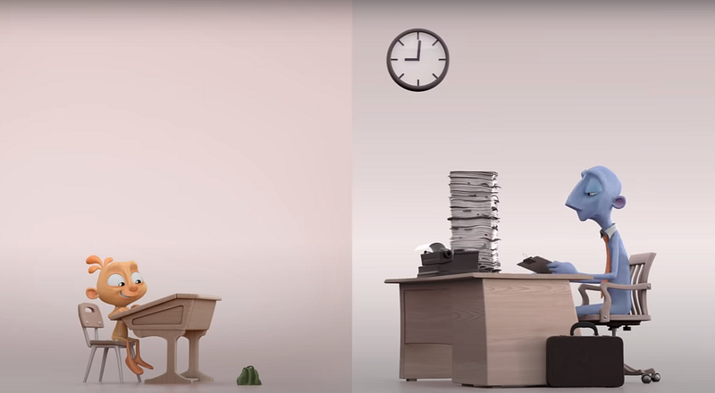

Aqui no Brasil, mas também em muitas partes do mundo, a grande maioria das escolas ainda adota uma abordagem educacional do século XVII.

*Cena do curta-metragem Alike — <https://www.youtube.com/watch?v=kQjtK32mGJQ>*

Queremos organizar, ordenar, disciplinar e controlar todo o processo de ensino-aprendizagem, **padronizando o desenvolvimento das crianças e dos jovens** (como se todos fossem iguais) **para formar funcionários e empregados competitivos para o mercado de trabalho** (como se esse fosse o único ou o principal objetivo da educação).

Os professores são orientados a darem conta de conteúdos numa sequência predeterminada, seguindo um livro didático ou uma apostila para **tentar tornar eficiente um processo que deveria ser, antes de tudo, eficaz**. Não importa muito quem é o professor, mas sim que ele cumpra com o planejamento pedagógico e que dê conta de “transmitir” todo o conhecimento. **Da mesma forma que a escola tradicional ignora as diferenças entre os alunos, ela também despersonaliza os professores**.

Já os pais abdicaram totalmente de sua participação no processo educacional dos seus filhos. Isso virou uma responsabilidade apenas das escolas. Estão todos muito ocupados atuando como funcionários ou empregados no mundo do trabalho. Afinal, foi para isso mesmo que foram bem educados.

As empresas sofrem com a falta de competências socioemocionais de seus trabalhadores: **não conseguem trabalhar em equipe, enfrentam dificuldades para resolver conflitos e dependem sempre do estímulo de um chefe para realizarem alguma atividade** (assim como na escola, onde sempre dependeram do professor para aprender). Esses trabalhadores são contratados por suas capacidades racionais e demitidos pela ausência de competências emocionais.

Muitas pessoas já apontaram esses e outros problemas do modelo educacional tradicional. Autores, professores, filósofos e outros estudiosos apresentaram alternativas e abordagens educacionais inclusivas e mais aderentes aos dias atuais. Existe, porém, uma inércia enorme proveniente do medo da mudança e uma dose sensata de conservadorismo que impede uma reestruturação completa no modelo educacional.

Entretanto, depois da COVID-19, **a educação e as escolas poderão mudar para sempre**.

As escolas mais bem estruturadas estão percebendo que ter os melhores ambientes físicos e equipamentos não é suficiente se o método de ensino que utilizam **limita a aprendizagem e o desenvolvimento de competências socioemocionais dos estudantes**.

Realizar aulas via internet utilizando o mesmo jeito de ensinar presencialmente está evidenciando o quão ineficaz é o processo educacional tradicional: os professores ficaram expostos por não terem desenvolvido certas habilidades; as apostilas e livros didáticos demonstraram-se restritos e ineficientes nesse ambiente; os pais apontam dificuldades nas atividades enviadas para os seus filhos fazerem em casa; e os estudantes sofrem por não terem competências para autogerenciar seus próprios estudos.

Assim, os **professores precisarão se reinventar** (ou se libertar do método de ensino tradicional) e desenvolver não apenas novas competências técnicas, como também tratar seus estudantes de forma personalizada. Os pais precisarão **retomar sua parcela de responsabilidade na educação dos filhos** e ficarão cada vez mais conscientes de todas as atividades que a escola realiza com os estudantes. Já os estudantes desenvolverão autonomia e habilidades de comunicação de uma maneira que jamais poderiam fazer na escola do passado.

Toda essa experiência extraordinária criada pela pandemia no contexto escolar e vivenciada pelos professores, estudantes e pais poderá provocar uma transformação na educação. A escola que não se adaptar ficará na história como mais uma das vítimas da COVID-19.
