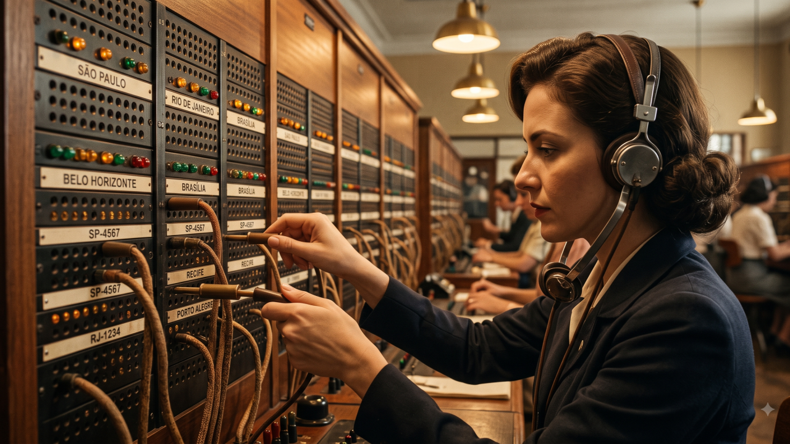

*A telefonista do passado - Imagem criada pelo Gemini (NanoBanana 2)*

Durante boa parte do século XX, para falar com alguém no telefone, você precisava falar antes com outra pessoa.

A telefonista atendia, ouvia o número que você procurava e encaixava dois plugues num painel cheio de tomadas. Ela não decidia o assunto da conversa e nem se interessava por ele. Mas fazia uma coisa fundamental: **colocava quem queria falar em contato com quem deveria responder.**

Quando a comutação automática chegou, essa função foi desaparecendo. O telefone continuou funcionando. Funcionou melhor.

Guardo essa imagem porque ela isola bem uma fatia do trabalho de gestão. Uma fatia, e não o bolo inteiro. E é justamente essa confusão entre a fatia e o bolo que está estragando quase toda conversa sobre inteligência artificial e a camada gerencial das organizações.

## A diferença entre o gestor e a telefonista

Boa parte do que um gestor faz durante o dia é receber informação de um lado, decidir para onde ela vai e conectar quem sabe com quem precisa agir. Dentro disso, convivem duas atividades muito diferentes:

1. **O roteamento puro:** encaminhar a informação certa para a pessoa certa, reconhecer padrões, distribuir. Foi isso que a telefonista fez a vida inteira, sem julgar o conteúdo de nada.
2. **O julgamento embutido:** decidir o que conta como relevante hoje. Ler o momento. Saber que aquele pedido, vindo daquele cliente, depois da conversa da semana passada, precisa furar a fila. Perceber que a pessoa tecnicamente mais indicada para a tarefa está a duas semanas de um *burnout*, e que delegar para ela seria a decisão certa no papel, mas desastrosa na vida real.

De fora, as duas parecem a mesma coisa. Chegam e saem pelo mesmo canal e cabem na mesma descrição de cargo. Só que uma é reconhecimento de padrão; a outra é leitura de contexto, histórias e pessoas.

## O que a IA faz muito bem (e o que ela só parece fazer)

A inteligência artificial imita o roteamento puro com uma competência assustadora. Um sistema que lê mil mensagens, resume, classifica, prioriza e distribui executa uma fatia real desse trabalho. Faz em segundos o que consumia a manhã inteira de alguém.

Se o seu desconforto com a relação entre IA e gestão vem daí, ele é legítimo. Essa parte do trabalho está sendo automatizada agora, e quem construiu uma carreira baseada apenas nela tem um problema concreto.

O que não cede ao mesmo mecanismo é o julgamento embutido. E o motivo tem menos a ver com a capacidade da máquina e mais com o insumo que ela recebe: **o sistema só enxerga o que foi registrado.**

A informação de que um colaborador anda sobrecarregado, de que o cliente ficou irritado na última reunião ou de que aquele projeto possui uma história política complexa que ninguém documentou: esse tipo de informação não está em nenhum lugar que o sistema alcance.

Ainda assim, a IA vai rotear. Com consistência, em escala e sem hesitar, simplesmente porque ela não sabe o que não sabe.

O custo disso não aparece onde ele nasce. Aparece duas semanas depois: na pessoa que pediu demissão, no cliente que escalou o problema para o seu chefe, no projeto que atrasou sem que ninguém consiga apontar exatamente qual decisão causou o gargalo. Roteamento errado raramente produz um erro visível imediato. Ele produz **atrito distribuído** e atrito distribuído não tem dono.

## IA substituindo gerentes?

Existem manchetes circulando que perguntam se a IA vai substituir os gerentes. É uma pergunta ruim, porque trata a gestão como se fosse uma coisa só.

A pergunta deveria ser outra: **quanto do trabalho de coordenação na sua organização é roteamento sem julgamento, e quanto é julgamento que apenas se parece com roteamento?**

- Se a maior parte for a primeira, você tem uma camada inteira fazendo trabalho de telefonista. A automação vai revelar isso de um jeito constrangedor.
- Se a maior parte for a segunda, a analogia da telefonista ilustra apenas o pedaço menor. Cortar essa camada em nome da "eficiência" vai destruir uma capacidade analítica que ninguém sabia que estava ali, porque ela nunca apareceu em nenhum indicador de performance.

O incômodo é que essa proporção varia de empresa para empresa, de área para área e de gestor para gestor. Ninguém tem esse número exato. E, no entanto, decisões drásticas de reestruturação estão sendo tomadas como se todo mundo tivesse.

## Como descobrir isso na sua empresa

Não existe método perfeito para essa medição, mas conheço um teste pragmático que funciona.

Pegue as decisões de encaminhamento que um gestor tomou na última semana. Para cada uma, faça a seguinte pergunta: **o critério que ele usou está documentado em algum lugar?**

- Se está, aquilo é roteamento. Provavelmente será automatizado, com ou sem a sua autorização.
- Se não está, e ele consegue explicar o raciocínio por trás da decisão quando você pergunta, você acabou de encontrar o *julgamento* que estava passando por roteamento.
- Se ele não consegue dar uma explicação lógica quando perguntado, você acaba de tropeçar na terceira e mais perigosa categoria: o vício operacional. O famoso 'sempre foi feito assim'. Não é roteamento, tampouco julgamento, e será engolido pela automação sem que ninguém sinta falta.

Vale a pena fazer esse exercício antes de decidir qualquer coisa sobre a estrutura da sua equipe. Porque, no fim das contas, a automação fará essa separação por você, de um jeito ou de outro.

## Para refletir

- Quanto do que a sua camada gerencial faz sobreviveria se o critério de encaminhamento fosse estritamente escrito e entregue a um sistema?
- Quando alguém do seu time toma a decisão certa sobre para quem mandar uma tarefa, essa pessoa está aplicando uma regra fria ou lendo um contexto que nenhuma máquina tem como enxergar?
