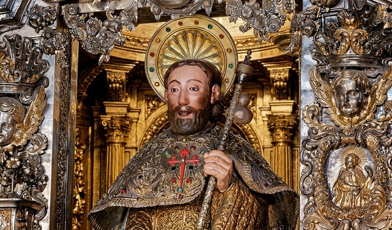
*Apóstolo Santiago no altar-mor da Catedral de Santiago de Compostela, Galiza.*

Quem caminha para Compostela acaba reparando numa coisa por volta do terceiro ou quarto dia. A concha de vieira aparece em todo lugar. Está pintada nos marcos de pedra à beira da estrada, gravada no metal das placas urbanas, pendurada na mochila do peregrino que vem logo à frente, esculpida nos portais das igrejas românicas... E ninguém sabe direito por que uma concha marinha virou o símbolo de uma caminhada que atravessa montanhas e planaltos secos, a centenas de quilômetros do mar.

A resposta está numa história que os peregrinos ouviam nos albergues e mosteiros do caminho, contada em voz alta, noite após noite, durante séculos. É a Lenda Áurea Jacobéia, o relato de como o corpo de um apóstolo decapitado em Jerusalém foi parar no fim do continente europeu. Ela ganhou forma no século XII, e o nome pelo qual ficou conhecida veio da coletânea de vidas de santos que foram reunidas algumas décadas depois.

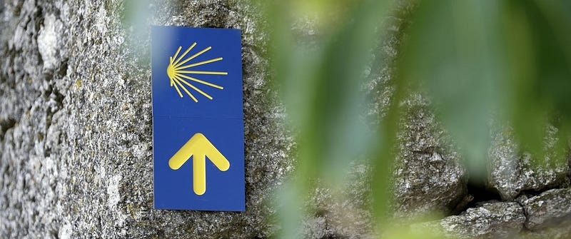

Mas a concha tem uma história, assim como a estrela que dá nome a Compostela, o cajado que o peregrino carrega, o ganso que aparece em dezenas de topônimos ao longo do trajeto e até a “loba” que recebe o corpo do apóstolo na versão medieval da lenda. Cada um desses elementos veio de algum lugar e vários deles vieram de um mundo anterior ao cristianismo.

É isso que torna a lenda tão interessante. Ela é uma história cristã contada por cima de camadas muito mais antigas que ainda não sumiram. Continuam ali, visíveis para quem sabe olhar.

Percorrer a lenda com atenção muda a experiência de peregrinar, porque a estrada deixa de ser só paisagem e passa a ser história.

---

## A narrativa de Santiago

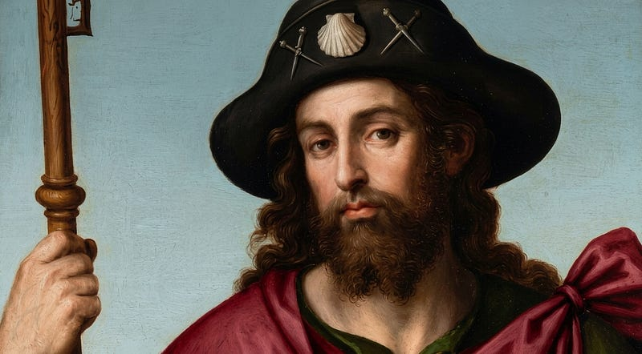
*Santiago peregrino, de Juan de Juanes — Museo de las Peregrinaciones y de Santiago*

Tiago, filho de Zebedeu e irmão do apóstolo João, era pescador na Galileia quando Jesus o chamou. Tornou-se um dos três discípulos do círculo mais íntimo, grupo que acompanhou os momentos reservados do Mestre.

Os dois irmãos tinham fama de temperamento forte, e o apelido que ganharam de Jesus veio de um episódio concreto. Ao chegarem a uma cidade samaritana que se recusou a recebê-los, Tiago e João propuseram fazer descer fogo do céu para consumi-la. Jesus os repreendeu: "*vós não sabeis de que espírito sois*". Dali saiu o nome grego Boanerges, filhos do trovão ou filhos do fogo.

O apelido já contém a tensão que atravessa a personagem: o pregador também se tornaria o cavaleiro de espada flamejante. O fogo reaparece tanto no episódio do dragão quanto na interpretação alquímica da lenda.

Vale reparar no nome antes de seguir. Iacobus, a forma latina do hebraico Jacob, perdeu a terminação no ocidente da Península e virou Iago. Santo Iago virou Sant’Iago, depois São Tiago. O mesmo Iacobus virou James no inglês e Jacques no francês. E os construtores que abriram as estradas e ergueram as catedrais medievais na França eram chamados justamente de Jacques. O apóstolo e os pedreiros compartilham o nome muito antes de compartilharem a rota.

Conta a tradição que, depois da morte de Cristo, os apóstolos repartiram entre si as regiões do mundo para levar a nova fé. A Tiago coube o extremo ocidente, o limite da terra conhecida naquele tempo, o lugar onde o sol se punha e além do qual só havia oceano: a Península Ibérica.

### A missão que não deu certo

A pregação na Hispânia foi um fracasso. Tiago teria desembarcado na costa mediterrânica da Andaluzia, nas terras da antiga Tartessos, e tomado a via romana que passava por Emerita Augusta, Conimbriga e Bracara Augusta rumo ao interior da Galécia, terminando em Iria Flávia. A tradição portuguesa acrescenta um trecho e reivindica uma primazia: o apóstolo teria passado por Coimbra, Rates, Póvoa de Varzim, Guimarães e Braga, o que faria do itinerário português o primeiro de todos os caminhos jacobeus.

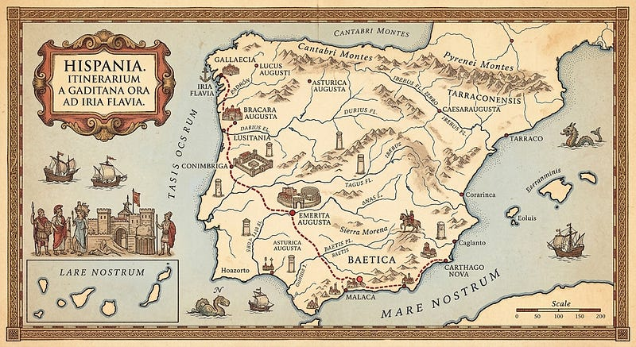
*Possível rota percorrida pelo Apóstolo Tiago na Península Ibérica*

Ele perseverou sete anos e colheu pouco. As versões divergem sobre quantos discípulos conseguiu reunir: umas falam em sete, outras em nove, outras em doze. Há um detalhe curioso: dizem que o apóstolo andava acompanhado de um cão, um animal mais sensível à sua palavra do que os próprios pagãos.

E havia uma coisa que ele ia deixando pelo caminho. Levava nos alforjes imagens da Virgem trazidas da Palestina e as distribuía nos lugares por onde passava. Quando acabaram, encomendou outras aos artesãos locais.

Foi no fundo desse desânimo que aconteceram os dois episódios Marianos mais queridos da tradição.

O primeiro se passa na Galiza, na costa brava de Muxía. Contam que, vendo o apóstolo abatido, a Virgem Maria veio ao seu encontro navegando numa barca de pedra conduzida por anjos. Depois de encorajá-lo, a embarcação se petrificou ali mesmo, e parte dela seria a Pedra de Abalar, um bloco enorme que ainda hoje oscila junto ao mar.

> Aquela pedra já era usada em ritos de fertilidade muito antes de qualquer cristão pisar na Galiza. A lenda cristã se instalou exatamente em cima de um santuário pagão e não fez esforço nenhum para esconder.

O segundo episódio acontece mais para o interior, em Cesaraugusta, a atual Zaragoza, às margens do Ebro. Conta-se que na madrugada de 2 de janeiro do ano 40, enquanto Tiago rezava com seus poucos discípulos, ouviram-se vozes de anjos cantando a saudação Ave Maria. Diante deles, sobre uma coluna de jaspe, apareceu a Virgem.

> O que tornam essas aparições únicas é que Maria ainda estava viva, em Jerusalém, quando se manifestou. Era a mãe de Cristo em carne mortal, aparecendo a milhares de quilômetros de onde de fato se encontrava, e é por isso que a tradição a considera as primeiras aparições mariana da história.

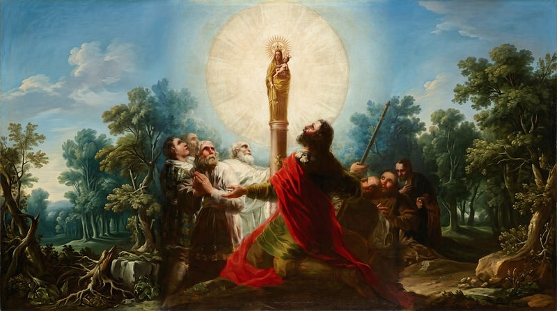
*Apóstolo Tiago e seus discípulos adorando a Virgem do Pilar — Francisco de Goya, 1775–1780*

Maria teria confortado o apóstolo, pedido que ele erguesse ali uma igreja e deixado o pilar de pedra como sinal. Nasceu daí a devoção à Virgen del Pilar, até hoje uma das mais queridas da Espanha.

Algumas versões situam essa aparição durante a pregação, outras já no caminho de volta. E há versões que chegam a informar a idade da Virgem naquele encontro: cinquenta e cinco anos e três meses. O dado vale menos como informação e mais como sintoma. Uma lenda que ganha esse grau de precisão é uma lenda que já foi contada muitas vezes, por muita gente disposta a preencher os buracos.

> Repare no que os dois milagres têm em comum. Uma barca que vira pedra, uma coluna que fica como marca. A lenda áurea gosta de pedras que guardam o sagrado. É a costura entre o mundo cristão e um mundo bem mais antigo, feito de menires e dólmens que já recebiam oferendas quando ninguém por ali tinha ouvido falar de apóstolos.

### O duelo com o mago

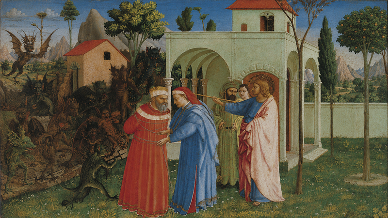
*O apóstolo São Tiago Maior libertando o mago Hermógenes — Fra Angelico*

Reconfortado pelas aparições, mas ainda sem colher frutos duradouros, Tiago voltou à Terra Santa. Foi lá que aconteceu um dos episódios mais esquecidos da lenda.

O apóstolo entrou em choque com um mago chamado Hermógenes, num duelo de poderes que parece saído de um conto antigo. Hermógenes mandou seu discípulo Fileto confrontar Tiago, e Fileto acabou convertido. Irritado, o mago o prendeu com feitiços, imobilizando-o. Tiago então enviou o próprio manto ao prisioneiro, com uma fórmula para que ele recitasse: Deus levanta os que caíram; Ele liberta os que estão cativos. Fileto se levantou e foi ao encontro do apóstolo.

Tomado pela cólera, Hermógenes convocou demônios para trazerem os dois à força. Os demônios voltaram, mas amarrados. Contaram que, no caminho, o Anjo do Senhor os havia prendido com correntes de ferro e pediram para serem libertados daquele tormento. Em vez de capturar o apóstolo, amarraram o próprio mago pelos pés e pelas mãos e o entregaram a ele.

Vencido, Hermógenes se converteu, mas continuou apavorado com a vingança dos demônios que antes comandava. Tiago lhe entregou o próprio bastão como proteção.

> Repare bem nesse gesto, porque é a primeira aparição do bordão nesta história, e ali ele não é um apoio para caminhar. É um objeto de defesa entregue por um apóstolo a um mago convertido.

Só então o mago se ofereceu para queimar seus livros de magia. Tiago recusou a fogueira, com receio de que a fumaça atraísse atenção demais, e mandou lançá-los ao mar.

Os nomes dos dois adversários dizem o que está em jogo. Hermógenes significa "nascido de Hermes". Fileto significa "amado". Juntos, são adeptos da filosofia hermética. O apóstolo não destrói o hermetismo naquele encontro. Ele o converte e o coloca a trabalhar do seu lado.

> É um episódio pequeno, mas revela o tom da lenda inteira. Tiago vence transformando o adversário, e não destruindo. Esse é o modo pelo qual a narrativa assimila o confronto entre dois tipos de conhecimento.

### O martírio e a barca sem rumo

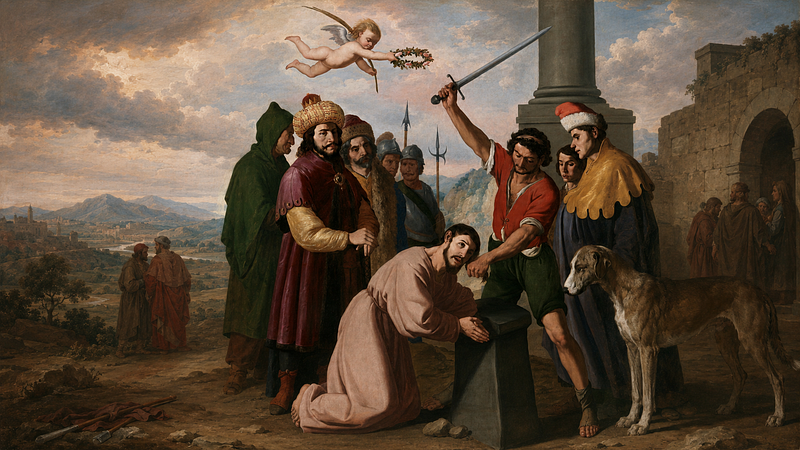
*Martírio de Tiago — Francisco de Zurbarán, 1640*

Pouco depois, já em Jerusalém, o apóstolo foi decapitado por ordem de Herodes Agripa, por volta do ano 44. Tornou-se o primeiro dos doze a morrer mártir e é o único cuja morte o Novo Testamento registra. A caminho do suplício, um paralítico pediu sua ajuda e Tiago o curou ali mesmo, amarrado e a caminho da morte. Josias, o fariseu que o conduzia, viu o milagre, converteu-se, foi batizado pelo próprio prisioneiro e acabou decapitado junto com ele.

Os corpos dos dois foram lançados no campo para que cães e feras os devorassem. Protegidos pela noite, dois discípulos recolheram o corpo e a cabeça do apóstolo e fugiram em direção ao mar. Levaram-no ao porto de Jafa e o colocaram numa barca sem leme, sem vela e sem remos, entregue à providência divina.

Sem que ninguém escolhesse o rumo, guiada por anjos, a embarcação partiu rumo ao oeste, na mesma direção que as almas tomam para o Além. Atravessou o Mediterrâneo, passou as Colunas de Hércules (Estreito de Gibraltar) e entrou no Oceano Tenebroso (Oceano Atlântico). Depois de sete dias, ou de uma única noite conforme a versão, penetrou na ria de Noia e parou junto a Iria Flávia.

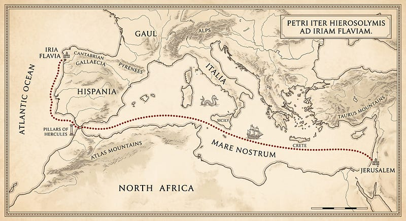
*Rota percorrida pela barca com o corpo do Apóstolo Tiago e seus discípulos*

Os discípulos saltaram em terra e amarraram a barca a uma grande pedra, um *pedrón* em galego. Só que a pedra não era uma pedra qualquer. Era uma ara romana, um altar votivo ligado ao antigo porto de Iria Flavia, e a inscrição que sobrou nela aponta para Netuno.

A barca guiada por anjos veio encostar justamente no altar do deus do mar. Com o tempo o povo trocou o nome latino por Pedrón, depois Padrón, e o marco foi parar na Igreja de Santiago de Padrón.

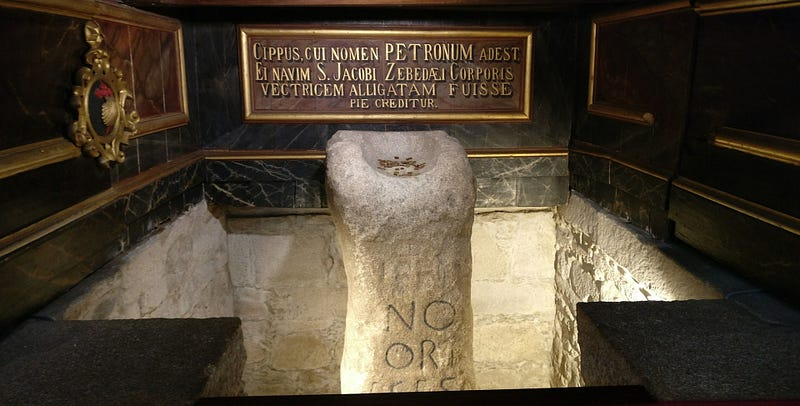
*O pedrón, no altar-mor da Igreja de Santiago de Padrón.*

Existe até um ditado: *"Quen vai a Santiago e non vai a Padrón, ou fai a romaría ou non"* (quem vai a Santiago e não vai ao Padrão, ou faz romaria ou não faz).

> Repare no traçado dessa viagem. Ela vai de leste a oeste, do nascente ao poente, atravessando o Mediterrâneo inteiro para ir encalhar justamente no fim do continente. Nenhum barco à deriva faria esse percurso.

A lenda ainda faz questão de dizer o que havia no céu quando a barca chegou. Sobre aquela costa se destacava a constelação do Cão Maior, no fim da faixa que os celtas chamavam de Arca de Lug e que a Idade Média rebatizaria como Caminho de Santiago. O corpo chega ao fim da terra debaixo do fim da Via Láctea.

### As três provações da rainha Lupa

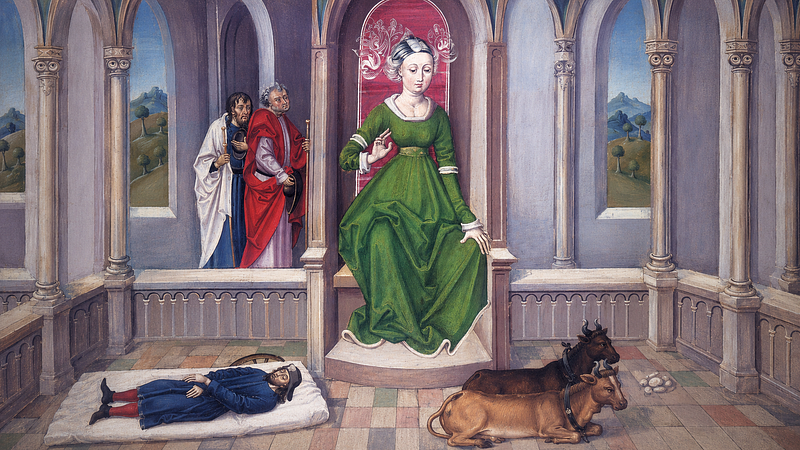
*O corpo do Apóstolo Santiago e os seus discípulos Teodoro e Atanásio perante a rainha Lupa, 1480 — Xacopedia*

Chegando à Galiza, os discípulos enfrentaram um problema prático: onde enterrar o mestre? A terra era governada por uma rainha pagã chamada Lupa, nome que em latim significa loba.

Antes mesmo de procurá-la, aconteceu o primeiro prodígio. Eles depositaram o corpo sobre uma enorme pedra, e a pedra amoleceu como cera, moldando-se ao corpo até virar um sarcófago perfeito. A terra reconheceu o santo antes que seus habitantes o fizessem. Ainda assim era preciso autorização, e foi aí que a lenda ganhou três provações de dificuldade crescente.

Na primeira provação, Lupa fingiu não ter poder para decidir e mandou os discípulos consultarem Régulo, sumo-sacerdote da Ara Solis, o altar do sol que ficava em Duyo, na ponta de terra onde hoje é Fisterra. O nome dele não é decorativo: Régulo é Regulus, a estrela mais brilhante da constelação do Leão.

Régulo odiava cristãos e mandou prender os dois. Durante a noite, pequenas luzes apareceram dentro da cela e desenharam na parede o contorno de uma porta que não existia. Os discípulos atravessaram a parede por ali e fugiram na escuridão. Régulo mandou soldados atrás dos discípulos e a ponte sobre o rio desabou enquanto seus perseguidores a atravessavam.

Enquanto os dois estavam em Duyo, a rainha aproveitou para mandar seus soldados buscarem o corpo. Foi então que aconteceu a cena mais estranha de toda a lenda. O corpo do apóstolo se ergueu no ar sozinho e começou a se deslocar para o leste. Os soldados foram atrás, sem coragem de tocá-lo, e viram quando ele contornou a região montanhosa de La Oca, a Gansa, e desceu sobre o Pico Sacro. Alguns ficaram vigiando e ergueram ali uma tumba. Os outros voltaram para contar à rainha.

Na segunda provação, a rainha Lupa armou uma cilada disfarçada de favor e mandou que buscassem seus bois, soltos num monte, para puxar a carroça com o corpo. Só que naquele monte não havia bois mansos: havia touros bravos e indomáveis, e a rainha sabia disso.

No monte, um dragão ainda avançou sobre os discípulos vomitando fogo, com um hálito que apodrecia a região inteira. Eles fizeram o sinal da cruz e a besta estourou pelo ventre, desaparecendo em fumaça. Nenhuma espada foi desembainhada: até aqui, nada nesta história foi vencido pela força. Diante dos touros, repetiram o gesto do sinal da cruz e as feras ficaram mansas no mesmo instante. Atrelaram os animais à carroça com a pedra que virara sarcófago e deixaram que seguissem sozinhos.

Na terceira provação veio o desfecho. Os bois, sem que ninguém os conduzisse, escolheram o caminho por conta própria e foram parar no pátio do palácio da própria Lupa. Foi demais para a rainha. Então, Lupa converteu-se, foi batizada, ofereceu o palácio para que se tornasse uma igreja e mandou destruir o templo da *Ara Solis*.

Só que os discípulos recusaram o palácio. Disseram que a última morada do apóstolo devia ser escolhida pela vontade de Deus. Subiram de novo na carroça e deixaram os touros seguirem. Os animais caminharam até parar junto a uma fonte, num campo que também pertencia à rainha, e ela doou o terreno de bom grado.

O campo passou a se chamar *Libere donum*, livre de dono. É daí que viria o nome Libredón, o bosque onde, séculos depois, o túmulo seria reencontrado. Antes disso o lugar era conhecido como *Arcis Marmoricis*, provavelmente por abrigar sepultamentos celtas e romanos, e a devoção popular acabou lendo nesse nome a arca de mármore do apóstolo.

> Com a doação do terreno, encerravam-se as três provações e definia-se o lugar da sepultura. Uma pedra que se molda. Um dragão que cospe fogo. Touros que ficam mansos. Bois que escolhem o caminho. E uma rainha chamada loba que entrega o palácio para virar igreja. É a imagem de uma religião nova se instalando sobre uma antiga, aproveitando o que encontrou em vez de arrasar.

### A estrela que reencontrou o túmulo

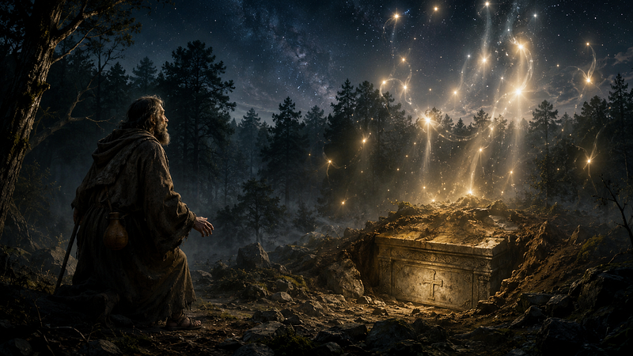
*Pelágio descobrindo o túmulo do Apóstolo Tiago no bosque Libredón*

Depois de tudo isso, o lugar da sepultura foi esquecido. Séculos de invasões e desmemória cobriram o sítio de vegetação, e ninguém mais sabia onde ficava. Até que, entre 813 e 830, conforme a fonte, no reinado de Afonso II das Astúrias, um eremita chamado Pelágio notou luzes estranhas caindo como chuva de estrelas sobre o campo perto de seu retiro. Ele vivia junto à igreja de San Fiz de Solovio, erguida sobre as ruínas de um santuário celta. Os moradores da redondeza viram as mesmas luzes.

O bispo de Iria Flávia, Teodomiro, foi verificar. Ao testemunhar o prodígio, decretou três dias de jejum, seguiu em procissão até o *Campus Stellae* e mandou escavar. Encontraram um pequeno mausoléu de mármore, com um sepulcro dentro e, no sepulcro, um corpo. Foi identificado como o do apóstolo.

Teodomiro comunicou o achado a Afonso II, que por sua vez notificou o papa Leão III e o imperador Carlos Magno. O rei peregrinou até o sepulcro, fundou ali três igrejas e junto delas se instalou uma comunidade de monges beneditinos encarregada de vigiar o túmulo, o mosteiro de Antealtares. Em 829 veio a primeira doação real. Nascia Compostela.

> É aqui que a lenda encontra sua imagem mais bonita. O túmulo não é achado por escavação nem por documento: é apontado por luzes no céu. E o nome do eremita que as vê, Pelágio, significa homem do mar. Repare no encadeamento inteiro. Uma barca guiada por um anjo cruza o oceano e chega ao fim do mundo. Séculos depois, um homem do mar vê uma estrela e reencontra o corpo. Céu e mar conduzem a história do começo ao fim.

## O último ato: o cavaleiro que volta

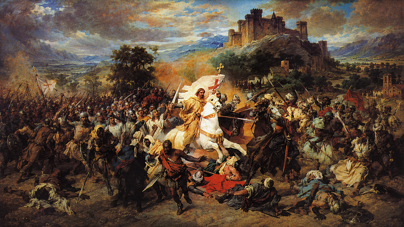
*Santiago na Batalha de Clavijo — José Casado del Alisal, 1885.*

A lenda ainda guardava uma surpresa. O apóstolo morto voltaria a aparecer, agora vivo e em armas.

Na batalha de Clavijo, em 844, com os cristãos em apuros diante das tropas muçulmanas, Tiago teria surgido no meio do combate montado num cavalo branco, brandindo uma espada de fogo e conduzindo os seus à vitória. Desse feito nasceu Santiago Matamouros, o apóstolo guerreiro que virou padroeiro da Espanha.

> Vale parar um momento e olhar o desenho completo que a lenda traça. O apóstolo prega e fracassa. Morre decapitado. Seu corpo cruza o mar rumo ao poente. É enterrado, esquecido, reencontrado sob uma estrela. E por fim renasce como cavaleiro luminoso. Morte e ressurreição, repetidas em vários registros, do começo ao fim. Esse desenho é a chave para entender por que tanta gente vê no Caminho de Santiago um rito de renascimento e não apenas uma viagem. A lenda ensaia várias vezes o mesmo movimento antes de propô-lo a quem caminha.

## O desenvolvimento da lenda

Uma coisa que ajuda muito a entender essa lenda é perceber que ela não nasceu pronta. Foi crescendo por camadas, cerca de três séculos depois.

Os relatos mais antigos do translado do corpo, que circulavam por volta do ano 1000, já traziam a rainha Lupa, os touros e a perseguição do sacerdote local, mas não davam nome aos discípulos que acompanharam a barca. Numa versão do século IX havia até outro elenco: o corpo era conduzido pelos sete cantos da Andaluzia por sete varões apostólicos, que iam distribuindo pelos santuários imagens da Virgem Negra.

Esses sete foram afastados no início do século XII e substituídos por dois, Atanásio e Teodoro, quando a Igreja de Compostela produziu sua versão oficial e a incorporou ao *Codex Calixtinus*, especificando também que o enterro se dera no bosque de Libredón, que já então se chamava Compostela.

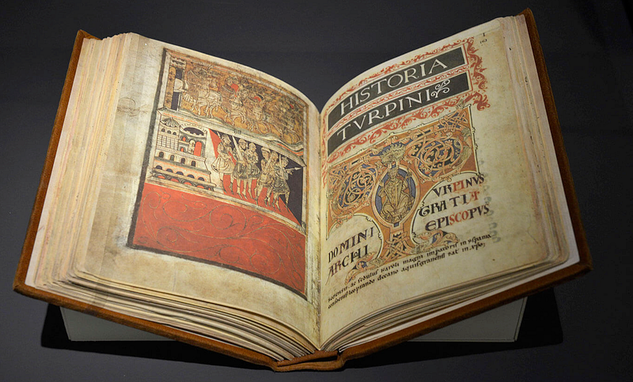
*O Codex Calixtinus*

O *Codex Calixtinus* é o grande livro dessa tradição, guardado na catedral compostelana. Seus cinco livros reúnem sermões, relatos de milagres, textos litúrgicos e narrativas associadas a Santiago. O quinto, tradicionalmente atribuído a Aymeric Picaud, é um dos primeiros guias medievais de peregrinação conhecidos, com informações práticas sobre rotas, hospedagens e costumes de cada região.

Um século depois, o dominicano Jacopo de Varazze incluiu a vida de Santiago em sua coletânea de vidas de santos, a *Legenda Aurea*, ou Lenda Dourada, que foi lida em toda a Europa medieval e moldou boa parte da forma como os santos passaram a ser representados na arte. Foi dessa obra que veio o nome pelo qual a tradição ficou conhecida. Em Portugal, ela circulou nos mosteiros e albergues do século XIII ao XVII, contada de viva voz aos peregrinos que passavam.

Do ponto de vista dos historiadores, não existe testemunho antigo de que Tiago tenha realmente pregado na Espanha. São Julião de Toledo, no ano de 686, escreveu que a pregação do apóstolo se dera entre os judeus, e o bispo de Iria Flávia ignora por completo o episódio da barca. Existe o túmulo, existe a decisão de identificá-lo como apostólico e existem as razões políticas de um reino asturiano que precisava de um padroeiro para enfrentar o Islã e firmar sua posição entre os vizinhos.

## O outro corpo possível

Existe até uma hipótese que costuma sumir das versões devocionais da lenda, e ela é a mais perturbadora de todas.

Prisciliano nasceu por volta de 340 na Galécia, numa família senatorial, e virou bispo de Ávila. Liderou um movimento cristão ascético que criticava a riqueza e a autoridade de parte do episcopado, valorizava a pobreza, o estudo das Escrituras e uma participação feminina incomum para a época.

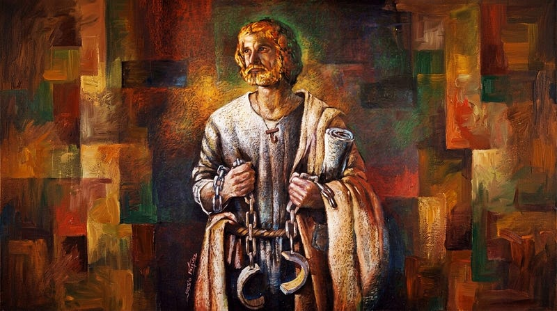
*Bispo Prisciliano de Ávila*

A reação foi rápida. Prisciliano foi acusado de bruxaria, condenado num processo montado para o caso e supliciado em Tréveris no ano 385. Tornou-se o primeiro cristão condenado à morte por um tribunal secular em consequência de uma controvérsia de heresia entre cristãos. Os bens das famílias envolvidas foram para o Estado. O patrimônio eclesiástico ficou intacto.

O movimento não morreu com ele. Sobreviveu na Península até meados do século VI. No Concílio de Toledo do ano 400, onze dos doze bispos galegos presentes eram priscilianistas.

Em 1900, o hagiógrafo Louis Duchesne publicou um artigo com uma sugestão incômoda: o corpo sepultado em Compostela seria o de Prisciliano, não o do apóstolo. A hipótese se apoia num relato do século V, de Sulpício Severo, segundo o qual os discípulos levaram os restos do mestre de volta à sua terra natal. Depois dele, o historiador espanhol Claudio Sánchez-Albornoz, o escritor Fernando Sánchez Dragó e o filósofo e ensaísta Miguel de Unamuno ajudaram a popularizar a ideia.

Há um argumento forte do outro lado. Nem no século IV nem no IX Compostela tinha a importância de Iria Flávia ou de Braga, que também eram centros priscilianistas. Se fosse para esconder um mártir da Galícia, aquele não era o lugar óbvio.

Nada disso diminui a lenda. Só ajuda a entender o que ela é: uma construção simbólica montada peça por peça, ao longo de gerações, com um cuidado que a torna ainda mais interessante. O escritor e jornalista francês Louis Charpentier, autor de *Les Jacques et le mystère de Compostelle*, obra dedicada à interpretação iniciática do Caminho, sugere que essa tradição não teria sido forjada de uma só vez. Para ele, a narrativa teria se ajustado, ao longo do tempo, a elementos mais antigos associados ao lugar, ao caminho de estrelas, à concha, ao nome, à rainha Lupa e ao cão.

Não é preciso escolher um lado para reparar no que a hipótese ilumina. Naquele chão, antes de qualquer basílica, havia um cristianismo galego diferente, popular, perseguido e teimoso, que sobreviveu duzentos anos à execução do seu líder. A pergunta central dessa hipótese não é a quem pertence o corpo, mas por que Compostela se tornou, pouco tempo depois do suposto sepultamento, um dos maiores centros de peregrinação da Europa.

---

## Os símbolos da lenda e suas raízes pagãs

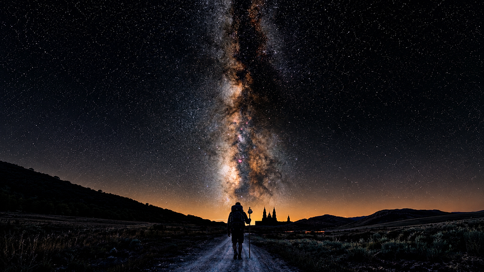
*A Via Láctea e o caminho das estrelas até Santiago de Compostela*

### A estrada de estrelas

Na Idade Média, o nome popular da Via Láctea em boa parte da Europa era Caminho de Santiago. A faixa esbranquiçada que atravessa o céu noturno de leste a oeste servia de referência para quem viajava, e a crença era que ela apontava para Compostela.

Charpentier chamou a atenção para um detalhe que costuma passar despercebido. No fim da Via Láctea fica a constelação do Cão Maior, com Sirius, a estrela mais brilhante do céu. E a lenda dá a Santiago justamente um cão por companheiro. A estrada terrestre espelha a estrada celeste, e o cão que acompanha o apóstolo é o mesmo que brilha no fim do caminho de estrelas.

Vale acrescentar um elo que costuma faltar nessa leitura. No simbolismo tradicional, o cão é a versão domesticada do lobo. É ele quem acompanha e conduz quem busca a iniciação, e a lenda faz esse animal levar o apóstolo até uma terra governada por uma loba. Na iconografia medieval, a cabeça de cão era emprestada aos artífices iniciados, os cinocéfalos, os mesmos que construíram os edifícios das vias jacobeias. Na fachada sul da catedral de Compostela, erguida entre 1103 e 1111, Santiago aparece com o pé sobre uma cabeça de cão.

Para os povos celtas aquela faixa luminosa tinha outro nome e outra função: era o caminho das almas, a rota que os mortos percorriam rumo ao outro mundo. Some isso à direção oeste que a barca de Santiago percorreu e o quadro fica claro. Caminhar para Compostela é seguir a trilha das almas na direção do poente, exatamente como faziam os povos que ali estavam antes.

### Por que uma loba recebe o apóstolo

O nome da rainha pagã não é casual. Lupa, a loba, reina na região de Lugo. E Lugo carrega no nome o deus celta Lug.

Lug, ou Lugh, foi uma das divindades supremas do panteão celta. Deus da luz, senhor de todas as artes e ofícios, guerreiro e mago ao mesmo tempo, aquele que sabe fazer tudo.

Na interpretação etimológica de Charpentier, a proximidade sonora entre *Lug*, o francês antigo *lou* e o latim *lupus* permitiria ler a loba da tradição cristã como uma transposição do deus celta. O deus celta da luz e a loba da lenda cristã compartilham a mesma raiz sonora.

O historiador e escritor português Vítor Manuel Adrião, autor de *Codex Jacobeu: de Portugal a Santiago de Compostela* e dedicado ao estudo da simbologia e da tradição portuguesa medieval, propõe uma interpretação que não depende dessa associação etimológica. Para Adrião, Lupa também remeteria a Lupe e à Lua, o astro que marca os ciclos, governa as marés e brilha com luz que não é sua.

E veja a quem a lenda a subordina: para decidir sobre o corpo do apóstolo, a rainha lunar precisa consultar Régulo, o sacerdote do altar do sol. A Lua depende do Sol na lenda exatamente como depende no céu.

Depois disso, é difícil olhar para a data da festa de Santiago como coincidência. A festa ocorre em 25 de julho, período associado, na astrologia tropical, à entrada do Sol no signo de Leão. Regulus, por sua vez, é uma estrela tradicionalmente ligada a essa figura zodiacal.

Adrião também identifica marcas de Lug em topônimos peninsulares formados pelas raízes *Lug* e *Lux*, esta última relacionada à luz. A própria Lusitânia seria a Terra de Luz, e Lisboa, Logroño e Lugo estariam nessa mesma linhagem luminosa. Não custa notar que Logroño e Lugo ficam justamente sobre o Caminho.

O que a Igreja fez, nessa leitura, foi absorver o velho deus solar e distribuí-lo entre figuras cristãs. Lug reaparece em São Miguel, o arcanjo da luz que enfrenta o dragão, e também em São Lourenço, o mártir queimado sobre a grelha cuja festa cai em agosto, justamente quando o céu produz a chuva de meteoros que o povo chama de lágrimas de São Lourenço.

Olhe de novo, agora, para o dragão vencido pelos discípulos e para os touros amansados. Deixam de ser episódios decorativos. São a imagem da nova religião assimilando as forças da terra, domando o que era selvagem e colocando-o a serviço do sagrado cristão. E a rainha loba, que se rende por último, é a própria terra pagã aceitando o novo dono.

### Lusina, a deusa escondida nas santas

Se Lug é o princípio masculino e solar dessa história, ele tem uma contraparte feminina que a lenda guarda com cuidado. Adrião a chama de Lusina, ou Melusina, e a identifica com Atégina, a antiga deusa celto-lusitana ligada à regeneração, à terra e à primavera. Seria a Deusa-Mãe dos povos pré-cristãos, aquela para quem se erguiam menires e dólmens, cultuada nas fontes, nas grutas e nas grandes pedras.

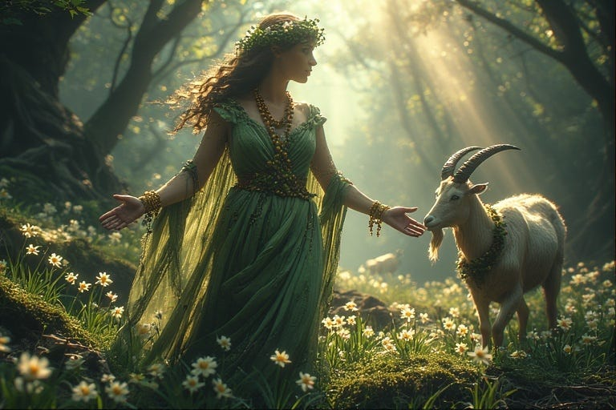
*Ilustração da Deusa Celta Atégina ou Lusina.*

Essa deusa não desapareceu quando o cristianismo chegou. Ela foi absorvida por várias figuras femininas cristãs, e o rastro é reconhecível. Assumiu o rosto de Santa Luzia, cujo nome guarda a luz e cuja proteção recai sobre os olhos, o órgão de ver. Assumiu o de Maria Madalena, que a tradição provençal faz recolher-se numa gruta no sul da França, imagem exata do útero da Mãe-Terra. E assumiu, sobretudo, o rosto das Virgens Negras, tão veneradas ao longo das rotas de peregrinação e quase sempre encontradas em grutas ou sobre fontes que brotam do chão.

Lembra das imagens que Tiago levava nos alforjes e ia deixando pelo caminho? São essas. Numa das versões antigas da lenda, são Virgens Negras talhadas pelo próprio São Lucas, distribuídas pelos principais santuários da rota. A lenda cristã explica, com um evangelista, a presença de uma figura feminina escura em cada gruta e cada fonte do percurso.

E há uma última peça que fecha o desenho. A São Lucas se atribuem os papéis de pintor, escultor, escritor e músico, os mesmos atributos que os celtas davam a Lug, pai de todas as artes, que segundo os mitos transmitia parte do seu conhecimento por intermédio de sua esposa, a deusa Lusina. Lucas e Maria ocupam, na versão cristã, exatamente as posições de Lug e Lusina.

> Repare no par que atravessa a lenda inteira de forma velada. Um princípio masculino, solar, celeste, ligado às estrelas e à luz. E um princípio feminino, telúrico, ligado à terra, às águas e às pedras. Santiago e a Virgem, na versão cristã. Lug e Lusina, na leitura pagã. É esse casamento entre céu e terra que dá ao Caminho sua força de rito de passagem, e é por isso que as duas aparições marianas da lenda acontecem justamente sobre pedras.

### O ganso e o Jogo da Oca

Aqui chegamos ao símbolo mais intrigante de todos. Ao longo do Caminho de Santiago, um animal aparece com uma insistência que não parece acidental: o ganso, ou a oca, como se diz em espanhol.

Ele está na toponímia, do começo ao fim da rota. Há o vale de Ansó, perto de Jaca, onde a travessia dos Pirineus começa. Há os Montes de Oca, já em Castela. Há a povoação de El Ganso, nos montes de León. Há um Paso de la Oca perto de Compostela. Espalhados por centenas de quilômetros, sempre dentro do mesmo corredor, esses nomes desenham um rastro.

E o rastro não está só no mapa. Está dentro da própria lenda, no episódio mais estranho dela. Quando os soldados de Lupa vão apreender o corpo do apóstolo, ele se ergue no ar e se desloca sozinho, e o que os soldados veem é o corpo contornar a região montanhosa de La Oca, a Gansa, antes de descer no Pico Sacro. O ganso não é uma curiosidade toponímica colada por fora. Ele está no roteiro de voo do cadáver mais importante da história do Caminho.

Por que um ganso? Nas mitologias antigas ele é um animal de fronteira, mensageiro entre o céu e a terra, guia do outro mundo. Entre os celtas era alimento proibido, sinal de que carregava estatuto sagrado. E há um detalhe visual que fecha o raciocínio: a pata do ganso, estilizada e voltada para baixo, se reduz a três traços que se abrem a partir de um ponto. Esse signo, o pé de ganso, foi marca de ensino dos druidas.

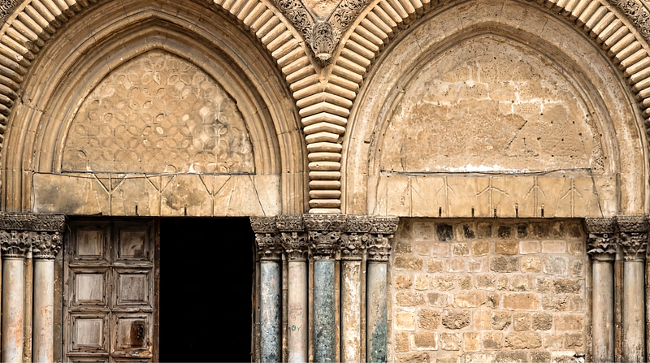
*A entrada dupla da Igreja do Santo Sepulcro em Jerusalém, com suas 8 patas de ganso esculpidas.*

Adrião traz aqui uma observação preciosa. Nas estelas funerárias do antigo cemitério de Iria Flávia, ponto de chegada da barca do apóstolo, os construtores-livres assinavam suas obras com um pé de ganso, forma simplificada da flor-de-lis. Para ele, esse signo era o emblema de Lusina, a deusa padroeira desses construtores. O símbolo pagão sobreviveu gravado na pedra, ao lado dos túmulos, à vista de quem soubesse ler.

E há o jogo. Existe um velho tabuleiro europeu chamado Jogo do Ganso, ou Jogo da Glória, em que o jogador avança numa espiral de casas numeradas rumo ao centro, ajudado pelas casas com gansos e atrapalhado por armadilhas: uma ponte, um poço, um labirinto, e uma casa temida chamada Morte.

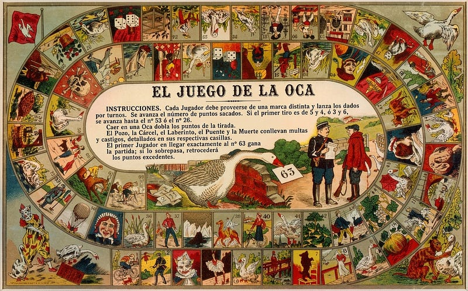
*O Jogo do Ganso*

Muitos estudiosos das tradições iniciáticas enxergam nesse jogo uma alegoria do próprio Caminho. Adrião observa que o tabuleiro tem 63 casas; a soma de seus algarismos, seis mais três, resulta em nove, número que Adrião associa aos ciclos da Terra. O peregrino avançaria de oca em oca, atravessando mortes simbólicas, até renascer no final.

Não se sabe se o jogo nasceu do Caminho ou se o Caminho inspirou o jogo, e convém dizer que a versão mais difundida hoje, a de um mapa cifrado criado por templários, é elaboração moderna sem base documental. Mesmo sem comprovação documental dessa origem, as correspondências propostas entre o tabuleiro e os pontos simbólicos da rota tornam a comparação sugestiva.

Por fim, há uma coincidência recente que vale registrar, e ela está diante dos olhos de todo mundo que caminha hoje. As setas amarelas que orientam o Caminho foram criadas nos anos 1980 por Elías Valiña Sampedro, pároco de O Cebreiro, que dedicou a vida a estudar e reanimar a rota. Ele saiu marcando o percurso de Roncesvalles até Compostela com tinta amarela.

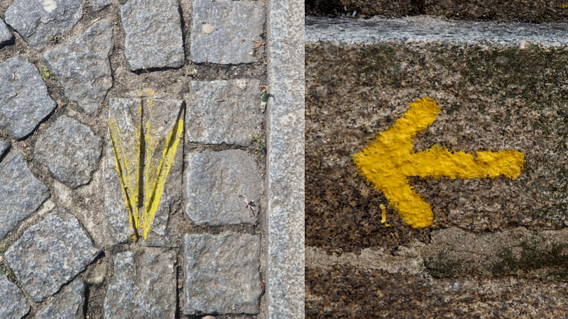
*Setas amarelas que sinalizam o Caminho de Santiago*

Agora olhe o desenho da seta. Duas linhas que convergem para um vértice, mais o traço central que sai desse mesmo ponto. Três linhas e um vértice, exatamente o que os druidas usavam como marca de ensino e o que os construtores medievais deixavam gravado nas pedras que assentavam.

O padre não estava recuperando nenhum signo antigo, estava resolvendo um problema prático de sinalização com a tinta que tinha à mão. E ainda assim escolheu, talvez por casualidade, a mesma figura que a vieira já escondia nas estrias e que os construtores assinavam nas estelas de Iria Flavia.

### A concha

Voltamos ao símbolo do começo, aquele que aparece em cada marco da estrada. A vieira.

A lenda explica sua origem com um milagre. Quando a barca se aproximou da costa, os habitantes de Gaia e Maia celebravam um casamento na praia. Os cavaleiros faziam jogos com suas lanças, e um deles caiu ao mar com o cavalo. Sumiu sob a água diante do terror de todos. Passado o tempo em que já não havia mais o que esperar, ressurgiu vivo ao lado da barca. Tanto ele quanto o cavalo estavam inteiramente cobertos de conchas de vieira. Os discípulos o abençoaram e ele voltou a pé para a festa.

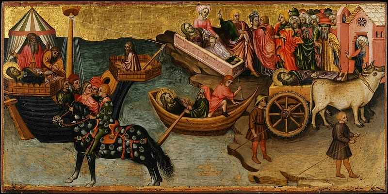
*O cavaleiro coberto por conchas na Translação do corpo de Santiago — Tábua de Giovenal de Orvieto, 1441.*

De um jeito ou de outro, a vieira virou a insígnia de quem cumpriu a peregrinação, uma prova de que tinha chegado ao fim do mundo e retornado para contar.

Só que a concha guarda um segredo de forma. Olhe uma vieira com atenção. As estrias que se abrem em leque, convergindo para um único ponto na base, lembram muito uma pata palmeada. Lembram, mais precisamente, um pé de ganso. Vários autores da tradição esotérica sustentam que a concha de Santiago é a cristianização daquele antigo signo dos construtores. Quando ficou arriscado exibir o símbolo pagão, ele foi transformado numa concha, justificado por uma bela lenda, sem perder o desenho essencial das linhas que se abrem.

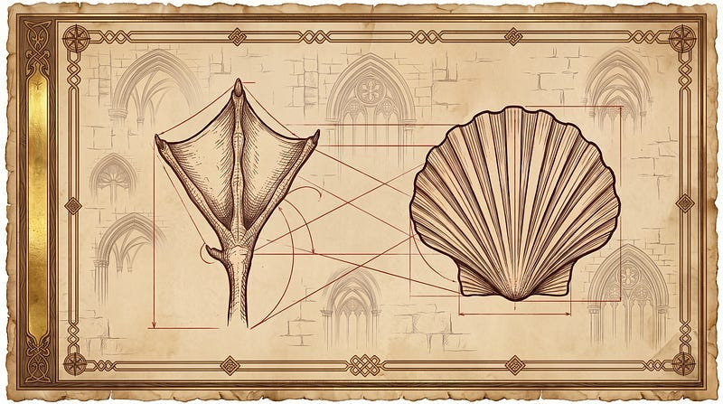
*Pata de ganso x Concha*

O simbolismo da vieira é generoso e comporta várias leituras ao mesmo tempo. As estrias que convergem representam os muitos caminhos que partem de toda a Europa e se encontram num destino único. A concha também era, no mundo antigo, emblema de fertilidade e do feminino, associada a Vênus, a deusa nascida do mar sobre uma concha. A ligação está até na palavra: veneris está na raiz de venerabilis, venerável.

René Guénon, autor francês, reparou em outra pista. Em algumas regiões da França a vieira é chamada creusille, palavra vizinha de creuset, que é o crisol, o recipiente onde o alquimista funde a matéria. A concha do peregrino carrega no nome a ideia de purificação pelo fogo, que os pitagóricos chamavam de catarse e tratavam como fase preparatória da iniciação.

E houve um tempo em que ela não era só emblema. Antes das matracas, os luso-galaicos do litoral batiam duas conchas de vieira uma contra a outra, como castanholas primitivas que o folclore galego e ribatejano ainda usa. Aquele som acompanhava as ladainhas dedicadas à deusa da noite, representada por Vênus, o planeta dos pastores, dos marinheiros e dos peregrinos. Mais tarde a mesma imagem foi absorvida pela ladainha mariana como Stella Maris, estrela do mar.

Até o objeto mais banal da mochila carrega, escondido, o eco daquela Deusa-Mãe das águas. E já foi instrumento musical dos ritos dela.

Um detalhe que Charpentier registra com humor: essas conchas eram chamadas *merelles*, nome que vem de um povoado da costa galega, e vieiras não se grudam em corpos nem em cascos, já que vivem soltas no fundo do mar. O milagre foi construído para dar uma insígnia reconhecível a milhares de peregrinos. Sua lógica é simbólica, e é justamente por isso que funciona tão bem.

### O cajado, a cabaça e a direção

Faltam os companheiros de viagem. O peregrino clássico carrega um bordão, o cajado alto que serve de apoio nas subidas e afasta cães e perigos, e uma cabaça pendurada nele para levar água. São objetos práticos, que identificavam o peregrino, mas também têm uma dimensão simbólica.

O bordão é o bastão do viajante espiritual, o mesmo que aparece na vara de Moisés e no cajado dos velhos magos das narrativas antigas. Símbolo de autoridade e de sustento, ele marca quem está autorizado a percorrer o caminho sagrado.

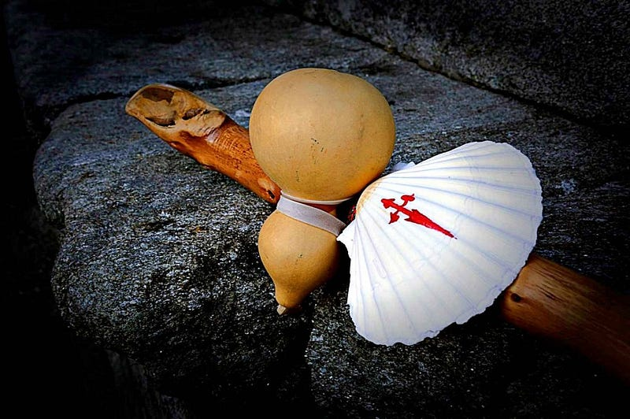

Só que a lenda já tinha dito para que ele servia. Quando Hermógenes se converteu e ficou apavorado com a vingança dos demônios que antes comandava, Tiago lhe entregou o próprio bastão como proteção. O cajado do peregrino nasce, dentro da história, como escudo contra o que se deixou para trás. Todo mundo que sai de casa levando um bordão está repetindo esse gesto, quer saiba, quer não.

A cabaça remete à provisão divina e à purificação, já que a água acompanha e lava o caminhante. É fácil reconhecer nesses objetos resquícios de instrumentos rituais bem mais antigos, ressignificados pela devoção cristã.

A direção reúne esses símbolos. Para os povos antigos da Europa atlântica, o oeste era o destino das almas, porque é ali que o sol mergulha no mar todas as tardes para renascer na manhã seguinte. Os celtas situavam nessa direção a ilha de Avalon, morada bem-aventurada dos mortos. Para Charpentier, o movimento contínuo rumo ao oeste aproxima Compostela das antigas peregrinações de morte conhecidas na Bretanha e na Cornualha.

Não por acaso muitos peregrinos seguem até Finisterra, o fim da terra, e ali queimam uma peça de roupa ou as botas gastas. É um gesto de desprendimento, o velho eu deixado para trás na beira do mundo. Adrião lembra que os antigos ritos druídicos de iniciação incluíam exatamente essa dramaturgia, com o iniciado declarando eu morri e eu ressuscitei. O Caminho conservou o essencial do rito sob roupagem cristã: parte-se como uma pessoa e chega-se como outra.

## Compostela, o campo da estrela

Finalmente, falta o nome do destino.

A leitura mais popular faz derivar Compostela de *Campus Stellae*, o campo da estrela, em referência às luzes que apontaram o túmulo ao eremita Pelágio. É bonita e encaixa perfeitamente na lenda. Os eruditos, mais desconfiados, preferem derivar o nome do latim compositum, no sentido de cemitério, já que a tumba ficava numa necrópole. Também faz sentido, e provavelmente é a etimologia correta.

Charpentier acrescenta uma terceira possibilidade, vinda da alquimia. *Compost* seria a estrela que se forma na superfície do cadinho numa das primeiras operações da Grande Obra, sinal de que o trabalho está no rumo certo. Compostela seria então a estrela sobre o campo, o indício de uma transformação bem-sucedida. Ele sugere ainda uma leitura mais reservada, que faria de Compostela o Mestre da estrela.

Essa leitura alquímica não é invenção moderna, e vale ver até onde ela vai. Alquimistas conhecidos fizeram a peregrinação, entre eles Arnaldo de Vilanova e Raimundo Lúlio, que tem até uma lápide na catedral lembrando sua passagem. E eles liam a Lenda Áurea como um manual cifrado, atribuindo função a cada peça da história.

A barca é o athanor, o forno onde a matéria se transforma. O dragão é o fogo criador. O pedrón é a matéria-prima. Lupa é a Lua e a prata, os mistérios menores. Régulo é o Sol e o ouro, os mistérios maiores. O Pico Sacro é o centro, a perfeição alcançada. A chuva de estrelas que Pelágio vê é o composto que se ilumina dentro do crisol. A catedral é o laboratório, palavra formada por labor e oratorium, de onde vem o ora et labora dos beneditinos. E a tumba é a obra consumada.

Repare que até a praça final entra na conta. Obradoiro foi lido como obra de ouro, o ponto onde o peregrino chega depois de atravessar o Pórtico dos Perdões, o das Pratarias e o da Glória.

Não é preciso aceitar essa interpretação como verdade histórica nem escolher uma única etimologia. As três leituras podem conviver como camadas simbólicas de uma mesma tradição. Um nome que significa cemitério, estrela e mestria ao mesmo tempo descreve bem o que acontece com quem caminha até lá.

---

## Uma estrada anterior ao apóstolo

Chegamos ao ponto que costura tudo. Como um corpo levado por uma barca à deriva foi parar justamente no fim de uma antiga rota alinhada com a Via Láctea, marcada por monumentos megalíticos, voltada para o poente dos mortos e salpicada de topônimos de ganso?

A resposta que a corrente esotérica oferece é ousada: **o Caminho já existiria muito antes de Santiago**. Seria uma rota de peregrinação pré-cristã, aberta por povos construtores que sabiam ler as energias da terra e as posições do céu, percorrida rumo ao ocidente em busca de renascimento. A lenda do apóstolo teria vindo depois, cristianizando uma tradição anterior, dando nomes cristãos aos velhos deuses e santos às antigas festas.

Essa [rota dos antigos construtores](/artigos/a-rota-esquecida-dos-antigos-construtores/) é um tema por si só, com sua própria geografia e suas próprias evidências. O que importa aqui é a consequência: a lenda áurea Jacobéia não apagou o que veio antes. Ela guardou. Funcionou como um baú que preservou os símbolos de um mundo mais velho justamente ao traduzi-los para a linguagem da nova religião.

Talvez seja essa a razão de o Caminho continuar lotado numa época que se diz sem mistério. Quem parte hoje não precisa acreditar em nada disso, mas acaba tocando, sem saber, numa camada de significados que atravessa milênios. A concha na mochila, a flecha amarela que substitui a estrela, o cansaço do corpo, a chegada ao mar. Tudo isso já era feito muito antes, com outros nomes.

---

## Para levar na mochila

A beleza dessa lenda não depende de ela ser literalmente verdadeira. Ela permaneceu ao alcance da percepção coletiva, permitindo que cada pessoa recolhesse dela a parcela que mais lhe interessava. Quem queria um santo, levava um santo. Quem queria um mapa iniciático, levava um mapa. Nenhum dos dois saía enganado, e nenhum dos dois levava a história inteira.

É por isso que ela continua funcionando. O que a lenda oferece é uma linguagem de símbolos que dá sentido ao ato simples de caminhar, e essa linguagem nunca exigiu unanimidade sobre o que ela significa.

Fico pensando que talvez seja isso o que o Caminho ainda faz com as pessoas. Ele devolve significado a gestos que a vida cotidiana esvaziou. Andar vira travessia. Cansar vira prova. Chegar ao mar vira renascimento. E uma concha qualquer, pendurada numa mochila, volta a ser aquilo que sempre foi: a marca de quem foi até o fim do mundo e voltou diferente.

E, se peregrinar é atravessar uma morte simbólica para renascer transformado, que caminho você vem adiando percorrer por medo de não voltar o mesmo?

---

### Fontes medievais e primárias

BÍBLIA. *Bíblia de Jerusalém*. Nova ed. rev. e ampl. São Paulo: Paulus, 2002.

MORALEJO, Abelardo; TORRES, Casimiro; FEO, Julio (trads.). *Liber Sancti Jacobi: Codex Calixtinus*. Santiago de Compostela: Xunta de Galicia, 1992.

SULPÍCIO SEVERO. *Sacred History*. Livro II, caps. 46–51. In: SCHAFF, Philip; WACE, Henry (eds.). *A Select Library of Nicene and Post-Nicene Fathers*. Second Series, v. 11. Buffalo: Christian Literature Publishing, 1894.

VARAZZE, Jacopo de. *Legenda áurea: vidas de santos*. Tradução de Hilário Franco Júnior. São Paulo: Companhia das Letras, 2003.

### Autores citados no artigo

ADRIÃO, Vítor Manuel. *Codex Jacobeu: de Portugal a Santiago de Compostela*. Lisboa: Espiral, 2025.

CHARPENTIER, Louis. *Les Jacques et le mystère de Compostelle*. Paris: Robert Laffont, 1971.

DUCHESNE, Louis. Saint Jacques en Galice. *Annales du Midi*, v. 12, n. 46, p. 145–179, 1900.

GUÉNON, René. À propos des pèlerinages. *Le Voile d’Isis*, jun. 1930. Reimpresso em: GUÉNON, René. *Études sur la franc-maçonnerie et le compagnonnage*. Paris: Éditions Traditionnelles, 1964–1965. 2 v.

SÁNCHEZ-ALBORNOZ, Claudio. En los albores del culto jacobeo. *Compostellanum*, v. 16, 1971.

SÁNCHEZ DRAGÓ, Fernando. *Gárgoris y Habidis: una historia mágica de España*. Pamplona: Peralta, 1978. 4 v.

UNAMUNO, Miguel de. *Andanzas y visiones españolas*. Madrid: Renacimiento, 1922. Biblioteca Virtual Miguel de Cervantes.

### Estudos recomendados

BURRUS, Virginia. *The Making of a Heretic: Gender, Authority, and the Priscillianist Controversy*. Berkeley: University of California Press, 1995. University of California Press.

CHADWICK, Henry. *Priscillian of Avila: The Occult and the Charismatic in the Early Church*. Oxford: Clarendon Press, 1976.

NAVAZA, Gonzalo. Etimoloxías xacobeas. In: BOULLÓN AGRELO, Ana I.; MÉNDEZ, Luz (eds.). *Os camiños de Santiago de Europa a Galicia: lugares, nomes e patrimonio*. A Coruña: Real Academia Galega, 2022. DOI: 10.32766/rag.404.02.

SEVILLE, Adrian. *The Cultural Legacy of the Royal Game of the Goose: 400 Years of Printed Board Games*. Amsterdam: Amsterdam University Press, 2019. JSTOR.

VARELA RODRÍGUEZ, Joel. El Privilegio de los Votos de Santiago: edición crítica y traducción. *Sacris Erudiri*, v. 63, n. 1, 2024. DOI: 10.1484/J.SE.5.150134.
