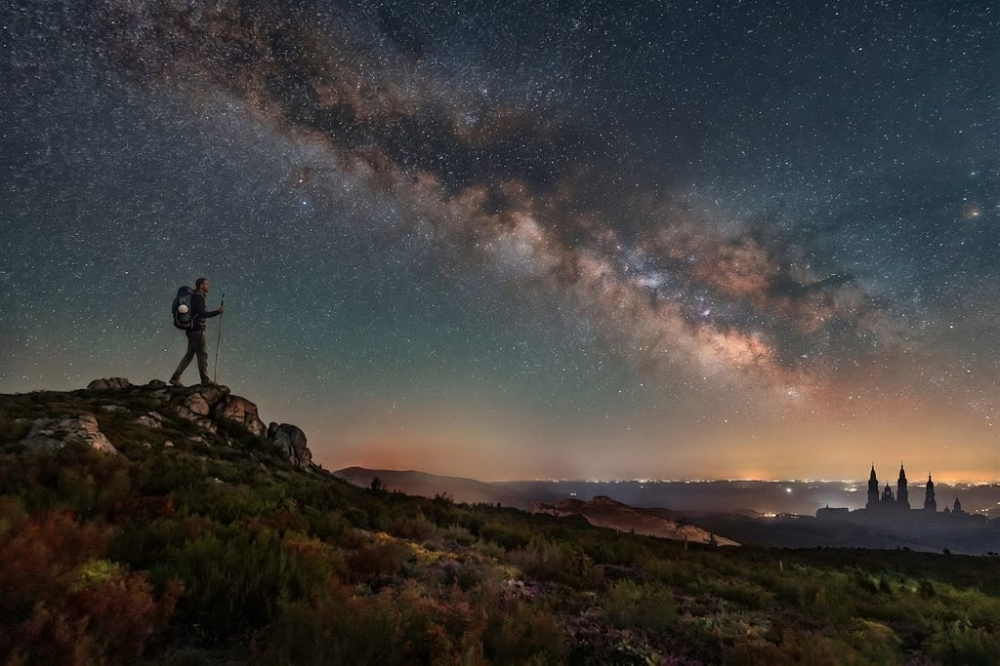
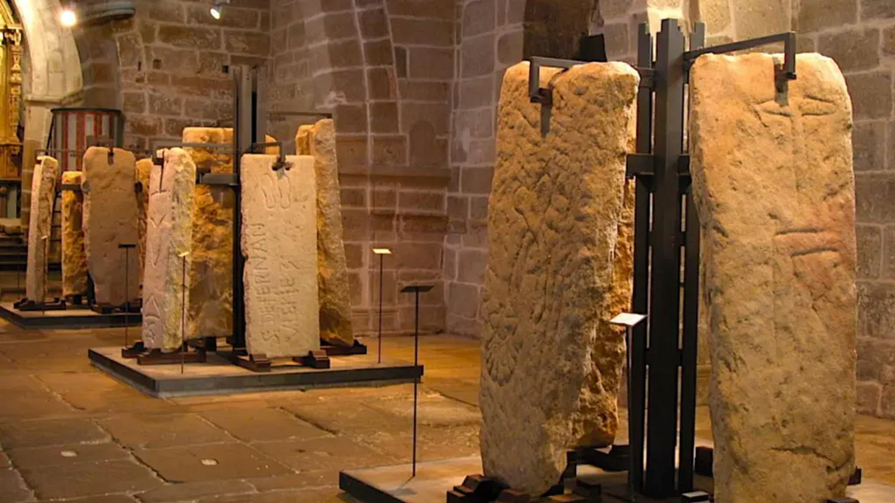

> Muito antes do Caminho Francês para Santiago de Compostela existir, uma rota iniciática de construtores já cruzava os Pireneus. Reconstruí seu traçado a partir das pistas deixadas por Louis Charpentier.

Quem caminha hoje para Santiago de Compostela segue uma trilha bem sinalizada. Há setas amarelas pintadas em placas, muros, postes e calçadas; albergues a cada poucos quilômetros; mapas, livros e guias que descrevem cada igreja e cada lenda do percurso. Tudo parece feito para que ninguém se perca. E talvez esse seja justamente o ponto que merece atenção: um caminho tão cuidadosamente preparado para ser percorrido por multidões pode ser, ele mesmo, o resultado de uma escolha. **Alguém decidiu por onde os peregrinos deveriam passar**.

Foi essa intuição que orientou [Louis Charpentier](https://fr.wikipedia.org/wiki/Louis_Charpentier) ao escrever [*Les Jacques et le mystère de Compostelle*](https://link.amazon/B00fr8JSm), publicado em Paris pela editora Robert Laffont em 1971, na coleção *Les énigmes de l’univers*. A obra chegou ao Brasil e a outros países de língua latina sob o título *O mistério de Compostela*. Sua tese é desconfortável e fascinante ao mesmo tempo: **o Caminho Francês de Santiago que conhecemos seria a cristianização tardia de uma rota muito mais antiga, anterior ao culto ao apóstolo, percorrida não por penitentes em busca de salvação, mas por construtores em busca de conhecimento**.

Apesar de algumas afirmações necessitarem de comprovação pelos métodos da ciência histórica, sua leitura é coerente o suficiente para provocar uma curiosidade legítima: **e se o traçado original desse caminho pudesse ser recuperado?** Foi a partir dessa pergunta que construí o mapa que está neste artigo, buscando desvendar esssa antiga rota iniciática.

Antes de avançar, é justo situar o leitor sobre quem foi Charpentier e que efeito sua obra teve. Ele não era arqueólogo nem historiador acadêmico. Era jornalista, peregrino, viajante e editor, e chegou ao tema das chamadas ciências tradicionais depois de observar o efeito dos megálitos sobre o comportamento de animais e plantas.

Em 1966 publicou [*Le Mystère de la cathédrale de Chartres*](https://link.amazon/B01NXhgbx) (O Mistério da Catedral de Chartres), que se tornou um sucesso de público e o transformou em um dos nomes mais lidos da onda de literatura de mistério que tomou a França e a Europa nos anos 1960 e 1970. Foi nesse embalo que veio *Les Jacques et le mystère de Compostelle*, recebido com entusiasmo pelos leitores interessados em esoterismo e simbolismo, e com reservas por parte de críticos que viam em seus encadeamentos algo entre a erudição e a especulação livre.

## O Caminho Francês de Santiago como conhecemos

Vale começar pelo presente, porque é dele que todo o resto se distancia. O principal itinerário para Santiago de Compostela hoje é o chamado Caminho Francês. Ele começa em Saint-Jean-Pied-de-Port, do lado francês dos Pireneus, cruza a fronteira por Roncesvalles e segue por Pamplona, Puente la Reina, Logroño, Burgos, León e Ponferrada até chegar a Santiago, já na Galícia. É a rota mais percorrida, a mais documentada e a mais bem servida de albergues. Quando alguém diz que está fazendo o Caminho, quase sempre é desse que está falando.

*[Mapa da rota atual do Caminho Francês, de Saint-Jean-Pied-de-Port a Santiago de Compostela.](https://www.google.com/maps/d/viewer?mid=1sET9YDELCtNMjR9M6hGqK8ml2iroXGg)*

Convém lembrar que a peregrinação cristã a Compostela é, historicamente, algo relativamente recente. Ela só nasce por volta do século IX, quando corre pelo Ocidente cristão o rumor de que, num canto da Galícia livre da invasão muçulmana, homens santos haviam descoberto, avisados por luzes misteriosas, o túmulo do apóstolo Santiago Maior. Com o tempo, a lenda cresceu, falou-se de milagres, e gente da França, da Itália, da Alemanha, de Portugal e da Inglaterra começou a tomar a estrada. Tornou-se moda: quem não podia ir a Jerusalém ou Roma, partia para Santiago.

Aqui entra um aspecto que ajuda a entender a dinâmica dessas peregrinações medievais. Elas se organizavam em torno de relíquias, isto é, restos físicos de santos ou objetos a eles ligados, considerados sagrados e capazes de operar milagres. Uma relíquia importante atraía multidões, e com elas vinham doações, prestígio e movimento para a cidade ou local que a abrigasse. As rotas de peregrinação se traçavam, então, de mosteiro em mosteiro, de basílica em basílica, de relíquia em relíquia, como uma sucessão de pontos de devoção que conduziam o peregrino até o destino final. O túmulo do apóstolo na Galícia era o grande ímã desse movimento, e a concha que os peregrinos passaram a usar como insígnia nasceu justamente dos símbolos e das lendas em torno da chegada do corpo do santo pelo mar. A peregrinação, vista assim, tinha tanto de fé quanto de empreendimento.

Não por acaso, o Caminho Francês é também o primeiro roteiro de peregrinação da Europa a ganhar algo parecido com um guia de viagem. Por volta do século XII, compilou-se o chamado [Codex Calixtinus](https://link.amazon/B099oaWgc), ou *Liber Sancti Jacobi*, um manuscrito atribuído em parte ao clérigo francês Aymeric Picaud, reunindo sermões, milagres e relatos ligados ao apóstolo. Seu quinto livro descreve as etapas do caminho, os povos e os costumes de cada região, os santuários a visitar e até os perigos da estrada, funcionando como um verdadeiro manual do peregrino. O detalhe revelador, para a tese de Charpentier, é que o mesmo Codex traz também a [Historia Turpini](https://link.amazon/B00xm330l), o relato que atribui a Carlos Magno e a seu cavaleiro Roland um papel heróico na abertura da rota. Charpentier lê essa associação com desconfiança. Para ele, os organizadores do caminho eram hábeis na arte da publicidade e recrutaram a figura já consagrada do imperador, que jamais esteve em Compostela, para dar prestígio a uma peregrinação que precisavam promover. O guia medieval, nessa leitura, não apenas descreve o Caminho Francês: ajuda a construí-lo, moldando a lenda que o justificava.

Portanto, guarde esse traçado e essa origem, porque o argumento de Charpentier nasce de uma comparação. A rota que ele tenta recuperar não coincide com o Caminho Francês e é muito anterior ao culto das relíquias. Ela entra na Espanha por outro ponto dos Pireneus, segue por desfiladeiros e só se cruza com o caminho atual lugares específicos.

## O Caminho das Estrelas

A primeira pista de Charpentier vem de um objeto curioso. O relicário de Carlos Magno trazia, gravada, a direção de Compostela indicada por duas fileiras de estrelas. Charpentier não as lê como ornamento, mas sim como um mapa.

Há uma razão antiga para essa associação entre Compostela e as estrelas. Na tradição popular, o Caminho de Santiago é a própria Via Láctea, aquele rastro de estrelas que atravessa o céu noturno em direção à constelação do Cão Maior. Os peregrinos caminhavam para o oeste tendo, à noite, essa faixa luminosa apontando o rumo. O nome Compostela, aliás, é muitas vezes ligado a *campus stellae*, o campo da estrela. O céu e a terra, nessa leitura, repetem o mesmo desenho: um corredor que vai do nascente ao poente.

*Ilustração que mostra a Via-Láctea como guia noturno para os peregrinos.*

Para Charpentier, as duas fileiras de estrelas do relicário correspondem a duas linhas paralelas que cruzam a Península Ibérica do Mediterrâneo ao Atlântico. E o que sustentaria essa leitura é a toponímia. Ao longo dessas linhas, ele encontra uma sucessão de nomes ligados à estrela: o Pic d’Estelle e o Puig de l’Estelle na Catalunha, Estella em Navarra, cujo nome basco Lizarra também designa a estrela, e ainda Lizárraga, já em direção à Galícia. São pontos espalhados por quase mil quilômetros, e quase todos se alinham em torno de duas faixas de latitude muito próximas.

A primeira linha corre perto da latitude 42°30′. A segunda, um pouco mais ao norte, perto dos 42°50′. Compostela está a 42°53′, ligeiramente deslocada, mas o Pico Sacro, que a lenda aponta como o primeiro túmulo do apóstolo, fica bem próximo dos 42°46′. Charpentier resume o argumento de forma direta: alinhar vários pontos sobre um mesmo paralelo, ao longo de mil quilômetros, não é obra do acaso. Exige saber geográfico e astronômico. Exige instrumentos. E exige que alguém, muito antes da Era cristã, soubesse onde estava.

É aqui que a história fica interessante para quem quer desvendar essa antiga rota. Charpentier não fala de uma linha única, mas de uma faixa. O caminho original correria entre as latitudes 42°30′ e 42°50′. Foi essa faixa que usei como moldura para a reconstituição cartográfica.

*[Mapa contendo a faixa delimitada pelas latitudes 42°30′ e 42°50′, sobreposta ao norte da Península Ibérica.](https://www.google.com/maps/d/viewer?mid=1Ax6iD0sLWObdO-zJpI2PZ_hB0TfCFzU)*

Dentro dessa faixa, os pontos citados pelo autor deixam de ser uma lista de nomes curiosos e passam a desenhar um corredor. É como se o céu, com sua Via Láctea, tivesse sido projetado no solo entre dois paralelos.

Charpentier vai além e observa que o caminho de Compostela não está sozinho. Haveria eixos semelhantes em outras latitudes da Europa ocidental, todos terminando no Atlântico. Um liga Sainte-Odile, na Alsácia, ao extremo da Bretanha, perto dos 48°. Outro vai de Dover, na Inglaterra, até a costa da Cornualha, perto dos 51°. E haveria ainda um quarto, passando por Le-Puy-en-Velay, perto dos 45°. Juntos, formariam uma progressão regular: 42, 45, 48, 51. A simetria pode ser coincidência ou indício, mas serve ao propósito de situar Compostela dentro de um padrão maior e não como um caso isolado.

## Os construtores e suas marcas na pedra

Charpentier chama de *Jacques* os antigos construtores que percorriam essa rota. Não eram peregrinos comuns. Eram pedreiros, artesãos, talhadores de pedra, organizados em confrarias que atravessavam a Europa erguendo igrejas, mosteiros e fortalezas. As lendas dessas fraternidades não invocam o apóstolo, mas sim um “Mestre Jacques”, um arquétipo de trabalhador da pedra que teria participado da construção do Templo de Salomão.

A relação dessa gente com o caminho é antiga e Charpentier a faz remontar a um passado muito anterior ao cristianismo. Ao longo de toda a rota, e especialmente em sua parte final, na Galícia, o solo está coberto de monumentos megalíticos: dolmens, túmulos, menires, pedras gravadas. Só na província de Pontevedra, que corresponde ao último trecho do caminho das estrelas, ele aponta mais de cem localidades com dolmens ou túmulos com petróglifos, aquelas gravações feitas na rocha em tempos neolíticos. Esses sinais, para ele, não são enfeite nem passatempo. São uma forma de escrita que ainda não sabemos ler, deliberadamente colocada em lugares escolhidos e protegida por muros de pedra.

O detalhe que costura tudo é a continuidade dos sinais. Os mesmos traços que aparecem nos petróglifos neolíticos reaparecem, séculos depois, nas marcas que os construtores deixavam nas pedras das igrejas que erguiam ao longo do caminho. Cada pedreiro livre gravava na pedra que trabalhava um sinal próprio, sua assinatura. Esse sinal não era apenas identificação. Era prova de que aquele homem assumia pessoalmente a responsabilidade por seu trabalho e portanto de que era um homem livre, que dispunha livremente do que produzia. Charpentier observa um dado curioso: essas marcas aparecem nas igrejas românicas, mas tendem a desaparecer nos monumentos civis, nas fortalezas e nas construções mais tardias, como se a liberdade do ofício também tivesse se perdido com o tempo.

*Templo gótico e cemitério de Santa María A Nova, em Noia, com mais de 500 lápides medievais inscritas.*

Há um lugar onde essa tradição se mostra de forma quase enigmática. Em Noia, na Galícia, existe um conjunto de lápides medievais cobertas apenas de desenhos, sem nome algum, sem inscrição. Apenas sinais gravados, parecidos com os dos petróglifos e com as marcas dos construtores. Charpentier as interpreta como túmulos de mestres iniciados, gente para quem o nome já não contava. O iniciado, ao morrer para o mundo, perde o nome, mas conserva sua qualificação, expressa em sinais.

## As sete portas da rota iniciática

Charpentier descreve o caminho original como uma sequência de **sete portas**. A palavra merece explicação, porque ela não significa um portão físico, mas sim algo mais próximo de uma passagem ritual.

Cada uma das sete portas é um desfiladeiro de montanha, uma passagem estreita e difícil entre dois mundos. Geograficamente, é o ponto por onde se atravessa de um vale para outro. Simbolicamente, é uma prova a ser vencida, um limiar.

Em quase todas as tradições iniciáticas, avançar significa cruzar uma série de umbrais, e a cada travessia o iniciado deixa para trás um estado anterior e nasce para um novo. A ideia de fundo, que percorre o livro inteiro, é a de que não se muda sem renascer, e não se renasce sem antes morrer para o que se era. As cerimônias de iniciação, em quase toda parte, começam simbolicamente com uma morte. Mata-se o homem velho para que nasça o novo.

Por isso as portas costumam estar associadas a grutas. A gruta é o ventre da Terra Mãe, o lugar onde o iniciado entra para morrer e de onde sai transformado, como quem volta a nascer. Não por acaso, várias dessas passagens desembocam em cavernas que mais tarde foram cobertas por igrejas, como se o cristianismo tivesse construído sobre o lugar do rito antigo. A própria palavra reforça a leitura: vários desses pontos carregam, em basco, a ideia de porta em seus nomes.

O caminho seria, então, uma sucessão de sete mortes e sete renascimentos, da primeira à última passagem, composto por 7 portas:

1. A primeira porta fica perto de **Jaca** e leva a **San Juan de la Peña**, não pela estrada atual, mas por **Atarés** ou Santa Cruz de Serós. Atarés, justamente, vem de *atari* (que significa “porta” em basco). Era ali que se entrava na rota, com o primeiro rito celebrado na gruta onde mais tarde se ergueria o mosteiro.
2. A segunda é o **Alto de Loiti**, precedido pelo povoado de **Aldunate**, nome que de novo guarda o *ate* basco (que também faz referência à “porta”). Dá acesso à Sierra de Alaiz e à sua gruta.
3. A terceira é o longo desfiladeiro de **Estella**, que segue o rio e desemboca em La Rioja, passando pelo porto de **Echegárate**, nome que Charpentier traduz como passo do pedreiro.
4. A quarta é o desfiladeiro de **Pancorbo**, entre Miranda e Briviesca.
5. A quinta porta abre a entrada dos Montes de **León**, não pela estrada do Manzanal, mas pelo desfiladeiro que a ferrovia segue por Porquero. Desemboca na planície fértil do Bierzo, onde os templários ergueram em **Ponferrada** uma fortaleza enorme, marcada não com a cruz, mas com a letra Tau.
6. A sexta é o porto de **Piedrafita**, que leva a **O Cebreiro**, com uma das casas hospitaleiras mais antigas do caminho, num pequeno povoado céltico que ainda conserva as pallozas de teto de palha. É o ponto por onde se entra na Galícia, terra de Lug, o deus celta que dá nome a Lugo.
7. A sétima é o **Paso de Oca**, que conduz a **Compostela**, mas sobretudo ao **Pico Sacro**, à montanha sagrada onde a lenda situa o primeiro túmulo do apóstolo. Esse mesmo caminho leva ainda a **Padrón** e a **Noia**, os dois pontos onde o percurso encontra o mar.

A rota original e o Caminho Francês não correm sempre separados, nem sempre juntos. Eles se tocam em alguns pontos e se afastam em outros. A rota original dos constutores entra na Espanha pelo **Somport**, e não por Roncesvalles, de modo que durante todo o trecho dos Pireneus os dois seguem distintos. Encontram-se pela primeira vez em Puente la Reina. Depois voltam a divergir e tornam a coincidir em León e em Ponferrada, sobrepondo-se a partir daí até Portomarín.

Foi a partir dessa lógica de aproximações e afastamentos que reconstituí a rota, e cada uma das minhas referências cobriu um trecho. As **sete portas** de Charpentier deram a espinha dorsal e o sentido iniciático do percurso. O **Caminho Aragonês** serviu para recuperar o início da rota: ele parte de Somport, passa por Jaca e por Aldunate e chega a Puente la Reina, onde encontra o Caminho Francês. Já o **Camino Olvidado**, ou Caminho Esquecido, uma antiga rota de peregrinação a Santiago que cruza o norte da Espanha por baixo da cordilheira Cantábrica, foi essencial para recuperar o trecho central: ele passa por Aguilar de Campoo, Guardo, Cistierna e San Miguel de Escalada antes de chegar a León, onde de novo toca o Caminho Francês. Combinadas com a faixa de latitudes, essas referências se sobrepõem e desenham um corredor coerente.

O desfecho, porém, é onde a rota recuperada se separa de vez do caminho moderno. Ao alcançar o Pico Sacro, em vez de seguir para a catedral de Santiago, ela toma o rumo de Padrón e, de lá para Noia, terminando diante do oceano em Finisterre. É essa divergência final que melhor revela a diferença de propósito entre os dois caminhos.

*[Mapa contendo a faixa de latitudes e o traçado da rota iniciática recuperada, combinando as sete portas, o Caminho Aragonês e o Camino Olvidado](https://www.google.com/maps/d/viewer?mid=1aNv_iFdyQiLdZk7j9Dzxcsfwm_vgvvo)*

## A influêcia da Ordem de Cluny

Para entender por que esse caminho antigo se transformou no Caminho Francês para Santiago de Compostela, é preciso falar da Ordem Monástica de Cluny.

Cluny foi uma abadia beneditina fundada no século X, na Borgonha, França, que se tornou o centro de uma rede de mosteiros espalhada por toda a Europa. Em seu auge, a ordem cluniacense reunia centenas de casas que respondiam a um mesmo abade. Era uma das instituições mais poderosas do Ocidente medieval, com influência sobre reis, papas e sobre a própria forma de viver a fé.

Entretanto, há um aspecto da abadia de Cluny que interessa particularmente a esta história: os beneditinos eram construtores. Boa parte dos monges era de carpinteiros, canteiros e pedreiros. Muitos abades foram, eles próprios, mestres de obras. A arte de construir alcançou com a Ordem de Cluny um de seus pontos altos, e a ordem foi um celeiro de mestres construtores na Idade Média.

No primeiro quarto do século XI, a Ordem de Cluny tomou posse, por assim dizer, do caminho de Compostela. O processo começou com a introdução da regra cluniacense no mosteiro de San Juan de la Peña, em 1025, com apoio do rei Sancho de Aragão. Monges espanhóis viajavam a Cluny, monges cluniacenses vinham à Espanha, e os intercâmbios se espalharam. Foi nessa época que a Ordem de Cluny abriu aos peregrinos a rota de Roncesvalles, mais fácil que o Somport, e organizou a rede de mosteiros, albergues e hospitais que tornaram a peregrinação acessível a multidões. Foi também por essa via que se consolidou o Caminho Francês.

É nesse ponto que a leitura de Charpentier ganha força. Ele observa que a Ordem de Cluny não destruiu a tradição antiga. Fez algo mais sutil: desviou os peregrinos dela. Abriu uma rota paralela, confortável, ladeada de hospitais, e conduziu para ela a massa dos penitentes. O “caminho turístico”, digamos assim, foi traçado ao lado do caminho das estrelas, não sobre ele. Passada Estella, que era inevitável, os peregrinos eram levados em direção a Logroño, Burgos e a planície, afastando-se dos lugares megalíticos e sagrados da rota original. Nada de Paso de Oca, nada de concentração em Padrón, nada de Noia. Apenas um rápido asseio em Lavacolla e o direito de gritar de alegria à vista das torres de Compostela.

Charpentier sugere que isso pode ter sido proposital e até desejável. Para quem buscava uma via de conhecimento, o turista era um estorvo no caminho. Manter as duas multidões separadas protegia o que ainda restava de iniciático na rota antiga. Ao mesmo tempo, e isso é importante, Cluny não parece ter tentado apagar a tradição pagã que estava na base. Pelo contrário, a abadia borgonhesa teria enviado seus próprios operários para aprender naquela espécie de universidade itinerante. Há quem diga que a grande arte de Cluny nasceu, em parte, no próprio caminho de Compostela.

## Construtores, não apenas peregrinos

Pelo caminho de Compostela desfilavam penitentes, místicos, mendigos e salteadores. Mas, segundo Charpentier, à frente de todos iam os construtores. E estes não peregrinavam como penitentes nem como místicos. Caminhavam como aprendizes, como candidatos à iniciação, em busca de um conhecimento ligado ao próprio ofício.

O caminho seria, então, uma grande escola. Diz-se que sem o caminho de Compostela o românico não teria sido o que foi, alimentado por uma ciência simbólica reencontrada e aplicada nas igrejas que se erguiam ao longo da rota.

As grutas de San Juan de la Peña, de Santa Cristina, de Sasabé teriam sido lugares de rito, onde a iniciação acontecia no ventre da terra antes de ser coberta por capelas cristãs. As capelas octogonais, como a de Eunate, cujo nome basco significaria as cem portas, repetem a forma da caverna primitiva e um ritual que se perdeu.

Os próprios alquimistas chamavam de caminho de Compostela o longo trabalho de laboratório que, através de provas sucessivas, levava à pedra filosofal. Não por acaso, quando Nicolas Flamel percorre a rota, não é em Compostela que encontra o que procura, mas em León, com um sábio cabalista, passando de estudante a adepto.

León, aliás, ocupa um lugar especial nessa leitura. Charpentier a aproxima de Chartres e de Glastonbury, lugares que ele chama de alumbramento, de nascimento. Como se o sentido da rota não estivesse no túmulo ao final, mas na transformação que acontecia ao longo do caminho.

## Caminhar como método: o corpo, a terra e o poente

O caminho transforma quem o percorre. Charpentier propõe uma ideia que talvez seja a mais instigante de todo o livro: a transformação não viria apenas do destino, nem dos ritos nas grutas, mas do próprio ato de caminhar. A pé, em atrito com a terra, dia após dia, o corpo do peregrino entraria em sintonia com ritmos que a vida sedentária faz esquecer.

Quem caminha por semanas, vencendo o cansaço, passo após passo, acaba ajustando seu ritmo interno ao ritmo da própria Terra e ao do cosmos, ao ciclo da aurora, do dia, da tarde e da noite. Charpentier fala em uma espécie de impregnação, um despertar de sentidos que estavam adormecidos. O homem moderno, preso ao ritmo das máquinas e sentado em seus veículos, teria perdido o contato com essas correntes da velha Terra Mãe, que ele descreve como dispensadora de todos os dons. O caminho seria um modo de reencontrá-las.

A direção importa nesse raciocínio. A rota corre de leste para oeste, em sentido contrário à rotação da Terra, rumo ao sol poente. Para Charpentier, marchar contra o giro do planeta, seguindo o sol em sua descida, não é gesto qualquer. É um ato quase instintivo. E é justamente isso que explicaria por que as antigas linhas de peregrinação seguem com tanta exatidão o traçado dos paralelos terrestres: não se trata só de chegar a um lugar, mas de percorrer um eixo, de fazer o corpo atravessar uma faixa específica do globo no sentido do movimento solar.

Há ainda um terceiro elemento que se soma à marcha e à direção: o solo por onde se caminha. Os antigos sabiam, segundo Charpentier, escolher os lugares onde erguiam seus megálitos, lugares dotados de propriedades telúricas que agiam sobre as plantas, os animais e os homens. As grutas, os dolmens, as pedras gravadas que pontuam o caminho não estariam espalhados ao acaso, mas postos sobre veios de energia da terra. Percorrer essa rota seria, então, atravessar uma sucessão desses pontos ativos, com efeitos sobre o corpo e a mente que ele admite não saber explicar, mas cuja realidade afirma com convicção.

Não é preciso aceitar a explicação para perceber o que há de verdadeiro na intuição. Qualquer pessoa que tenha caminhado longas distâncias conhece a mudança que se opera depois de alguns dias: a cabeça desacelera, a percepção se aguça, surge uma espécie de clareza que não vem do pensamento, mas do corpo em movimento. Charpentier dá a esse fenômeno uma roupagem esotérica, ligando-o às correntes da terra e ao curso do sol. Mas a experiência de fundo, a de que o caminhar prolongado altera quem caminha, é algo que muitos peregrinos relatam até hoje, com ou sem vocabulário místico.

## O fim do caminho: Padrón, Noia e Finisterre

Há um detalhe que distingue a rota iniciática do Caminho Francês moderno, e ele está no destino. Para o peregrino de hoje, o caminho termina diante da catedral de Santiago. Para os antigos construtores, segundo Charpentier, Compostela não era o fim. Era quase uma estação a mais antes do verdadeiro término, que ficava na costa, onde a terra encontra o oceano.

Depois da sétima porta, o caminho seguia para Padrón, lugar onde a lenda diz ter aportado o barco com os restos do apóstolo. O nome, para Charpentier, guarda a ideia céltica de *pardon*, de reunião, de assembleia. Era um ponto de chegada e de encontro. E seguia também para Noia, a pequena cidade à beira da ria que um cronista medieval chamou de chave da Galícia. Noia carrega uma lenda notável: ali teria desembarcado, depois do grande dilúvio, o primeiro navegante, associado à figura de Noé. Nas alturas que cercam a ria, existe de fato uma cadeia de colinas chamada montes Aro. É em Noia, vale lembrar, que estão aquelas lápides sem nome, cobertas de sinais, que Charpentier lê como túmulos de mestres construtores.

O sentido desse término litorâneo retoma a ideia da marcha para o poente, agora levada ao seu limite. Caminhar para o oeste, como vimos, era caminhar em direção a uma morte simbólica e a um renascimento. Não por acaso, era para o oeste que se dirigia o espírito do morto egípcio, e a oeste ficavam as Ilhas Bem-aventuradas e a Ilha de Avalon, para onde iam as almas dos celtas. O sol morre todo dia no poente antes de renascer no nascente, e a peregrinação repetia esse movimento. Chegar à beira do Atlântico era completar o gesto: alcançar o ponto onde a terra acaba e o sol mergulha na água.

É por isso que o caminho que reconstruí não termina em Santiago, mas avança até o oceano, em Finisterre. O nome vem do latim *finis terrae*, o fim da terra, o ponto onde, para os antigos, o mundo conhecido acabava e começava o desconhecido. Diante do mar aberto, com o sol se pondo sobre a água, fechava-se o sentido da rota: a marcha rumo ao poente, a chegada ao limite do mundo, o fim que era também um começo. Finisterre é o destino natural de um caminho que sempre foi, antes de tudo, um caminho de morte e de renascimento.

## O que sobrou disso tudo

Reconstituir essa rota não é provar que Charpentier estava certo. É, antes, considerar uma hipótese e ver até onde ela leva. Quando se sobrepõem as sete portas, a faixa entre os paralelos 42°30′ e 42°50′, o Caminho Aragonês e o Camino Olvidado, surge um corredor que faz sentido geográfico, e que difere do trajeto turístico consolidado pela Ordem de Cluny. Esse corredor, que parte dos Pireneus e termina diante do oceano em Finisterre. É o que o mapa apresenta.

Talvez o mais instigante não seja decidir se a rota iniciática existiu de fato. Seja qual for a resposta, há algo de revelador no simples gesto de Cluny ter coberto, e não apagado, uma tradição anterior. Como se a fé nova tivesse precisado se assentar sobre uma memória antiga para criar raízes. E essa memória, ainda que disfarçada, continua ali, escrita na toponímia, nos sinais gravados na pedra, na posição dos mosteiros, no traçado dos desfiladeiros e no nome dos montes, vilarejos e cidades.

Fica então a provocação, para quem caminha ou para quem apenas se interessa por essas histórias: **O caminho que percorremos é mesmo o caminho que escolhemos ou é o caminho que alguém escolheu por nós?** E o que ganharíamos se, em vez de seguir as setas amarelas, tentássemos enxergar a trilha que elas, talvez, vieram esconder?
