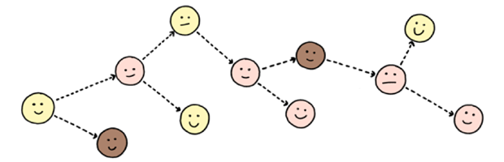
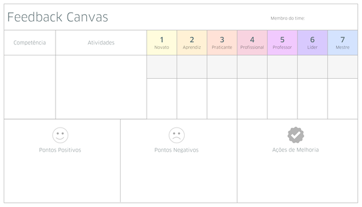

*Texto originalmente publicado no blog "Além da gestão tradicional" em março de 2013.*

Há alguns anos, tenho estudado e discutido com amigos sobre como avaliar o desempenho de uma pessoa no trabalho. Até então, ao contrário dos inúmeros métodos e ferramentas disponíveis no mercado, tenho concluído que **não faz sentido determinar o desempenho individual quando o resultado do trabalho a ser feito depende mais do desempenho coletivo**.

## O todo é maior que a soma das partes

Empresas são [sistemas complexos](http://pt.wikipedia.org/wiki/Sistemas_complexos) que criam valor para as pessoas que são seus clientes. Desta perspectiva, a capacidade de gerar valor está dividida, de maneira não uniforme, entre todos os agentes que formam esse sistema. Assim, o desempenho é sistêmico e nenhum de nós, individualmente, é responsável pela totalidade do desempenho de uma empresa.

*Jurgen Appelo — Empower Teams — Management 3.0*

É preciso entender também que o desempenho de uma pessoa é dependente das **interações** que ela tem com as outras pessoas que trabalham na mesma empresa. A **valorização do trabalho em equipe** é apenas uma evidência de como esse comportamento se tornou mais visível e importante nos dias de hoje.

Entretanto, se o desempenho é coletivo e o nosso trabalho acontece através de relações não lineares com outras pessoas, faz sentido estabelecer metas individuais ou mesmo medir a produtividade de uma pessoa?

## A busca pela eficiência x inovação

Historicamente, a avaliação de desempenho surgiu no modelo de gestão Taylorista. Para Taylor, a gestão da empresa deveria ser separada da execução do trabalho. O trabalho seria dividido em funções e a eficiência viria da melhora na execução (tempo e qualidade) de cada atividade. Melhorando cada parte, melhora-se o todo. Assim, cabia à gestão medir e monitorar esse desempenho, tomando decisões que aumentassem a eficiência do trabalho.

Naquele contexto econômico e industrial, essa abordagem funcionou muito bem. Como não era preciso inovar, como os mercados eram estáveis e existiam poucos concorrentes, então a busca era mesmo pela eficiência. Taylor e Ford conseguiram produzir mais carros em menos tempo, criando a linha de montagem e conquistando a produção em massa (muito mais eficiente do que a produção artesanal).

Hoje as coisas são bem diferentes. Os mercados são instáveis, a concorrência é muito maior, a informação está disponível para todas as pessoas, o conhecimento e a comunicação ganharam muita importância e a **inovação é o único fator consistente de diferenciação** que pode manter uma empresa competitiva.

**O trabalho se tornou tão dependente da criatividade que não é possível dividí-lo em partes ou funções** sem que exista alguma perda significativa de comunicação e eficácia (fazer a coisa certa). Individualmente, o trabalho também tornou-se mais complexo. Agora, é necessário um grupo de pessoas, uma equipe, para conseguir trabalhar com todo o conhecimento disponível e produzir uma inovação que garanta, de forma sustentável, a geração de valor para os clientes e para o negócio.

## Desempenho individual

Por outro lado, é possível identificar dentro do processo de trabalho algumas atividades que são realizadas individualmente por uma pessoa. Nestes casos, seria possível medir o desempenho individual? Pode até ser que sim, mas será que faz sentido? Será que são essas atividades que geram mais valor para o negócio?

Apesar destas atividades serem muito importantes, elas tendem a se tornar *commodities* ou serem até automatizadas por software e máquinas. Atividades individuais e isoladas (que não sofrem nenhuma influência de outras pessoas na empresa) costumam gerar menos valor para o negócio no contexto atual da economia do conhecimento. Logo, pode ser um desperdício querer monitorar o desempenho destas atividades no processo de trabalho, já que o verdadeiro valor está na inovação criada a partir do trabalho coletivo.

Entretanto, se não faz sentido medir o desempenho individual, e medir o desempenho coletivo não é tão fácil, que abordagem adotar para conseguir melhorar os resultados de uma pessoa, de uma equipe ou de um negócio?

## Feedback

Adotando uma visão mais sistêmica, devemos favorecer o *feedback* e não avaliar o desempenho de uma pessoa ou de uma equipe. Deixar claro quais são os resultados negativos e positivos no trabalho pode fazer que a própria pessoa avalie seu desempenho e melhore na direção dos objetivos do negócio. O desempenho no trabalho é uma conseqüência direta das ações tomadas por uma pessoa de acordo com o *feedback* recebido do ambiente que ela se encontra.

Desta forma, uma pessoa pode melhorar seu desempenho no trabalho recebendo feedback dos outros integrantes da sua equipe, mudando seu comportamento e buscando novos conhecimentos.

Por outro lado, uma equipe pode melhorar seu desempenho recebendo feedback dos clientes (no aspecto de criação de valor) e feedback da empresa (no aspecto financeiro), melhorando seus produtos, seus processos e sua forma de fazer gestão.

A partir do feedback podemos ter consciência de como um agente afeta um sistema complexo e determinar como podemos evoluir. A melhoria deve ser refletida na mudança de comportamento e na capacidade coletiva dos agentes do sistema para gerar resultados diferentes (preferencialmente, melhores).

## Substituindo a avaliação de desempenho individual

Para abandonar a avaliação de desempenho individual, precisamos de uma maneira efetiva de favorecer o feedback individual dentro do contexto de uma equipe. O **Feedback Canvas** é uma ferramenta que criamos na [Webgoal](http://www.webgoal.com.br) para ajudar nesse processo de transição.

Essa ferramenta tem como objetivo estruturar, orientar e suportar o processo de feedback dentro do contexto do trabalho em equipe. Sua dinâmica cria um ambiente de confiança para que um integrante de uma time possa receber feedback de seus pares.

A apresentação a seguir mostra como utilizar o **Feedback Canvas** para realizar uma sessão de feedback:

Neste vídeo também mostro como utilizar essa ferramenta de feedback e explico mais detalhes sobre como adotá-la nas empresas ou equipes:

Baixe o [arquivo de impressão do Feedback Canvas](http://bit.ly/feedback-canvas-A2) e experimente com a sua equipe, começando por você.
