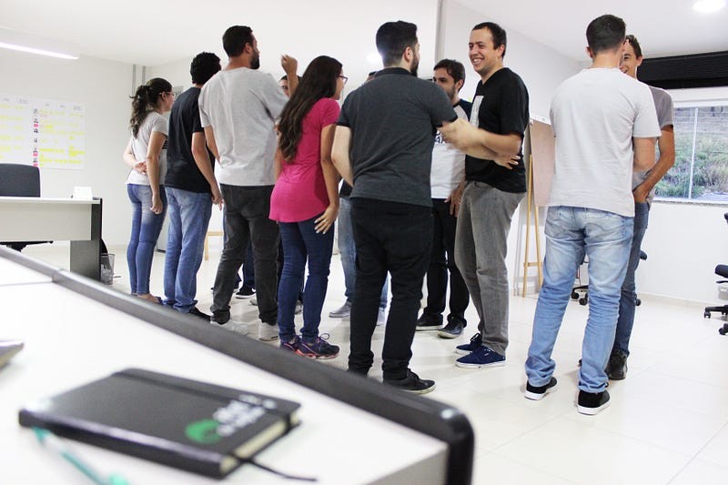

Esse pequeno ensaio visa responder uma questão levantada em um evento de que participei:

> “Devemos fazer a gestão das pessoas ou do sistema?”

Um sistema é um conjunto de agentes ou elementos que mantêm uma relação de interdependência para cumprir um propósito ou alcançar um objetivo. Uma empresa é um sistema complexo adaptativo, dado que é formada por agentes vivos (dotados de livre-arbítrio) e está em constante mudança para se adequar às forças do mercado.

A dualidade **Sistema x Pessoas** é interessante e perigosa. Ao mesmo tempo que simplifica a análise de problemas (trazendo um viés determinista de separar o todo em partes), também traz a falsa perspectiva de que pessoas e sistema são duas coisas separadas ou isoladas.

Entretanto, cada agente (pessoa) é uma representação fractal do próprio sistema (empresa) do qual faz parte. As características do sistema são definidas pelos agentes e suas relações, mas também estão refletidas em cada indivíduo.

Desta forma, reformulando a pergunta inicial, o questionamento ficaria melhor assim:

> “Como construir juntos um bom sistema, fazendo o trabalho que deve ser feito para obter resultados melhores?”

Em empresas que adotam uma gestão orgânica, como na Webgoal, existem muitas situações de conflitos. Por outro lado, é através de conflitos que as pessoas conseguem amadurecer, tornando o sistema do qual fazem parte mais preparado para novos desafios e dificuldades.

**Leia também:** [**O estilo de gestão da Webgoal**](/artigos/o-estilo-de-gestao-da-webgoal/)

Quando eu vejo a gestão tradicional querendo formalizar o sistema, padronizar a operação, fixar a estrutura hierárquica e prescrever como tudo deve acontecer para manter o controle, entendo também que existe um esforço sistêmico para evitar que surjam conflitos.

Nesse contexto, o consenso é a evidência mais gritante da mesma forma de pensar e agir sobre o trabalho. Onde existe consenso, não existem conflitos. Onde não existem conflitos, não existe colaboração para superá-los. Onde não há colaboração, não há (novas) conexões relevantes entre os agentes. Quando não temos relações relevantes entre agentes vivos, não temos um sistema complexo adaptativo.

Por isso, não é preciso esperar por milagres na gestão tradicional: não existirão processos e ferramentas que salvarão a empresa da mediocridade advinda da padronização, do planejamento e da previsibilidade.

O sistema deve ser “construído” todos os dias, enquanto “construímos” a nós mesmos como pessoas e profissionais. É preciso deixar que o sistema mude (ora vai estar melhor, ora vai estar pior) e perceber rapidamente o feedback externo de sua atuação, sendo ágil para nos adaptarmos, reagindo às mudanças para encontrar o melhor *fit* com o mercado. É preciso criar oportunidades para que conflitos aconteçam e possam ser superados, estabelecendo um ambiente psicologicamente seguro para que as pessoas evoluam e criem novas e melhores conexões, pois todo sistema complexo adaptativo é uma construção coletiva.

É preciso entender que a necessidade, a vontade e a velocidade de amadurecimento de cada pessoa são diferentes. Ora alguém vai estar mais engajado, ora outrem não terá a mesma motivação dos demais. Agentes deixarão o sistema e outras pessoas virão para trazer novas capacidades para a empresa.

Ora teremos um líder, ora existirão diversos líderes para ajudar o sistema a superar problemas específicos. Afinal, o florescimento de líderes é um sinal de que o *gap* nas relações está sendo preenchido por alguém. Lembre-se: a liderança é um fenômeno social que só acontece quando existe colaboração entre as pessoas.

Pessoas e sistemas são inseparáveis. Se gerir pessoas não faz sentido, gerir o sistema também não. É preciso vivenciar o sistema entendendo que, como agente, você faz parte do todo e que o todo também está em você.
