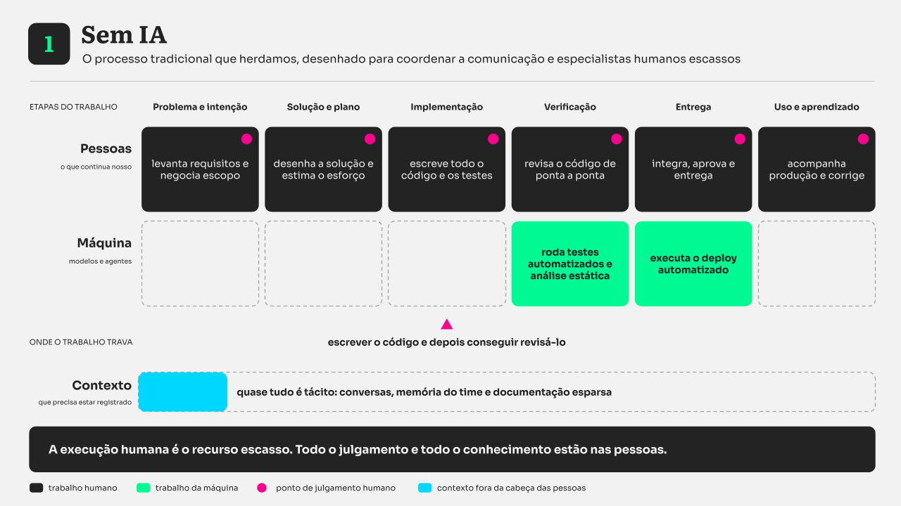

Quando a eletricidade chegou às fábricas americanas, no fim do século XIX, os industriais fizeram o movimento mais sensato do mundo: trocaram a máquina a vapor por um grande motor elétrico e mantiveram todo o resto. O motor continuava girando o mesmo eixo central que atravessava o galpão, que continuava movendo as mesmas correias penduradas no teto, que continuavam acionando as mesmas máquinas dispostas do mesmo jeito, perto do eixo, porque perto do eixo era onde havia força.

A conta fechava no papel e a produtividade não se mexeu por décadas. O ganho só apareceu quando alguém percebeu que era possível colocar um motor pequeno em cada máquina, e que isso libertava o chão de fábrica do eixo. As máquinas puderam ser dispostas na ordem do trabalho, e não na ordem da transmissão de força. Aí a produtividade subiu.

**Vejo um movimento parecido na adoção de inteligência artificial no processo de desenvolvimento de software.**

Quase toda empresa que conheço já comprou o "motor". Licenças de agentes e modelos de IA foram distribuídas, o uso é alto, os desenvolvedores gostam e ninguém quer voltar atrás. Mas quando alguém pergunta o que mudou no projeto, a resposta fica vaga, e a conversa descamba para números que medem atividade: sugestões aceitas, linhas de código geradas, pull requests abertos, etc.

Parte do desconforto vem de uma imprecisão de vocabulário. Dizer que uma equipe adotou IA informa tão pouco quanto dizer que uma fábrica adotou eletricidade. Pode significar que as pessoas ligaram um assistente no editor e seguem trabalhando como antes. Pode significar que a equipe passou a escrever especificações executáveis e delega a implementação. Pode significar ainda que existe um conjunto de agentes operando dentro de um sistema de permissões, verificações e portões de revisão.

São arranjos distintos de trabalho, com custos, riscos e pré-requisitos próprios, e a decisão que interessa raramente é qual deles adotar de uma vez para tudo. É qual deles usar em cada tipo de trabalho.

Apresento neste artigo quatro possíveis arranjos de trabalho. Começo pelo processo sem IA, sigo pela assistência de IA no editor, pelo desenvolvimento orientado por especificações e pela orquestração de agentes.

## Um exemplo didático

Considere uma loja de eletrônicos online que precisa permitir que o cliente cancele um pedido pelo próprio aplicativo.

Parece trivial, mas não é. Cancelar um pedido toca em quase tudo:

- até que momento o cancelamento é permitido, considerando que o pedido pode já estar separado ou em rota;
- o que acontece quando o pagamento já foi efetivado, com regras diferentes para cartão, Pix e boleto;
- como o estorno é registrado para a conciliação financeira, inclusive quando houve cupom ou frete grátis condicionado;
- como o estoque retorna e o que fazer quando o item já foi vendido de novo;
- quem pode cancelar em nome de quem, entre cliente, atendimento e administrador;
- o que o cliente vê em cada estado, com prazos que dependem do meio de pagamento;
- o que o antifraude precisa registrar sobre cancelamentos repetidos.

É uma história de tamanho médio, com regra de negócio, dinheiro envolvido e consequências jurídicas se sair errado. É exatamente o tipo de trabalho onde as promessas de produtividade encontram a realidade.

Essa mesma demanda vai atravessar os quatro arranjos de trabalho, com as mesmas quatro pessoas em cena: quem cuida do produto, quem projeta a experiência, quem desenvolve e quem coordena o projeto. O que muda de um arranjo para o outro é o que cada uma faz e onde o julgamento humano precisa estar.

## Modo 1: sem IA, o processo "tradicional"

*Todo o julgamento e quase todo o conhecimento estão nas pessoas, e o trabalho trava em escrever o código e depois conseguir revisá-lo.*

Vamos começar pelo jeito consolidado de desenvolver software, porque é onde boa parte das equipes ainda opera na maior parte do tempo.

O **gerente de produto** levanta as regras conversando com atendimento, financeiro e logística, escreve a história com critérios de aceite em texto corrido e defende a prioridade.

O **designer** desenha os fluxos, cobre o "caminho feliz", os avisos de prazo e os estados de erro que consegue antecipar, e entrega o handoff com espaçamentos e comportamento anotados.

O **desenvolvedor de software** lê tudo, estuda o serviço de pedidos, descobre que já existe uma rotina de estorno parcial escrita para outro fluxo, escreve o código e os testes e abre o pull request. Outra pessoa revisa o diff inteiro.

O **gerente de projetos** coordena as dependências, negocia a janela com o time de pagamentos e mantém o quadro atualizado perguntando às pessoas em que ponto elas estão.

Automação existe: testes automatizados, análise estática e deploy são feitos pela máquina desde muito antes. A diferença é que essa automação é determinística e roda depois que alguém decidiu tudo.

Onde o trabalho trava: na implementação e, logo em seguida, na capacidade de revisar o que foi implementado. O recurso escasso é a execução humana qualificada.

Do ponto de vista de negócio, esse modo tem uma propriedade que costuma ser subestimada: a capacidade é linear e previsível. Dobrar a entrega exige dobrar o time, com todo o custo de coordenação que isso traz. Em compensação, o conhecimento fica quase todo tácito, distribuído em conversas, memória de time e documentação esparsa. É por isso que a saída de duas pessoas seniores muda o desempenho de uma equipe inteira.

## Modo 2: assistência de IA no editor

*A IA acelera a implementação, mas o processo em volta permanece o mesmo e o gargalo se desloca para a revisão.*

É a forma mais difundida do uso de IA no desenvolvimento de software, a mais barata de começar e a que menos mexe na organização do trabalho.

Tecnicamente, o que acontece é mais interessante do que a sugestão que aparece na tela. A extensão instalada no ambiente monta um pacote de contexto com o arquivo aberto, a posição do cursor, trechos de arquivos relacionados e, quando existem, as instruções que o time registrou no repositório em arquivos do tipo AGENTS.md ou equivalente. Esse pacote vai para um serviço que decide qual modelo atende a requisição, conforme complexidade, custo e latência aceitável, e a resposta volta como texto sugerido. Quem decide se aquilo entra no código é quem está escrevendo.

No nosso exemplo, o **desenvolvedor de software** abre o serviço de pedidos, começa a escrever o método de cancelamento e recebe sugestões coerentes com o estilo do projeto. Pergunta ao assistente quais cenários de teste fazem sentido e recebe uma lista razoável, que inclui o caso do cupom e esquece o caso do item já revendido. Pede uma explicação da rotina de estorno legada e economiza meia hora de leitura.

Os outros papéis mudam pouco. O **gerente de produto** usa a IA para resumir tickets de atendimento e rascunhar a história. O **designer** gera variações de layout e textos de interface. O **gerente de projetos** continua perguntando às pessoas em que ponto elas estão.

A evidência sobre o ganho é mais ambígua do que a propaganda sugere. A assistência acelera bastante a produção de código novo em território conhecido e ajuda pouco quando o trabalho é entender um sistema maduro antes de mexer nele. Nosso cancelamento de pedido é o segundo caso.

Para quem decide o orçamento, três consequências. A licença é barata e o retorno é real, mas local. Acelerar a implementação leva o trabalho mais rápido até o próximo gargalo, que passa a ser a revisão. E medir a adoção por sugestões aceitas ou linhas geradas mede atividade, não resultado.

## Modo 3: desenvolvimento orientado por especificações

*O agente implementa a partir da especificação, e o julgamento humano se concentra em três portões: especificação, plano e aceite da entrega.*

Aqui o esforço humano sai da escrita do código e vai para a escrita da intenção. É o **desenvolvimento orientado por especificações**, em que um documento versionado descreve o comportamento esperado e serve de contrato para o agente que vai implementar.

O ciclo tem três momentos com revisão humana entre eles. Primeiro a **especificação**, em linguagem natural, com critérios de aceite e limites explícitos. Depois o **plano técnico**, que diz quais arquivos serão tocados, em que ordem, com quais riscos e alternativas. Só então a **implementação**, em incrementos pequenos, verificada a cada passo.

No nosso exemplo, isso significa que as sete perguntas do início deste texto precisam estar respondidas antes de existir código. É um desconforto produtivo: o agente não pergunta quando fica em dúvida, ele preenche a lacuna com o palpite mais provável. Uma especificação que não diz o que fazer quando o item já foi revendido vai gerar uma implementação que decide isso sozinha, com uma regra plausível e errada.

O que cada papel faz muda de verdade neste modo.

O **gerente de produto** para de escrever histórias e passa a escrever contratos. Critérios de aceite deixam de ser uma lista de intenções e viram condições verificáveis, no formato que um teste consegue checar. O trabalho de descobrir a regra com atendimento e financeiro continua igual, e fica mais visível quando está incompleto.

O **designer** entra antes, não depois. Estados vazios, carregamento, erro, limites de conteúdo, ordem de foco e contraste passam a ser escritos como restrições junto das regras de negócio. No cancelamento, é o designer que garante que a especificação diga o que o cliente vê quando o prazo expirou, quando o estorno demora cinco dias úteis e quando ele não tem permissão. É exatamente o material que costuma faltar quando só existe o "caminho feliz".

O **desenvolvedor de software** revisa dois artefatos novos antes de olhar qualquer diff, e ganha uma habilidade que antes era opcional: descrever comportamento sem ambiguidade. Continua programando, e escolhe deliberadamente o que escrever à mão. A parte delicada do estorno, que mexe com dinheiro, provavelmente continua sendo escrita por uma pessoa.

O **gerente de projetos** deixa de perguntar em que ponto as coisas estão. O estado passa a ser legível nos artefatos: a spec está aprovada, o plano está aprovado, três incrementos passaram na verificação. O trabalho vira manter o lote pequeno e cuidar dos *gates*.

Duas advertências. A primeira é histórica: tratar a especificação como fonte da verdade não é ideia nova. As ferramentas CASE dos anos 90 e o Model Driven Architecture nos anos 2000 tentaram algo próximo e fracassaram em grande parte porque manter o artefato de alto nível sincronizado com o sistema real exigia uma disciplina que não sobrevive à pressão de prazo. O que mudou é que o consumidor da especificação deixou de ser um gerador determinístico e passou a ser um modelo capaz de lidar com ambiguidade e com código existente. Isso torna o problema mais tratável, mas não o elimina. Uma especificação desatualizada alimentando um agente produz erro com aparência de conformidade.

A segunda é econômica: especificar bem custa tempo. Para uma correção de duas linhas, escrever a especificação custa mais caro que fazer a alteração. Para o nosso cancelamento, ela se paga antes de qualquer agente entrar em cena, porque força a conversa que a equipe estava adiando.

## Modo 4: orquestração de agentes (fábrica de software de IA)

![Diagrama do modo 4, orquestração de agentes: a máquina atua em todas as seis etapas, captando sinais, explorando alternativas, executando em ambientes isolados, verificando em camadas, expondo progressivamente e acumulando evidência; as pessoas definem sinal, restrições e risco aceitável, escolhem a alternativa e o nível de autonomia, decidem as exceções e aprendem com as evidências; o trabalho trava na capacidade de verificar e na atenção humana disponível; o contexto registrado cobre código, arquitetura, decisões, tickets, telemetria, design system e políticas.](../../../assets/articles/ia-no-processo-de-desenvolvimento-de-software/modo-4-orquestracao.png)

*O sistema executa e verifica, as pessoas entram por exceção, e delegar nesse nível exige que quase todo o contexto esteja registrado fora da cabeça do time.*

O quarto modo é o mais recente e o menos consolidado. Em vez de uma pessoa conversando com um agente, existe um conjunto de agentes executando tarefas dentro de uma arquitetura que decide o que cada um recebe, o que pode fazer e como o resultado é verificado.

Um **orquestrador** recebe a demanda, decompõe e distribui. **Agentes** especializados executam recortes específicos em ambientes isolados, com permissões declaradas, do tipo pode rodar a suíte de testes e não pode tocar em infraestrutura de produção. Uma camada de **governança** define *gates* de qualidade, trilhas de auditoria e os pontos em que uma pessoa precisa aprovar. E existe uma camada de **contexto**, que reúne repositório, tickets, decisões de arquitetura, resultados de build e observabilidade, normalmente combinando um banco de grafos para as relações explícitas, ligando commit, tarefa, serviço e incidente, e um banco vetorial para busca por semelhança de significado.

No nosso exemplo, o episódio "cancelamento de pedido" gera execuções paralelas: implementação do fluxo, migração para registrar o motivo do cancelamento, testes de contrato com o gateway de pagamento, ajuste da tela e da mensagem, revisão de segurança sobre a permissão de cancelar em nome de terceiro, atualização da documentação de conciliação. Cada execução produz evidência. A pessoa entra onde o risco justifica, e não em cada etapa.

Os papéis mudam mais uma vez.

O **gerente de produto** passa a trabalhar com intenção e resultado, e ganha algo que antes era caro: explorar alternativas. Antes de comprometer a implementação, dá para pedir a mudança mínima, a solução arquitetural completa, a busca por funcionalidade equivalente que já exista e a estimativa de impacto operacional, junto da opção de não construir. A decisão continua humana, com mais material na mesa.

O **designer** vive a mudança mais forte. O design system deixa de ser documentação e vira contexto executável. Com o servidor MCP do Figma, por exemplo, um agente lê componentes, variáveis e tokens reais e gera implementação que referencia o design system de verdade, em vez de reproduzir a aparência de um print. A Figma também passou a permitir que agentes escrevam no própria canvas. A consequência prática é que parte da revisão visual vira verificação automática: conformidade com tokens, contraste, tamanho de alvo e ordem de foco são propriedades checáveis por sensor. O designer revisa por exceção e usa o tempo que sobra no que a máquina não faz, que é entender o usuário e decidir se o fluxo resolve o problema.

O **desenvolvedor de software** opera várias execuções em paralelo, define o que cada agente pode tocar e lê evidência em vez de ler todo o diff. Quando o agente erra, a pergunta deixa de ser como corrigir aquilo e passa a ser qual controle está faltando no ambiente para que o erro não volte. A resposta pode ser um exemplo, uma regra de lint, um teste de contrato, uma fitness function de arquitetura ou uma permissão mais restrita. Esse trabalho tem nome na literatura recente: *harness engineering*.

O **gerente de projetos** deixa de coordenar a alocação de pessoas em tarefas e passa a gerir três coisas novas: o nível de autonomia concedido a cada tipo de trabalho, a fila de exceções que precisa de decisão humana e o custo por episódio de desenvolvimento, que agora inclui tokens e infraestrutura de execução.

O relato mais forte desse modo vem da OpenAI, publicado em fevereiro de 2026: uma equipe que começou com três engenheiros e chegou a sete construiu um produto com cerca de um milhão de linhas e aproximadamente 1.500 pull requests aceitos, sem nenhuma linha escrita à mão, sob a regra de que humanos conduzem e agentes executam.

Para quem decide, este modo tem uma característica que muda a conversa de orçamento: o custo deixa de ser majoritariamente licença por pessoa e passa a ter um componente variável por execução. Isso aproxima o desenvolvimento de software da lógica de custo unitário que o negócio já conhece em outras áreas, e exige medir custo por episódio entregue, não custo por pessoa.

## Risco, verificação e contexto

Os quatro arranjos podem conviver no mesmo projeto e até na mesma entrega, e em todos eles a **IA amplifica o sistema de trabalho existente**. Equipes que sabem por que estão construindo algo, registram suas decisões e têm um caminho confiável até produção, melhoram em qualquer modo, enquanto equipes que não sabem por que estão construindo vão descobrir que a IA acelera a produção de software que ninguém pediu. Por isso a decisão útil acontece atividade por atividade, e três critérios ajudam a tomá-la.

O primeiro é o **risco da ação**, medido por impacto, incerteza e irreversibilidade. Alterar um texto de interface e executar uma migração que mexe em estorno não pedem a mesma autonomia, e quanto maior o custo de desfazer o erro, mais cedo o julgamento humano precisa entrar e menor deve ser o lote entregue ao agente.

O segundo é a **verificabilidade do resultado**, que responde se existe forma barata e confiável de saber que o trabalho ficou certo sem alguém ler tudo. Onde há teste significativo, contrato de interface ou comportamento observável em produção, dá para delegar mais. Onde a verificação depende de alguém experiente olhando o código, a delegação apenas transfere o esforço de lugar, e costuma aumentá-lo.

O terceiro é o **custo de descrever a intenção**. Trabalho barato de descrever e caro de executar favorece a especificação, enquanto trabalho caro de descrever e barato de executar favorece a assistência. No nosso exemplo do cancelamento, a regra de estorno pede especificação, o ajuste de texto da tela pede assistência e a atualização da documentação pode ser inteiramente delegada, tudo dentro da mesma entrega.

Esse custo depende de quanto contexto já saiu da cabeça das pessoas. Quanto mais autonomia se quer conceder em uma atividade, mais conhecimento precisa estar registrado de forma legível por pessoas e por máquinas, o que deixa de ser burocracia para virar pré-requisito de delegação segura.

## Para refletir

1. Em quais atividades do seu time o julgamento precisa acontecer antes da execução, e em quais ele pode acontecer depois?
2. Quanto do contexto que vocês usam para decidir está registrado em algum lugar que uma pessoa recém-chegada, ou um agente, conseguiria ler?
3. E quando alguém disser que a sua equipe adotou IA, você consegue dizer qual modo está ligado em cada atividade, ou apenas que o motor foi trocado?
