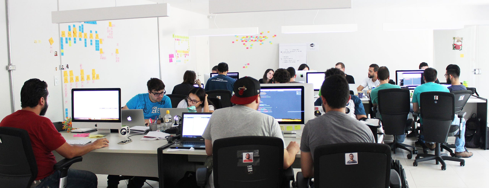

Gestão horizontal. Gestão distribuída. Gestão sem gerentes. Gestão sem hierarquias. Gestão proibida!

Liderança dinâmica. Trabalho em equipe. Autonomia. Colaboração. Auto-organização. Transparência.

Há 10 anos vejo a busca do mercado por uma definição e por características que representem o estilo de gestão da Webgoal.

Primeiro, ouvi que era impossível. Depois disseram que só funcionava em empresas de tecnologia. Afirmaram que esse estilo de gestão serviria apenas para empresas pequenas. Por fim, repetiam que não era escalável.

Enquanto isso, trabalhávamos com a crença de fazer parte de uma organização que cumpre um propósito e almeja objetivos que, sozinhos, nenhum de nós seria capaz de alcançar.

Buscávamos, todos os dias, encontrar uma forma melhor de entregar valor e atender os nossos clientes. Construíamos, física e emocionalmente, um ambiente de trabalho que visava promover o desenvolvimento pessoal e profissional de todos. Víamos emergir uma cultura que valorizava o aprendizado e o companheirismo entre as pessoas.

Nos preocupávamos com o sentimento das pessoas, apesar de nem sempre ter a maturidade e a percepção correta do mundo para agir antes que algum descontentamento acontecesse. Nos iludimos também com algumas pessoas e suas atitudes, mas descobrimos a importância e a necessidade de criar situações de conflitos para que todos nós pudéssemos evoluir.

Enquanto isso, crescíamos em número de pessoas e em tamanho do negócio. Aprendíamos como desenvolver software para tornar empresas melhores e pessoas mais felizes. Conquistávamos admiração e prêmios pelo nosso estilo de trabalho inovador. Compartilhávamos nosso *case* de gestão em eventos e faculdades de administração.

Caminhávamos para encontrar o nosso próprio jeito de fazer gestão. Sem copiar, nem seguir o padrão ou um modelo.

Afinal, todas as empresas são únicas e formadas por pessoas diferentes: o estilo de gestão de uma empresa é como uma impressão digital.

Hoje, vejo que nosso estilo de gestão é uma tendência no mundo. Centenas de consultores e especialistas (que nunca experimentaram essa forma de trabalho) explicando os motivos pelos quais as empresas deveriam mudar. Milhares de empresas querendo copiar “modelos de gestão inovadores” que são utilizados em startups e em outras companhias de renome.

Vejo muita gente querendo dar um nome para essa maneira de fazer gestão. Diversos processos estabelecendo como você deve trabalhar com autonomia. Softwares de gestão sendo criados para automatizar e manter sob controle organizações que precisam se libertar do jogo de poder da gestão tradicional.

Enquanto isso, continuamos aqui, na Webgoal, destilando o nosso estilo de gestão, entendendo que “*nenhuma empresa pode ser maior ou melhor do que o horizonte espiritual e intelectual das pessoas que a formam*”.
