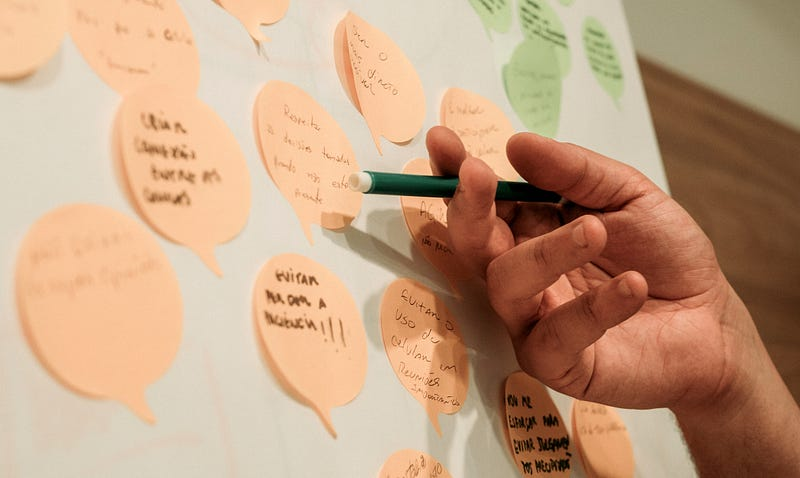
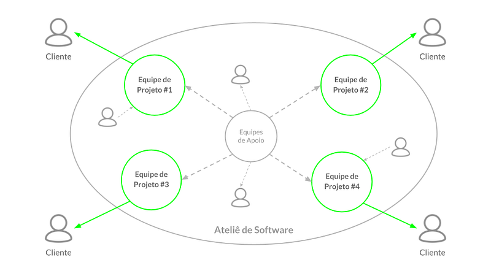

> Após diversas conversas com clientes, parceiros e amigos específicos para entender nossa forma de trabalhar, compartilhamos publicamente o estilo de gestão do Ateliê de Software.

> Nosso objetivo é inspirar outras organizações que buscam implementar abordagens de gestão modernas, baseadas na transparência e autonomia, promovendo um ambiente de trabalho mais flexível e colaborativo.

> *➔* Esse é o 3º de uma série de 4 artigos. Ele explica nossa estrutura organizacional e apresenta nossas práticas atuais de gestão.

As práticas do **Ateliê de Software Way** são o reflexo de uma abordagem de gestão moderna e centrada nas pessoas. Elas demonstram como o dia a dia da organização funciona e como os [valores, princípios e premissas](https://medium.com/atelie-de-software/o-estilo-de-gestão-do-ateliê-de-software-parte-2-afa58ec674e3) se manifestam de forma pragmática através de estruturas, processos e ferramentas de gestão.

## Estrutura organizacional

A estrutura do Ateliê de Software é composta por **equipes autônomas de alto desempenho, multidisciplinares, conectadas em rede e orientadas para a criação de valor para o cliente**. Não há uma posição formal tradicional, mas o reconhecimento da **liderança emergente**, que se manifesta para enfrentar desafios e resolver problemas de forma ágil.

As **Equipes de Projeto** são formadas e organizadas de acordo com as características e necessidades dos projetos de desenvolvimento de software, e cada uma delas é responsável integralmente pelo atendimento de um cliente específico.

O Ateliê conta também com **Equipes de Apoio** que ocupam as atividades administrativas-financeiras, comerciais, de marketing e de gestão de pessoas. Essas equipes de apoio garantem a eficiência dos processos internos e o suporte necessário para que as equipes de projeto possam trabalhar de maneira fluida. Quando necessário, as equipes de apoio podem contar com o auxílio de consultores externos e profissionais especializados, como advogados e contadores, que trazem conhecimentos específicos para fortalecer a operação.

*Representação simplificada do design organizacional do Ateliê de Software*

Já as Equipes de Projeto recebem suporte tanto das Equipes de Apoio quanto de profissionais mais experientes em desenvolvimento de software, design e facilitação de projetos. Esses especialistas atuam de forma pontual, auxiliando as equipes a superar desafios específicos e promovendo o desenvolvimento de soluções inovadoras.

Para realizar determinadas iniciativas ou projetos internos, os membros do Ateliê também se organizam em pequenos **Comitês Temporários** orientados a objetivos específicos, como a realização de cursos de imersão e eventos, promoção de confraternizações, discussão de aumentos salariais, entre outros. Esses comitês são formados conforme necessário, com autonomia para definir estratégias e implementar soluções de maneira eficiente e colaborativa.

Essa estrutura **promove a auto-organização e a responsabilidade individual e coletiva**, onde os papéis são definidos pelas próprias equipes, e os profissionais têm total liberdade para ajustar suas funções de acordo com suas necessidades de trabalho e suas habilidades.

## Práticas de gestão

O Ateliê de Software adota práticas de gestão que favorecem a autogestão, a colaboração e a transparência, permitindo que cada membro contribua para o desenvolvimento organizacional e para a tomada de decisões.

As práticas adotadas refletem a cultura do Ateliê, baseada na confiança e na responsabilidade compartilhada, criando um ambiente de trabalho flexível e adaptável às necessidades dos projetos e dos clientes.

### Equipes Autônomas

Observando nossa estrutura organizacional, fica claro que equipes autônomas são o coração do estilo de gestão do Ateliê de Software. Essas equipes têm total responsabilidade sobre seus respectivos trabalhos, organizando seus próprios horários, locais, métodos e ferramentas de trabalho, o que reforça um ambiente de confiança e engajamento.

A autonomia não se limita à execução do trabalho técnico, mas se estende às decisões estratégicas, como contratação de novos membros, definição de planejamento, alocação de recursos e negociação de contratos.

Cada equipe é multidisciplinar e composta por profissionais com diferentes habilidades que colaboram ativamente, ocupando diversos papéis que estão relacionados à definições de cargos mais genéricas (para não limitar a atuação das pessoas).

Não há uma figura central de comando; em vez disso, surge uma liderança de acordo com o contexto e as necessidades do momento. Essa abordagem distribui o poder de decisão entre todos os membros, eliminando barreiras burocráticas e promovendo uma cultura de responsabilidade compartilhada.

Além disso, as equipes independentes são orientadas pelos valores de transparência e colaboração. Todas as informações financeiras, operacionais e estratégicas são amplamente compartilhadas, o que permite decisões informadas e participativas.

Ao eliminar a necessidade de supervisão hierárquica e fortalecer a auto-organização, as equipes do Ateliê não apenas aumentam a eficiência e a inovação, mas também criam um ambiente de trabalho mais abrangente e sustentável, onde cada membro é protagonista do sucesso coletivo.

### Desenvolvimento Profissional e Cultura de Feedback

O desenvolvimento profissional no Ateliê de Software é orientado por um processo contínuo de **feedback** e pela criação de **oportunidades de aprendizado constante**. A cultura de feedback não visa comparações entre pares ou avaliações de desempenho tradicionais; ao contrário, é utilizada como uma ferramenta de crescimento individual.

Para facilitar esse processo, o Ateliê criou o [**Feedback Canvas**](https://medium.com/além-da-gestão-tradicional/feedback-em-vez-de-avaliação-de-desempenho-22a23a07efc7), uma ferramenta interna que organiza e estrutura o feedback no contexto de trabalho em equipe. O Feedback Canvas permite que os membros alinhem suas percepções e promovam melhorias constantes, contribuindo para o desenvolvimento profissional e a união das equipes.

Por fim, as pessoas têm autonomia para escolher cursos, eventos e treinamentos que considerem relevantes para o seu desenvolvimento. As próprias equipes decidem sobre os investimentos em educação, como a participação em conferências de tecnologia, ampliando ainda mais as oportunidades de aprendizado.

### Processos de Tomada de Decisão

As decisões no Ateliê de Software são tomadas de maneira descentralizada, privilegiando quem está mais próximo dos problemas e possui conhecimento direto sobre o projeto ou o contexto. Utilizamos dois métodos principais para tomada de decisão:

- **Decisão por Consentimento**: As decisões são tomadas com base nos melhores argumentos, sempre que não haja objeções razoáveis. Esse método incentiva a colaboração e a busca por soluções equilibradas.
- **Processo Consultivo**: Para temas mais complexos, um membro assume a responsabilidade de tomar a decisão, mas compromete-se a consultar colegas e especialistas para garantir uma perspectiva ampla e bem fundamentada.

Esses métodos são complementados por **Acordos de Trabalho** definidos pelas próprias equipes, estabelecendo regras e restrições para garantir que as decisões individuais sejam alinhadas com estratégias, objetivos e valores da organização.

### Decisões sobre Contratação, Demissão e Salários

As decisões relacionadas à **contratação, demissão e a discussão sobre aumentos salariais** são feitas diretamente pelas **Equipes de Projetos**, com suporte das **Equipes de Apoio** para os processos administrativos e formais.

Quando necessário, a **Equipe de Apoio de Gestão de Pessoas** auxilia nas conversas e facilita processos de feedback, assegurando que ele seja construtivo e eficaz. Essa equipe também oferece apoio psicológico aos integrantes, proporcionando um espaço seguro para discutir desafios emocionais e profissionais. Esse suporte adicional contribui para o bem-estar geral das pessoas e fortalece a cultura de confiança e cuidado mútuo no Ateliê de Software.

O sistema salarial é alinhado com os princípios de transparência e autonomia, permitindo que os próprios profissionais atribuam suas obrigações por meio de um processo de consentimento e consulta com seus pares. Para garantir que as decisões salariais sejam equilibradas e justas, o Ateliê utiliza um **ranking de valor agregado** por cada membro, comparando-o ao custo total para a empresa. Um comitê específico é formado para analisar o ranking e ajustar a remuneração quando necessário.

### Transparência e Distribuição de Lucro

A transparência é um pilar essencial da gestão no Ateliê. As informações sobre receitas, custos e despesas da empresa são acessíveis a todos, possibilitando uma discussão honesta e informada sobre decisões financeiras.

Além do salário, o Ateliê realiza a **distribuição de lucros duas vezes ao ano** (no final de cada semestre). As equipes são responsáveis por definir os critérios e a fórmula de divisão do valor destinado à PLR (Participação nos Lucros e Resultados), permitindo que os próprios integrantes decidam como distribuir essa parte do lucro de maneira justa.

### Rotinas de Comunicação

Para promover a consciência organizacional e a comunicação aberta, o Ateliê adota uma série de reuniões regulares:

- **Grande Roda do Ateliê**: Reunião semanal de uma hora onde todas as equipes se atualizam sobre os seus projetos, desafios e atividades, promovendo transparência e integração.
- **Reuniões das Equipes de Apoio**: Realizadas semanalmente, essas reuniões permitem que as equipes de apoio (administrativa-financeira, comercial e gestão de pessoas) discutam e planejem suas atividades e decisões estratégicas.
- **Reuniões das Equipes de Projetos**: As equipes de projeto realizam reuniões diárias para atualização das atividades e realizam planejamentos e retrospectivas de acordo com a necessidade de cada projeto ou cliente.

### Trabalho Remoto e Espaço Físico

Desde a pandemia, o Ateliê de Software atualizou o trabalho remoto como padrão, utilizando o **Discord** para colaboração diária. Também mantemos um grupo no **WhatsApp** para comunicações gerais e urgentes, enquanto o **Google Workspace** organiza agendas, documentos e processos.

No entanto, o escritório físico em Poços de Caldas (MG) está disponível para quem deseja trabalhar presencialmente, proporcionando um momento de confraternização e integração social.

---

## O estilo de gestão do Ateliê de Software

- [Parte 1: Introdução e principais influências](https://medium.com/atelie-de-software/o-estilo-de-gestão-do-ateliê-de-software-parte-1-e4481f7712d3)
- [Parte 2: Valores, propostas e princípios](https://medium.com/atelie-de-software/o-estilo-de-gestão-do-ateliê-de-software-parte-2-afa58ec674e3)
- Parte 3: Estrutura organizacional e práticas de gestão
- [Parte 4: Resultados e desafios](https://share.atelie.software/o-estilo-de-gest%C3%A3o-do-ateli%C3%AA-de-software-parte-4-97ca2795b16a)
