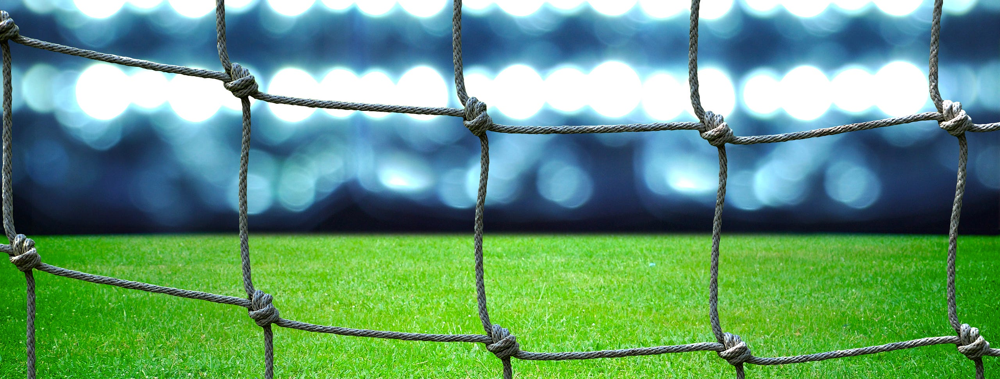

*Existia gestão em nossos encontros para jogar futebol. Então, abrimos mão da gestão para ter mais controle sobre o comportamento das pessoas.*

---

Todas as segundas-feiras, um grupo de amigos se reúne para jogar futebol. É um momento para **rever os amigos**, **praticar um pouco de exercício** e **diminuir o stress** causado pelo trabalho que ainda está por vir na semana.

Os jogos acontecem num campo society de grama sintética cercado por telas, cuja dimensões determinam o tamanho dos times: 6 jogadores para cada lado.

Cada partida tem duração de 8 minutos, tempo ideal para conciliar esforço e descanso físico dos “atletas” de ocasião e permitir que todos aproveitem as 2 horas de “pelada”.

A escalação oficial e as desculpas de não comparecimento nos jogos acontecem via WhatsApp, onde os jogadores mantêm um grupo para trocar mensagens, algumas piadas, fotos e vídeos interessantes.

Os jogadores pagam R$ 50,00 por mês ou R$ 20,00 por jogo avulso. Um dos integrantes do grupo fica responsável por recolher o dinheiro, que além de pagar o aluguel do campo serve também para manter um *kit* de primeiros socorros e pagar um churrasco no final do ano para todos os participantes.

## Dia de Futebol

No dia da pelada, alguém busca os coletes para determinar os jogadores de cada um dos três times. A divisão acontece por bom senso e busca o melhor equilíbrio entre os times: jogadores mais lentos e mais rápidos, mais e menos habilidosos, mais fortes e mais fracos fisicamente — todos harmonicamente divididos em equipes diferentes.

Para determinar os times que começam jogando, um tradicional método de decisão: "*2 ou 1*". Dois times participam do primeiro jogo e o outro time espera pela próxima partida, ficando responsável também por marcar o tempo de jogo e fazer as vezes da torcida.

Sem juiz, a primeira partida começa. O apito é substituído por um "*parou!*" que qualquer jogador pode dizer quando acontece uma falta. Todos respeitam o pedido e o jogo continua sem maiores problemas.

Após oito minutos, o time vencedor permanece em campo. O perdedor dá lugar ao time que estava aguardando do lado de fora.

Então a segunda partida começa. Caso o mesmo time vença novamente, este terá apenas mais um jogo: cada time joga no máximo 3 partidas seguidas. Mesmo vencendo a terceira partida, o time vencedor deve dar lugar ao time que está de fora. Essa prática ajuda a equilibrar o tempo de atuação dos jogadores, permitindo que todos joguem mais ou menos a mesma quantidade de partidas.

Após as 2 horas de futebol, os jogadores se reúnem para conversar, comer alguma coisa e jogar baralho. Uma pequena confraternização para descansar e aproveitar o fim de noite antes do próximo dia de trabalho.

## Regras e Restrições

Após a entrada de novos integrantes no grupo do futebol, convidados para completarem os times, algumas mudanças aconteceram na pelada. Foram instituídas três regras e mais duas restrições.

> Restrição #1: no terceiro jogo de um time, caso esse vença por mais de 3 gols de diferença, ele continuará jogando. No quarto jogo, deverá ganhar por 4 gols de diferença para continuar jogando e assim por diante.

Essa restrição foi criada para resolver o seguinte problema: no terceiro jogo de um time os jogadores do time adversário relaxavam, uma vez que não seria necessário vencer para continuar em campo. Fazia mais sentido se poupar para a próxima partida, que realmente seria determinante para continuar jogando ou sair.

> Restrição #2: quando a bola encostar na tela que cobre o campo, será marcado arremesso lateral.

Essa restrição foi criada para evitar que os times fossem prejudicados quando, num lançamento mais longo, a bola tocasse na tela que cobre o campo e enganasse a defesa do time adversário ou facilitasse um contra-ataque. Assim, o grupo estabeleceu essa restrição para tornar os jogos mais justos e competitivos.

> Regra #1: os jogadores de cada time serão determinados por sorteio.

Algumas pessoas reclamaram que haviam “panelinhas” na formação dos times, no sentido de bons jogadores sempre estarem juntos nas mesmas equipes. Então, o grupo achou melhor sortear os jogadores que fariam parte de cada time e deixar para o acaso o equilíbrio entre as equipes.

> Regra #2: ao recuar a bola para o goleiro, este não poderá pegá-la com as mãos.

Essa regra foi criada para evitar a famosa “cera” no futebol. Quando algumas pessoas que faziam parte de um time que estava ganhando percebiam que faltava pouco tempo para acabar a partida, recuavam várias vezes a bola para o goleiro com o objetivo de ganharem tempo e "esfriar" a partida. Esse comportamento ruim de alguns jogadores foi percebido pelo grupo, que estabeleceu esta regra para tornar as partidas mais dinâmicas e evitar esse antijogo.

> Regra #3: quando algum jogador colocar propositadamente a mão na bola, com exceção dos goleiros, será marcado um tiro livre direto a favor do time adversário.

Essa regra também foi criada para evitar o antijogo. Alguns jogadores, ao perceberem que não seria possível evitar o gol do time adversário, “matavam” um lance de perigo colocando a mão na bola. Esse ato irritava demais os jogadores adversários. Então, o grupo estabeleceu a regra da mão na bola para coibir esse mau comportamento.

## Benefícios e Consequências

Após os primeiros jogos com as novas regras e restrições, o grupo do futebol percebeu alguns benefícios, mas também consequências ruins.

A possibilidade de vencer ou perder por uma diferença de 3 gols no terceiro jogo fez com que os times jogassem para valer: o time vencedor passou a correr mais e buscar o maior saldo de gols. O time adversário passou a jogar sério para não correr o risco de deixar o campo no final da partida.

Os arremessos laterais marcados após a bola tocar na tela superior do campo deram uma nova dinâmica aos jogos, que ficaram mais disputados e equilibrados. Além disso, os “chutões” para frente diminuíram e o toque de bola melhorou.

Quanto ao sorteio dos times, a situação piorou. Os times ficaram ainda mais desequilibrados. Alguns times foram formados pelos melhores jogadores do grupo enquanto outros times pelos piores jogadores. Esse fato aumentou o descontentamento de grande parte dos jogadores. Alguns deles chegaram a deixar a pelada antes do fim.

Em relação ao recuo de bola para o goleiro, em muitos lances aconteceu a discussão sobre a intenção ou não do recuo. O mesmo vale para a mão na bola, que criou conflitos entre os jogadores pela discordância a respeito das intenções do jogador que cometeu a infração.

Essas regras criaram mais discussões entre os jogadores, que acabaram criando novas formas de antijogo, como enrolar para bater uma falta ou um lateral. Por conta disso, alguns integrantes do grupo especularam sobre chamar um juiz para apitar os jogos.

## Lições sobre Gestão

*1. Crie restrições que favoreçam a melhoria do desempenho coletivo*

As restrições foram criadas com o propósito de melhorar a dinâmica dos jogos e o comportamento dos times, favorecendo a auto-organização dos jogadores e o aumento da competitividade.

Estabelecer restrições ajudam as equipes a repensarem sua forma de "jogar" durante o próprio "jogo", buscando sempre um melhor desempenho. Pensar sobre o trabalho simultaneamente à sua execução gera mais aprendizado e possibilidades de inovação.

*2. Evite criar regras para controlar e punir as pessoas*

As regras criadas para evitar o antijogo e a “cera” não funcionaram, pois estabeleceram controle e punição para os jogadores e times por conta do mau comportamento de algumas pessoas.

Além disso, essas regras pretendiam criar um microgerenciamento das atividades dos jogadores, substituindo a autonomia e a maestria para lidar com as situações de antijogo.

Gestão não significa impor decisões e controlar o comportamento de 3% dos trabalhadores que fazem o trabalho mal feito, mas sim garantir liberdade e todo apoio necessário para que os outros 97% dos trabalhadores alcancem resultados ainda melhores.

*3. Não delegue a responsabilidade pela gestão para uma pessoa ou para o acaso*

As regras começaram a ser questionadas e interpretadas de formas diferentes por cada jogador, o que suscitou a presença de um juiz para garantir esses controles e punições.

Ter um "juiz" significa delegar decisões sobre o "jogo" para uma pessoa que teoricamente estaria mais preparada para isso do que todos os jogadores juntos.

Porém, se as pessoas estiverem alinhadas ao propósito e objetivos da empresa, não é necessária a presença de um gerente para que realizem seu trabalho com maestria e responsabilidade. Inclusive, a presença de um gerente já é um sinal que a gestão está sendo substituída por comando-e-controle.

O sorteio dos jogadores para compor os times era bem intencionado, mas foi ingenuidade achar que o acaso poderia ser melhor do que o bom senso das pessoas.

## Acréscimos

As restrições estavam alinhadas ao propósito da pelada: rever os amigos, praticar exercícios e diminuir o stress do trabalho.

As regras causaram discussões entre amigos, diminuíram a quantidade de exercício praticado e aumentaram o stress das pessoas.

Antes, tratávamos todos os jogadores como adultos, pessoas conscientes que aquilo era uma pelada e que estávamos todos ali para nos divertir. Depois de observar o comportamento infantil de algumas pessoas, passamos a criar regras que trataram todos como crianças, incapazes de decidirem sobre a intenção de um determinado lance do jogo.

No início, todos sabiam que estavam ali por um propósito e junto com os conhecimentos sobre futebol, eram capazes de tomar decisões com base no bom senso. Depois, essa capacidade foi substituída por regras e até pela possível presença de um juiz. Isso mostra como as pessoas perderam poder sobre a própria pelada.

## Terceiro Tempo

Quais são as definições (propósito, objetivos, valores, princípios e restrições) que caracterizam a sua empresa e que orientam o trabalho e o comportamento das pessoas na direção de melhores resultados?

Quais são as regras que foram criadas para microgerenciar o trabalho das pessoas e que promovem comportamentos ruins e resultados piores?

Em que situações na empresa a participação ativa das pessoas foi substituída por processos, ferramentas ou gerentes?
