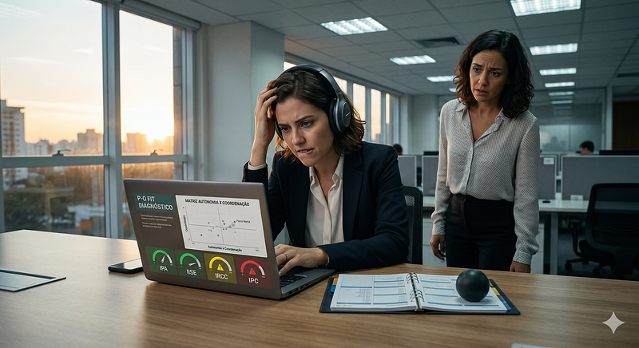
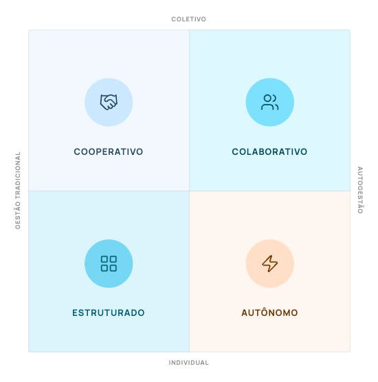

*Imagem criada com Gemini (Nano banana 2) — 4 índices de P-O Fit*

Defini “Coerência Cognitiva” como a **compatibilidade funcional entre a arquitetura cognitiva do indivíduo e a arquitetura de poder e comunicação da organização**, e argumentei que ela opera em duas dimensões simultâneas: o **grau de autonomia** exigido pelo ambiente e a **modalidade de coordenação** que o trabalho impõe. Essas duas dimensões formam os eixos da Matriz P-O Fit (Autonomia × Coordenação).

---

### Artigos sobre Coerência Cognitiva e o Modelo P-O Fit

*Para compreender melhor o contexto deste texto e os conceitos de Coerência Congnitiva e Person-Organization Fit, recomendo a leitura dos artigos:*

1. [Quando uma pessoa não combina com o seu trabalho](https://medium.com/@mhaddad/quando-uma-pessoa-n%C3%A3o-combina-com-o-seu-trabalho-57661576e96b)
2. [Coerência Cognitiva: quando a forma de pensar, decidir e agir encontra a forma de trabalhar](/artigos/coerencia-cognitiva/)
3. [A diferença entre grupo e equipe e o custo invisível da coordenação do trabalho](https://medium.com/@mhaddad/a-diferen%C3%A7a-entre-grupo-e-equipe-e-o-custo-invis%C3%ADvel-da-coordena%C3%A7%C3%A3o-do-trabalho-d39a65fc042f)

---

Faltava, no entanto, mostrar como esse conceito se torna mensurável. Nesta abordagem de P-O Fit que estou propondo, a tradução acontece através de **quatro índices** operacionais que, juntos, descrevem onde a pessoa se posiciona na matriz e com que profundidade ela sustenta esse posicionamento.

*Matriz P-O Fit Autonimia x Coordenação*

### Índices de posicionamento

São os que determinam onde o indivíduo se localiza na Matriz de P-O Fit:

- O **Índice de Prontidão para Autonomia (IPA)** define o Eixo X.
- O **Índice de Inteligência Social e Ética (IISE)** define o Eixo Y.

Esses dois índices respondem à pergunta “*em que tipo de ambiente esta pessoa prospera?*”.

### Índices de qualificação

São os que descrevem com que robustez o indivíduo sustenta esse posicionamento:

- O **Índice de Resiliência e Carga Cognitiva (IRCC)** qualifica a sustentabilidade emocional do perfil sob pressão.
- O **Índice de Processamento Cognitivo (IPC)** qualifica o estilo de processamento operacional e captura a camada de neurodiversidade do modelo.

Esses dois índices respondem à pergunta “*com que profundidade e que tipo de suporte esta pessoa precisa para prosperar no ambiente identificado?*”.

Essa distinção é importante porque um diagnóstico baseado apenas em posicionamento ignora a sustentabilidade do encaixe. Uma pessoa pode estar corretamente posicionada num ambiente de autogestão e ainda assim entrar em colapso operacional se o IRCC ou o IPC indicarem fragilidades não atendidas pelo desenho do trabalho.

## Índice de Prontidão para Autonomia (IPA)

O IPA **mede a capacidade funcional do indivíduo de operar sem supervisão direta**. Não se trata de medir se a pessoa “gosta” de autonomia, mas se ela consegue, na prática, sustentar trabalho de qualidade quando ninguém lhe diz o que fazer ou como fazer.

O índice integra três facetas. A primeira é o **lócus de controle**, o construto clássico de Rotter (1966) que distingue pessoas que atribuem causalidade a fatores internos (suas próprias decisões e esforço) daquelas que atribuem causalidade a fatores externos (sorte, chefes, conjuntura). A segunda é a **autodisciplina**, a capacidade de sustentar foco e cadência sem necessidade de pressão externa. A terceira é a **proatividade intrínseca**, o motor interno para iniciar melhorias e mudanças, em vez de esperar comando ou autorização.

A ancoragem teórica principal vem da **Teoria da Autodeterminação** de Deci e Ryan (2017), que identifica a autonomia como uma das três necessidades psicológicas básicas para a motivação intrínseca. O IPA é, em última instância, uma medida de prontidão disposicional para o exercício dessa necessidade no contexto do trabalho.

Neste modelo P-O Fit, o IPA define o Eixo X da matriz. Pontuações altas indicam adequação a ambientes de autogestão. Pontuações baixas indicam que o indivíduo opera melhor em contextos com direção mais explícita, papéis bem definidos e cadeia de comando clara. Nenhum dos dois extremos é superior. Cada um corresponde a uma configuração organizacional distinta.

## Índice de Inteligência Social e Ética (IISE)

O IISE **mede a orientação do indivíduo para a coordenação interpessoal e para a transparência informacional**. Foi o conceito desenvolvido no artigo anterior, articulado em três características: **amabilidade social** (a preferência e energia para interação coletiva), **integridade ética** (a disposição para compartilhar proativamente informação) e **empatia sistêmica** (a proatividade em ajudar pares sem comando superior).

A ancoragem teórica é tripla. A dimensão Amabilidade do **Big Five** (Costa & McCrae, 1992) sustenta o construto geral. O conceito de **Segurança Psicológica** de Edmondson (1999) ancora a característica de transparência, já que ambientes de informação aberta são tanto causa quanto consequência da segurança psicológica. A literatura sobre coordenação lateral em sistemas descentralizados, particularmente o trabalho de **Martela e Nandram** (2025) sobre o modelo Buurtzorg, embasa a característica de empatia sistêmica.

O IISE define o Eixo Y da matriz. Pontuações altas posicionam o indivíduo no espectro colaborativo-interdependente. Pontuações baixas indicam preferência por trabalho independente ou em grupo com baixa interdependência. Como argumentei no artigo anterior, a dimensão social não se reduz à sociabilidade: ela integra também a disposição para operar em sistemas de informação aberta. Um indivíduo altamente sociável que retém informação estratégica opera de forma qualitativamente diferente de alguém igualmente sociável e simultaneamente transparente.

## Índice de Resiliência e Carga Cognitiva (IRCC)

Se o IPA e o IISE dizem onde a pessoa está, o IRCC diz com que sustentabilidade emocional ela se mantém ali. O índice **mede a capacidade de manter eficácia operacional e equilíbrio emocional sob incerteza**, integrando: **tolerância à ambiguidade** (a capacidade de operar sem manual ou critério único de correção), **ownership** (o senso de responsabilidade e estabilidade sob pressão) e **abertura cognitiva** (a disposição para revisar a própria posição diante de argumentos melhores).

A ancoragem teórica é múltipla. Em relação ao **Big Five**, o IRCC correlaciona-se inversamente com o **Neuroticismo** (Costa & McCrae, 1992): pessoas com alto IRCC tendem a apresentar baixa instabilidade emocional. O índice também dialoga com a literatura clássica de tolerância à ambiguidade (Budner, 1962; McLain, 1993; Lauriola et al., 2016) e com o conceito de necessidade de fechamento cognitivo de Kruglanski e Webster (1996).

Funcionalmente, o IRCC qualifica a robustez de qualquer posicionamento na matriz. Um indivíduo pode ter alto IPA, o que indica prontidão para autonomia, e ainda assim apresentar baixo IRCC. Esse perfil revela uma autonomia real, porém frágil: capacidade de operar sem supervisão em condições estáveis, mas vulnerabilidade ao colapso quando a ambiguidade ou a pressão aumentam significativamente. Identificar essa fragilidade é o que permite à organização desenhar suportes adequados em vez de apenas alocar a pessoa num cargo formalmente compatível.

## Índice de Processamento Cognitivo (IPC)

O IPC é o índice mais singular do modelo e o mais conectado à literatura de neurodiversidade. Ele **mede como o indivíduo organiza, executa e sustenta o trabalho no nível operacional**, integrando três perspectivas: **versatilidade funcional** (a capacidade de transitar entre papéis e aprender novas competências), **assinatura de atenção concentrada** (o padrão atencional do indivíduo, com sensibilidade aos estímulos do ambiente) e **autoconhecimento do ritmo produtivo** (a clareza sobre o próprio fluxo cognitivo e sobre as condições em que ele funciona melhor).

A base teórica é formada por diferentes ideias. A perspectiva de versatilidade conecta-se com a dimensão Abertura à Experiência do **Big Five**. As perspectivas de assinatura atencional e autoconhecimento do ritmo dialogam diretamente com a literatura de neurodiversidade na perspectiva ***strengths-based*** (Doyle, 2020; CIPD, 2024), que reconhece padrões como hiperfoco, sensibilidade sensorial, energia em picos e necessidade de rituais estruturantes não como déficits, mas como estilos legítimos de processamento que requerem ambientes compatíveis.

Esse é o ponto onde o modelo P-O Fit se diferencia mais marcadamente das ferramentas convencionais de avaliação. A psicometria tradicional costuma tratar esses padrões como ruído ou como sinais de patologia. Aqui eles são tratados como informação diagnóstica relevante: indicadores de que o ambiente de trabalho precisa oferecer determinados suportes, como comunicação assíncrona, proteção de hiperfoco, fluxos não interrompidos ou trabalho em blocos curtos com pausas estruturadas.

Funcionalmente, o IPC é o índice primário para o que chamo de **flags de Design Universal**, recomendações de suporte ambiental que tornam o trabalho acessível a perfis cognitivos diversos sem patologizá-los.

*Os quatro índices de posicionamento na Matriz P-O Fit.*

## A combinação importa mais do que os índices isolados

O risco de qualquer instrumento diagnóstico é o reducionismo: tratar um número como definição da pessoa. Esse modelo P-O Fit foi desenhado precisamente para resistir a esse risco. Nenhum dos quatro índices, isolado, descreve o perfil de alguém. É a configuração conjunta dos quatro, lida em camadas, que constitui o diagnóstico.

Pense em quatro indivíduos com IPA alto. Todos prosperariam, em tese, em ambientes de autogestão. Mas:

- Se um deles tem IRCC alto e IPC alto, sustenta autonomia mesmo em alta complexidade, com versatilidade funcional para transitar entre papéis.
- Se outro tem IRCC baixo e IPC alto, sustenta autonomia em condições estáveis, mas precisa de suporte emocional ou de redução de incerteza em momentos críticos.
- Se um terceiro tem IRCC alto e IPC baixo com assinatura de atenção concentrada, sustenta autonomia, mas precisa de proteção de hiperfoco e de fluxos não interrompidos.
- Se um quarto tem IISE alto, prospera em autogestão colaborativa interdependente. Se tem IISE baixo, prospera em autogestão independente, com autonomia de método e resultado, mas sem demanda de coordenação intensa.

São quatro perfis com o mesmo “score de autonomia”, e que demandam desenhos de trabalho completamente diferentes. Reduzir qualquer um deles a um único número seria perder exatamente a informação mais útil para a organização e para o próprio indivíduo.

No [próximo artigo](https://medium.com/@mhaddad/a-matriz-p-o-fit-e-os-16-lugares-de-pot%C3%AAncia-c701320742bb), vou mostrar como essa configuração conjunta dos quatro índices se traduz em posicionamento na Matriz P-O Fit e gera os **16 perfis** que o modelo identifica, cada um com um **Lugar de Potência**, ambientes ideais e riscos de desengajamento específicos.

## Uma proposta de reflexão

Quando você lê as descrições dos quatro índices, qual deles você imagina como sua maior força? E qual é o que você acredita que precisaria de mais suporte ambiental para sustentar?

E olhando para a sua organização, ela mede ou ao menos conversa sobre alguma dessas dimensões nos seus processos de seleção, alocação e desenvolvimento de pessoas? Ou continua avaliando “perfil” e “fit cultural” apenas no nível dos valores declarados?
