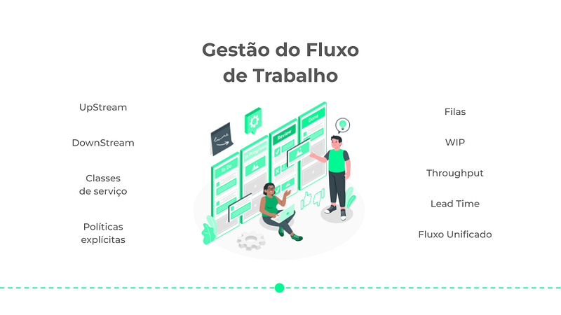

*A jornada do Ateliê de Software em busca de agilidade, milhares de post-its depois…*

> Esta é a história do [Ateliê de Software](https://www.ateliedesoftware.com.br/) e sua longa jornada em busca da Agilidade. Nós já ouvimos inúmeras vezes que a "*Agilidade está morta*" ou que a "*Agilidade não funciona*", por isso resolvemos fazer esse relato para aprofundar a discussão sobre o tema. Nosso propósito é mostrar que a "agilidade" é apenas uma característica que uma organização ou equipe desenvolvem quando são capazes de aprender e se adaptar continuamente para gerar valor para o negócio e para os clientes.

## Era uma vez…

Por volta de 2006, meus sócios e eu trabalhávamos numa "*Fábrica de Software*" que realizava projetos de desenvolvimento de software para o governo e grandes empresas. Esta fábrica possuía diversas certificações, como ISO9001, ISO27001 e CMMi 3, além de um processo extremamente estruturado de desenvolvimento de software, com papéis, artefatos e procedimentos bem definidos.

Cada projeto começava com a equipe de "*Análise de Negócios*", que descrevia os objetivos e também as principais regras do negócio do cliente. Depois, iniciava-se uma fase de "*Análise de Requisitos*", onde os requisitos funcionais e não-funcionais eram levantados, descritos e documentados por uma outra equipe especializada apenas nessa atividade.

A seguir, a equipe de "*Análise de Sistemas*", especificava os casos de uso e os seus respectivos protótipos de baixa fidelidade. Paralelamente, a equipe de design iniciava o desenvolvimento da interface, elaborando o conceito visual e definindo os padrões de interação com o usuário.

Quando o projeto chegava a esse ponto, cerca de seis meses já haviam se passado desde seu início. Somente então a equipe de programadores começava a implementar os casos de uso, enquanto a equipe de testes iniciava a especificação dos casos de teste. No final da implementação de cada caso de uso, os desenvolvedores enviavam o trabalho concluído para verificação e validação pela equipe de testes.

No final do projeto, o software era entregue ao cliente para implantação e utilização pelos seus usuários. No entanto, além de apresentar algumas falhas, o software se mostrava praticamente inútil, pois **o contexto havia mudado e as necessidades dos usuários já eram diferentes** daquelas identificadas no início do projeto.

Após quase dois anos de trabalho, com um investimento de milhares de reais e o envolvimento de mais de 15 pessoas, não conseguíamos entregar um software que realmente agregasse valor para o cliente e seus usuários. A fábrica possuía um processo de desenvolvimento de software que era eficiente e lucrativo apenas para o próprio modelo de negócios, mas que falhava em ser eficiente e eficaz na criação de valor para os negócios dos seus clientes.

## Na beira do abismo

Em 2007, a fábrica de software enfrentou uma crise sem precedentes. O falecimento do sócio-fundador, a perda de clientes importantes e a saída de profissionais experientes colocaram a empresa bem perto da falência.

Diante disso, iniciamos um grande esforço comercial para conquistar novos clientes e manter a fábrica em operação. Nesse contexto, uma fundação, em parceria com uma grande estatal brasileira, nos apresentou o desafio de implementar um software para suportar um renomado prêmio nacional de qualidade em gestão.

Esse era o projeto que a fábrica precisava naquele momento. No entanto, havia um detalhe crucial: o software precisava ser concluído em apenas seis meses, pois uma data já estava marcada para que empresas de todo o Brasil o utilizassem para participar do prêmio.

Cientes de que o processo pré-definido de desenvolvimento da fábrica de software era completamente inviável para esse cenário, e estando à beira do abismo, decidimos arriscar e adotar uma abordagem diferente de trabalho e gestão.

Naquela época, alguns integrantes da fábrica de software já estudavam sobre agilidade e os métodos ágeis, e aquela parecia ser a oportunidade ideal para experimentarmos uma abordagem iterativa e incremental de desenvolvimento de software.

Decidimos então utilizar Scrum para fazer a gestão do projeto. Formamos uma equipe multidisciplinar, com analistas, programadores, designers e testadores trabalhando juntos. Fazíamos reuniões semanais com o cliente, que estava sempre presente, validando cada funcionalidade implementada.

Dessa forma, o projeto avançou rapidamente com base em feedback e aprendizados contínuos, permitindo-nos cumprir o prazo e entregar o software na data desejada pelo cliente. Empresas de todo o Brasil fizeram o download da nossa solução e a utilizaram sem grandes problemas. Esse foi o primeiro projeto verdadeiramente bem-sucedido que testemunhamos naquela fábrica de software.

## Ninguém é um profeta em sua própria terra

Depois do sucesso daquele projeto e do software construído, a equipe de analistas, programadores, testadores e designers estava empolgada para continuar trabalhando daquela forma, que era muito mais leve e trazia resultados melhores para o cliente e para a fábrica.

Então, em uma reunião do *Grupo de Processo de Engenharia de Software*, o diretor da fábrica nos avisou que não faríamos mais projetos daquela forma, utilizando aquele tipo de método. Ele destacou que deveríamos seguir estritamente todas as certificações e processos pré-definidos, dado o grande investimento feito nessas certificações e práticas.

Apesar de todas as nossas alegações e das provas incontestáveis da eficiência e eficácia da abordagem ágil para desenvolvimento de software, apesar do sucesso do projeto e da satisfação do cliente, a fábrica de software optou por não trabalhar mais com agilidade. Assim, resolvemos partir e iniciar uma jornada completamente diferente.

## Ateliê de Software

Assim, em 2008, meus sócios e eu fundamos o [Ateliê de Software](https://www.ateliedesoftware.com.br), uma empresa idealizada para executar projetos de software sob medida utilizando métodos ágeis.

O nome escolhido foi proposital, pois contrastava com o conceito de uma organização fabril, refletindo nossa visão de como o desenvolvimento de software deveria ser abordado: uma combinação de arte e engenharia; técnica e criatividade; experimentação e aprendizado.

Apesar da empolgação com essa nova visão, a realidade era que tínhamos apenas uma única experiência com métodos ágeis e precisávamos aprender muito para alcançar um nível de excelência que garantisse o sucesso e a prosperidade do Ateliê de Software.

### Gestão Ágil de Projetos

Nossa jornada em busca de agilidade começou com a adoção do Scrum para a gestão dos projetos, um método ágil que já conhecíamos desde os tempos da fábrica de software.

Então, decidimos participar do treinamento de Scrum oferecido pela Caelum (hoje, Alura) e tivemos o privilégio de ter sido capacitados pelo [AleXandre Magno](https://medium.com/u/8a03a34b2dc1), que na época ministrava as formações para a certificação de Scrum Master.

Nos primeiros projetos do Ateliê de Software, percebemos que realizar planejamentos recorrentes e focar em entregar software funcional ao final de cada Sprint realmente melhorava o fluxo de geração de valor para o cliente. Aprendemos a trabalhar em equipe, a comunicar-nos de forma eficaz com os clientes e a manter a transparência nas relações.

Nesse início, também tivemos que aprender a vender projetos ágeis e elaborar contratos comerciais que fossem compatíveis com esse tipo de abordagem de trabalho. Para isso, recorremos a experiência do Vinícius Teles ([viniciusteles](https://medium.com/u/838042bebf54)) e utilizamos como referência o modelo de contrato que ele criou na sua empresa *Improve It*.

Apesar desse início promissor, nossas entregas de software ainda apresentavam baixa qualidade, com vários *bugs* retornando para correção nas Sprints seguintes. Embora tenhamos conseguido vender e fazer a gestão dos projetos e das equipes de forma ágil, ainda enfrentávamos desafios significativos em relação à qualidade na engenharia de software.

### Prática Ágeis de Engenharia de Software

Então decidimos investir em práticas ágeis de engenharia de software, como *TDD (Test-Driven Development)*, *Pair Programming*, *Peer Review*, *Refactoring*, *Continuous Integration*, *Continuous Deployment*, *Continuous Delivery* e diversas outras boas práticas que estavam surgindo ou se consolidando na primeira década dos anos 2000.

Para isso, em 2010, contamos com o apoio do nosso grande amigo [Klaus Wuestefeld](https://medium.com/u/b4445d9d3b72), que realizou conosco uma imersão nas práticas da *eXtreme Programming* e nos ajudou a elevar de maneira significativa a qualidade das nossas entregas.

De forma complementar, adquirimos o curso em vídeo de TDD do [Kent Beck](https://medium.com/u/db2690bcb10e), que ajudou a refinar as nossas técnicas de escrita de testes. Ainda tivemos a oportunidade de participar das pesquisas sobre TDD do [Maurício Aniche](https://medium.com/u/8e9549404863), que trouxe novos conhecimentos para o nosso time e revelou a grande importância de guiar o design e o desenvolvimento de um software a partir de testes unitários automatizados.

Após quase dois anos utilizando o Scrum para a gestão de projetos e as práticas ágeis da XP para entregar software de qualidade, acabamos por descobrir um novo ponto de "dor" em nosso processo de trabalho…

### Análise de Negócios e Requisitos Ágeis

Ter uma boa gestão do projeto e entregar software de qualidade revelou a necessidade de adotar também práticas ágeis para *Análise de Negócios e Requisitos*.

De forma geral, percebemos que as empresas que solicitavam desenvolvimento de software sob medida apresentavam uma grande dificuldade em determinar quais os problemas precisariam ser resolvidos pelo software, bem como quais objetivos de negócio deveriam ser alcançados como resultado do projeto.

Para ajudar os nossos clientes com essas definições, buscamos a orientação e os conhecimento do nosso amigo [Luiz C. Parzianello](https://medium.com/u/95236a29bc8b), que naquela época já apresentava uma abordagem ágil para análise de negócios e requisitos baseada no BABOK (hoje conhecido como "*AGILE Extension to the BABOK Guide*").

Adotamos também o método *Lean Inception* (que na época ainda se chamava "Direto ao Ponto") do [Paulo Caroli](https://www.linkedin.com/in/paulocaroli/) para elaborar projetos de MVPs e propostas técnicas mais consistentes. Para isso, tivemos a honra de ser capacitados pelo nosso amigo [Yoris Linhares](https://medium.com/u/7b36d96f37e5), da Orgganica, que ministrou o treinamento de *Lean Inception* para toda a equipe do Ateliê de Software e representantes dos nossos clientes.

Com o propósito de refinar nossas competências nessa área, ainda participamos da "*Formação de Analista de Negócios*" do nosso amigo [Paulo Vasconcellos](https://www.linkedin.com/in/pfvasconcellos/), que compartilhou seus conhecimentos e experiências, ajudou os nossos times na melhoria do trabalho de análise de negócios e acompanhou a gestão dos nossos projetos por alguns meses.

Assim, aprendemos a lidar de forma adequada com os requisitos de negócio, de software e do usuário, melhorando muito a qualidade dos nossos planejamentos e também a consciência da equipe e do cliente a respeito do valor a ser entregue pelo software.

### Product UX Design

Um outro aspecto que contribui muito para o ganho de agilidade nos projetos do Ateliê de Software foi a busca por abordagens ágeis de design de produtos (hoje já bem difundidas).

Enquanto aprendíamos a lidar com as práticas ágeis de engenharia de software, tivemos o primeiro contato mais de perto com o mundo do design de produto através do trabalho do [Frederick van Amstel](https://medium.com/u/a2b5cfc4c407) (mais conhecido como *Usabilidoido*) e seu treinamento DRIFT. Descobrimos o que realmente era design centrado no usuário e como utilizá-lo em nossos projetos desde o início.

Também tivemos o privilégio de contar com os conhecimentos e as orientações em *UX Design* do professor [Tiago Silva da Silva](https://www.linkedin.com/in/tiago-silva-da-silva), que ajudou a disseminar as principais ideias de usabilidade no Ateliê de Software e também a refinar as práticas de design em nossos projetos.

Assim, aprendemos que *Análise de Negócios e Requisitos* falhava quando não considerava em profundidade a perspectiva dos usuários, que era quem realmente utilizaria a nossa solução no dia a dia. Então, passamos a realizar pesquisas e entrevistas com usuários, criar personas, mapear suas respectivas jornadas nos processos de negócio e a realizar testes de usabilidade com a ajuda de protótipos de alta fidelidade.

Depois de quase 5 anos de muito aprendizado, os projetos do Ateliê de Software já contavam com Análise de Negócios e Requisitos Ágeis, Product *UX Design*, *Lean Inception*, Scrum e prática ágeis de Engenharia de Software da XP. Entretanto, ainda era preciso melhorar continuamente a nossa forma de trabalho...

### Gestão do Fluxo de Trabalho

Em 2013, para aumentar a eficiência e a eficácia dos nossos projetos de desenvolvimento software, decidimos adotar Kanban de maneira integrada ao Scrum.

Nosso interesse pelo Kanban surgiu após a palestra de [Alisson Vale](https://medium.com/u/1c7af9ed8737) no Agile Brazil 2010, em Porto Alegre, onde compreendemos a importância de gerenciar filas e lidar com gargalos e desperdícios em projetos de software.

Então, realizamos o treinamento do Método Kanban com [Rodrigo Yoshima](https://medium.com/u/153b88f31074), da Aspercom, que nos proporcionou novas perspectivas sobre gestão de fluxo, contribuindo para melhorar a nossa cadência de entregas.

Aprendemos a lidar com o *UpStream* e o *DownStream*, além de utilizar métricas e indicadores de fluxo para otimizar nosso processo de trabalho.

Também nos inteiramos sobre o conceito de *Fluxo Unificado*, idealizado pelo [Rafael Cáceres](https://www.linkedin.com/in/rafaelcaceres/) e [Celso Martins](https://www.linkedin.com/in/celsoavmartins/) da Taller, e passamos a aplicá-lo em contextos específicos no Ateliê de Software.

O Kanban ajudou a refinar nossa agilidade, permitindo um gerenciamento mais eficiente e uma entrega de software ainda mais eficaz.

### Estilo de Gestão Orgânico

Durante toda essa jornada em busca da agilidade, acabou emergindo no Ateliê de Software um estilo de gestão orgânico, centrado nas pessoas e nos seus relacionamentos. Nosso jeito de fazer gestão é guiado por decisões compartilhadas e distribuídas, orientadas por regras, restrições e acordos estabelecidos entre todos os envolvidos no negócio.

Baseado em equipes autônomas de alto desempenho, estáveis, formadas por profissionais experientes, que utilizam métodos e práticas ágeis para produzir software de qualidade, nosso estilo de gestão criou lastro em valores como *Autonomia*, *Colaboração*, *Auto-Organização*, *Transparência*, *Excelência* e *Aprendizado*.

Não temos uma estrutura hierárquica formal, mas valorizamos a liderança emergente para lidar com os desafios que enfrentamos. Temos uma cultura organizacional que promove um ambiente de segurança psicológica e que fomenta feedback para desenvolvimento profissional (inclusive, criamos o [Feedback Canvas](https://share.atelie.software/usando-o-feedback-canvas-na-pr%C3%A1tica-f3edd5d145da), uma ferramenta para facilitar o processo de feedback no contexto do trabalho em equipe).

O estilo de gestão do Ateliê de Software foi concebido, ao longo dos anos, com o apoio de grandes nomes como [Ricardo Semler](https://www.linkedin.com/in/ricardosemler/), [Niels Pflaeging](https://medium.com/u/333b6308a9a7) , [Frederic Laloux](https://medium.com/u/ce10a9fbf9a9) e [Jurgen Appelo](https://medium.com/u/79df0d151f0e). A partir dos livros, cursos, conselhos e consultorias desses profissionais, encontramos uma maneira de fazer gestão compatível com os valores e princípios do [Manifesto Ágil](https://agilemanifesto.org/iso/ptbr/manifesto.html).

Como resultado desse enfoque na gestão, em 2012 o Ateliê de Software conquistou o *Prêmio MPE Brasil*, promovido pelo SEBRAE. Na ocasião (quando ainda utilizávamos o nome Webgoal), fomos reconhecidos como a melhor empresa de TI do Estado de SP e também recebemos o prêmio de inovação, destacando-nos pelo nosso estilo de gestão (que atendia a todos os critérios de excelência e qualidade em gestão elencados pelo SEBRAE, mas os implementava de uma maneira muito diferente do tradicional).

## Uma jornada que ainda não acabou

Hoje, depois de 16 anos, dezenas de projetos entregues e diversos profissionais fantásticos que vivenciaram essa jornada em busca da agilidade, temos a alegria de compartilhar esse pequeno sucesso e agradecer a todos os clientes que apostaram nessa maneira moderna de desenvolvimento de software: [Conlicitação](http://www.conlicitacao.com.br), [W1 Consultoria](https://www.w1.com.br/), [Synergia](https://www.synergiaconsultoria.com.br), [Grupo Bandeirantes](http://www.band.com.br), [Lumiar Educação](https://lumiaredu.com/), [Granatum](http://www.granatum.com.br), [Access Loans](https://www.accessloans.com/) e tantos outros.

Atualmente, estamos aprimorando a nossa atuação em *Product UX Design* (para ajudar na concepção de produtos digitais dos nossos clientes) e *Software & IT Infrastructure Design* (para investir um pouco mais de tempo no início dos projetos para definições de Arquitetura de Software e Infraestrutura de TI por conta da complexidade e da necessidade de escalabilidade das soluções).

Também estamos aprendendo a utilizar [ferramentas de inteligência artificial](https://www.linkedin.com/pulse/5-pontos-importantes-sobre-intelig%C3%AAncia-artificial-2fqrf) para ter mais produtividade e aumentar a qualidade do que fazemos, melhorando o retorno sobre o investimento dos nossos clientes.

Por fim, já estamos nos preparando para atender o governo, conscientes das limitações impostas pelas leis em relação aos métodos e práticas ágeis. Talvez estejamos presenciando o início de um novo capítulo desta jornada, onde levaremos, de fato e finalmente, a agilidade para os projetos de software do setor público. 😉
