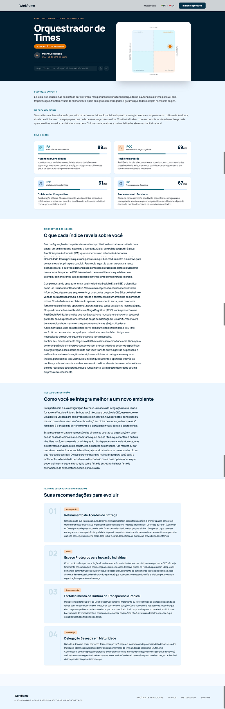

*Workfit.me — Ferramenta de diagnóstico para o modelo P-O Fit que estou propondo*

No [artigo anterior](/artigos/gestao-padronizada-num-mundo-de-mentes-diversas/), encerrei o argumento conceitual desta série com uma proposta: **reconhecer a diversidade cognitiva das pessoas não é uma concessão a sensibilidades individuais, mas o próximo passo necessário no design organizacional contemporâneo**.

---

### Artigos sobre Coerência Cognitiva e o Modelo P-O Fit

*Para compreender melhor o contexto deste texto e os conceitos de Coerência Cognitiva e Person-Organization Fit, recomendo a leitura dos artigos:*

1. [Quando uma pessoa não combina com o seu trabalho](/artigos/quando-uma-pessoa-nao-combina-com-o-seu-trabalho/)
2. [Coerência Cognitiva: quando a forma de pensar, decidir e agir encontra a forma de trabalhar](/artigos/coerencia-cognitiva/)
3. [A diferença entre grupo e equipe e o custo invisível da coordenação do trabalho](/artigos/a-diferenca-entre-grupo-e-equipe-e-o-custo-invisivel-da-coordenacao/)
4. [Os quatro índices da Coerência Cognitiva no trabalho](/artigos/os-quatro-indices-da-coerencia-cognitiva-no-trabalho/)
5. [A Matriz P-O Fit e os 16 Lugares de Potência](/artigos/a-matriz-p-o-fit-e-os-16-lugares-de-potencia/)
6. [Coerência Cognitiva e o Modelo de Onboarding nas Organizações](/artigos/coerencia-cognitiva-e-o-modelo-de-onboarding-nas-organizacoes/)
7. [Gestão padronizada num mundo de mentes diversas](/artigos/gestao-padronizada-num-mundo-de-mentes-diversas/)

---

É um argumento amplo, com implicações éticas e estratégicas. Ao mesmo tempo, é um argumento que corre o risco de permanecer no plano da retórica se não vier acompanhado de instrumentos que o tornem operacional.

Foi a partir dessa preocupação que nasceu o **WorkFit.me**, uma plataforma que estou desenvolvendo para transformar minha proposta de modelo P-O Fit em algo que qualquer pessoa possa usar. Este artigo apresenta a ferramenta: o que ela é, como funciona, o que ela entrega e como você pode acessá-la.

## Uma ferramenta para tornar o invisível, visível

A proposta central do WorkFit.me é simples: oferecer a qualquer pessoa a possibilidade de descobrir seu **Lugar de Potência** com base numa metodologia psicometricamente ancorada e sem custo.

A plataforma está disponível provisoriamente em <https://po-fit.vercel.app/> e implementa integralmente o modelo P-O Fit apresentado ao longo desta série de artigos.

A ideia de tornar o modelo acessível de forma gratuita é intencional. Instrumentos de diagnóstico organizacional costumam ficar restritos a consultorias caras e a processos corporativos fechados, o que produz um paradoxo evidente: quem mais precisa entender sua compatibilidade com um ambiente de trabalho é justamente quem menos tem acesso a esse tipo de informação. Por isso quero tornar o autoconhecimento sobre fit organizacional uma peça acessível para qualquer profissional que queira compreender melhor a si mesmo e ao contexto em que trabalha.

## A jornada do usuário

Do ponto de vista de quem acessa a plataforma, a experiência é direta. O usuário responde a um questionário de 36 itens, distribuídos em 12 blocos cognitivos que correspondem às dimensões estruturais do modelo. Cada item foi cuidadosamente construído para medir um comportamento observável no trabalho, não para captar valores declarados ou preferências abstratas.

*Workfit.me — Questionário com 36 questões para diagnóstico do perfil cognitivo*

O questionário leva no máximo 10 minutos para ser respondido. Ao final, o sistema aplica o algoritmo completo do modelo: calcula as médias dos 12 blocos, deriva os quatro índices (IPA, IRCC, IISE e IPC), posiciona o usuário na Matriz P-O Fit (Autonomia × Colaboração), identifica seu Lugar de Potência entre os 16 perfis, detecta as flags de Design Universal e sinaliza eventuais personas de risco a observar.

*Workfit.me - Arquitetura do algoritmo para avaliação dos índices, classificação do perfil e abordagem para onboarding*

O resultado é entregue em formato de relatório personalizado, escrito em linguagem acessível e orientado à ação. Nada de rótulos definitivos sobre “quem você é”. O relatório traduz o diagnóstico em descrições sobre onde a pessoa tende a prosperar, o tipo de comunicação que ela processa melhor, o nível de autonomia adequado para o seu perfil e o modelo de onboarding que faria mais sentido se ela fosse integrada hoje a uma nova organização.

## A arquitetura em três camadas

Por trás da simplicidade da experiência do usuário, o WorkFit.me é sustentado por uma arquitetura em três camadas.

A primeira é a **camada psicométrica**, ancorada em construtos validados da literatura científica. O IPA (Índice de Prontidão para Autonomia) dialoga com a Teoria da Autodeterminação de Deci e Ryan (2017) e com o construto clássico de lócus de controle de Rotter (1966). O IRCC (Índice de Resiliência e Carga Cognitiva) integra as três dimensões da MSTAT-II de Lauriola et al. (2016) e correlaciona-se inversamente com o Neuroticismo do Big Five (Costa & McCrae, 1992). O IISE (Índice de Inteligência Social e Ética) combina a dimensão Amabilidade do Big Five com o conceito de Segurança Psicológica de Edmondson (1999) e com a literatura de coordenação lateral em sistemas descentralizados (Martela & Nandram, 2025). O IPC (Índice de Processamento Cognitivo) dialoga com a perspectiva *strengths-based* de neurodiversidade de Doyle (2020) e do CIPD (2024). Cada item do questionário foi mapeado a esses construtos por meio de revisão sistemática da literatura.

A segunda é a **camada algorítmica**, que traduz as respostas em classificação. Essa camada aplica regras explícitas e replicáveis: fórmulas de cálculo dos índices, condições de gatilho para flags e personas, critérios de precedência entre os perfis e critérios de desempate quando múltiplas condições parecem satisfeitas. Todas essas regras estão documentadas e podem ser auditadas. A escolha por um algoritmo transparente, em vez de uma “caixa preta” baseada apenas em modelos estatísticos opacos, é deliberada. O usuário e a organização têm o direito de entender como o diagnóstico foi construído.

A terceira é a **camada interpretativa**, que traduz o resultado técnico em linguagem humana. Essa camada usa a inteligência artificial generativa como assistente de redação, mas mantém o conteúdo ancorado em templates estruturados a partir do próprio modelo. O resultado é um relatório que soa personalizado sem ser aleatório e que oferece recomendações práticas sem ser prescritivo.

## O que o relatório entrega

Concretamente, o relatório que o usuário recebe ao final do teste é composto por seis seções principais.

A primeira apresenta o **Lugar de Potência** identificado, com uma descrição interpretativa do perfil que vai além do rótulo. O usuário entende não apenas o nome do seu perfil (Facilitador Sistêmico, Especialista Analítico, Coordenador de Fluxo, entre outros), mas o que aquele posicionamento significa em termos de contribuição, energia e potencial.

A segunda descreve os **estados dos quatro índices** na camada dupla que o modelo emprega. Cada índice pode estar em cinco estados distintos, que qualificam a robustez do posicionamento e explicam nuances importantes. Alguém pode ter alta prontidão para autonomia, por exemplo, mas apresentar autonomia frágil sob pressão, o que exige suporte ambiental diferente de alguém com autonomia consolidada.

A terceira lista as **flags de Design Universal** aplicáveis, que são recomendações concretas de suporte ambiental. Se a flag Comunicação Assíncrona está ativa, o relatório explica quais tipos de ambiente favorecem esse perfil e sugere adaptações práticas de rotina. Se a flag Suporte Executivo está ativa, o relatório recomenda infraestrutura cognitiva específica, como Kanban visível e metas de curtíssimo prazo decompostas visualmente.

A quarta destaca eventuais **personas de risco** a observar, quando aplicáveis. Essa seção é apresentada com cuidado ético: não como julgamento sobre o caráter da pessoa, mas como sinalização de padrões que podem gerar atrito em determinados contextos organizacionais e merecem consciência.

A quinta apresenta o **modelo de onboarding** ideal para o perfil identificado. Se você entrar amanhã numa nova organização, qual seria o desenho de integração que favoreceria o seu florescimento? A quinta seção responde essa pergunta com base no modelo apresentado no artigo 6.

Para quem deseja mais profundidade, há uma versão estendida do relatório que inclui um **Plano de Desenvolvimento Individual** gerado por inteligência artificial a partir do diagnóstico completo. Esse plano oferece sugestões de próximos passos práticos: livros, cursos, tipos de projeto para buscar, conversas para ter, hábitos para experimentar. É uma trilha personalizada de desenvolvimento profissional, ancorada no perfil e nas flags identificadas.

*Workfit.me — Exemplo de relatório de P-O Fit e recomendação de ações de desenvolvimento profissional*

## Uma ferramenta em construção pública

Um aspecto importante para explicitar é que o WorkFit.me está em fase de validação aberta. Isso significa duas coisas.

A primeira é honestidade epistêmica. O modelo foi construído a partir de uma revisão consistente da literatura científica e testado com dados sintéticos calibrados para validar a coerência interna do algoritmo. Ainda assim, a Fase 2 do plano de pesquisa, que consiste na coleta de dados de 300 ou mais respondentes reais, na aplicação de análise fatorial confirmatória e na validação convergente e divergente com escalas externas consagradas, ainda está em andamento. Em outras palavras, o WorkFit.me hoje é útil e será progressivamente mais refinado à medida que os dados reais forem incorporados ao processo de calibração.

A segunda é uma consequência prática dessa transparência. Toda pessoa que faz o teste contribui para o refinamento contínuo do modelo. Os dados coletados de forma anônima e em conformidade com a LGPD alimentam a base que sustentará a validação estatística formal e a publicação científica que se seguirão. Ao fazer o seu próprio diagnóstico, você ajuda a construir o instrumento. E o instrumento, ao se refinar, ajuda a próxima pessoa a se autoconhecer com mais precisão.

## Um convite

Acesse <https://po-fit.vercel.app/>, faça o seu diagnóstico, descubra o seu Lugar de Potência e explore o relatório com curiosidade. Depois, se algo ressoou fortemente, ou se algo destoou completamente da forma como você se enxerga, escreva nos comentários. Esse retorno é o combustível que move a evolução do modelo. Cada divergência entre o que o algoritmo descreveu e o que você reconhece em si mesmo é uma pista valiosa. Cada convergência é uma confirmação. Cada sugestão sobre o que faltou é uma direção de refinamento.

Também é possível compartilhar a ferramenta com sua equipe, com colegas da sua rede ou com pessoas que você acredita que se beneficiariam de fazer o teste. Quanto mais diversa for a base de respondentes, mais robusto será o modelo. E quanto mais robusto o modelo, mais preciso será o diagnóstico que a próxima pessoa vai receber.

Esta série de artigos termina aqui, no sentido editorial. Entretanto, você pode obter mais detalhes sobre o conceito de Coerência Cognitiva e da proposta de Modelo de P-O Fit nesse *whitepaper*: [P-O Fit — um método para integrar Coerência Cognitiva e Design Organizacional](https://drive.google.com/file/d/1xHv7JClAeM8K5TTYPwp2FdKKOiS6WHHz/view?usp=sharing).

## Uma última proposta de reflexão

Se você ainda não fez o teste, o que está esperando? E se já fez, o que o resultado revelou que você já sabia sobre si mesmo, e o que revelou que você ainda não tinha nomeado com clareza?

Seja qual for a resposta, ela vale ser explorada. É nesse espaço entre o que sabemos intuitivamente sobre nós mesmos e o que ainda não conseguimos articular que o autoconhecimento profissional se constrói.
